# CAD 草图检索系统 — 交付规格说明书（Delivery Spec）

> 日期：2026-06-28
> 状态：待评审
> 范围：现有资产 → 数据 → 训练 → 评估 → 部署 → 交付 全流程
> 粒度：plan 级技术蓝图，不贴实现代码
> 主干策略：消融驱动
> 硬件：3× RTX 5090

## 目录

- [0. 文档导言](#0-文档导言)
- [1. 背景与目标](#1-背景与目标)
- [2. 现状盘点](#2-现状盘点)
- [3. 系统架构](#3-系统架构)
- [4. 数据管线](#4-数据管线)
- [5. 模型与训练](#5-模型与训练)
- [6. 评估协议](#6-评估协议)
- [7. 部署与服务](#7-部署与服务)
- [8. 开发流程与时间线](#8-开发流程与时间线)
- [9. 单元执行规格](#9-单元执行规格)
- [10. 风险登记册](#10-风险登记册)
- [11. 技术栈与环境](#11-技术栈与环境)
- [12. 交付清单与验收](#12-交付清单与验收)
- [13. 附录](#13-附录)

---

## 0. 文档导言

### 0.1 文档目的与读者

本文是 **CAD 草图检索系统**的交付规格说明书（Delivery Spec），也是本系统的**单一事实来源**。所有开发阶段的产物定义、阈值约定、决策规则、验收标准，以本文为准；与本文有冲突的其他文档均以本文覆盖。

**读者定位：** 本文面向将据此拆解实现计划并逐任务执行的工程读者。读者**无需任何外部背景**——本系统的方法选型、数据来源、技术栈、硬件约束在本文内完整定义。首次阅读本文即可获得执行所需的全部信息。

**一句话定位：** 本文是单一事实来源，所有阶段/产物/阈值/决策规则以此为准。

**文档范围：** 覆盖从现有资产盘点 → 数据管线 → 模型训练与消融 → 评估协议 → 部署与服务 → 前端交付的完整生命周期，粒度为 plan 级技术蓝图。

---

### 0.2 文档约定

本文遵循以下四条全局约定，所有后续 Part 默认继承，不再逐节重申。

**① 不贴实现代码**

本文是 plan 级蓝图，不包含任何函数体、类定义或可直接运行的脚本片段。每个执行单元的描述仅覆盖：

- **做什么**（单元职责与输出目标）
- **输入 / 输出**（数据格式、文件路径、接口类型）
- **依赖**（上游单元、外部库、硬件资源）
- **失败处理**（预期异常及止损策略）
- **接口契约**（与下游单元的边界协议）

允许出现的结构化内容：目录树、JSON / 接口 Schema、表格、复选框任务列表、命令意图描述。

**② 路径约定**

| 类型 | 落盘位置 | 说明 |
|------|----------|------|
| 大数据（原始模型、渲染图、特征库） | `~/data/` 大盘 | GPU 机本地磁盘，不写仓库目录 |
| 代码、配置、小型 Schema | 仓库目录 | 纳入版本控制 |
| 临时中间产物 | `~/data/tmp/` | 可安全清除 |
| 实验日志、checkpoint | `~/data/runs/` | 按实验 ID 子目录隔离 |

仓库目录**不存储**大体量数据文件（超出版本控制合理范围的文件一律落 `~/data/` 大盘，不入仓库）。大数据路径在各 Part 中以 `~/data/<子目录>` 形式给出，工程师在实际执行时映射到 GPU 机对应挂载点。

**③ "待回填"阈值约定**

本文中出现标注为 `[待回填]` 的阈值，均是**显式定值流程**的占位符，不是遗漏的 TODO。每处 `[待回填]` 旁必须标注其**回填依据**，说明由哪个实验阶段的哪项指标来决定该值。回填依据的格式示例：

```
相似度截断阈值 θ：[待回填 | 回填依据：M4 建库后对验证集 score 分布直方图取 P5 分位]
```

工程师在执行对应阶段后，将实测值填入 spec 并提交更新。在值填入之前，系统行为依赖**相对止损线**（见 §0.3）保持可运行状态。

**④ 命令以"命令意图"给出**

本文描述命令时，只给出**命令意图**——说明该命令做什么、操作哪些对象、产生什么副作用——而非可直接复制粘贴的完整 shell 脚本。这样做是为了：
- 避免因环境差异（路径、Python 版本、conda 环境名）导致的脚本失效；
- 强迫执行者理解意图后自行适配，防止盲目复制引入错误。

命令意图示例（非脚本）：

> 在 GPU 机上，用 conda 激活项目环境，以 `~/data/abc_v2/raw/` 为输入根目录，运行渲染脚本，将 12 视角渲染图输出到 `~/data/abc_v2/renders/`，遇到损坏 STEP 文件时跳过并记录到 `bad_files.txt`。

---

### 0.3 魔法数禁令与阈值约定

**魔法数的定义：**

> **魔法数（Magic Number）** = 出现在规格或代码中、没有来源标注、没有推导过程、不能从数据中反推的硬编码常量或阈值。

魔法数的危害：它使系统行为对数据分布变化不透明，且在超出原始适用范围后无法被合理地调整或质疑。

**本文禁止魔法数。** 全文所有阈值、超参数、评估目标，必须属于以下三种合法形式之一：

| 形式 | 说明 | 示例 |
|------|------|------|
| **(a) 标注回填依据** | 值当前为占位符，旁边标注将由哪个实验/指标决定该值 | `θ: [待回填 \| 回填依据: M4 score 分布 P5]` |
| **(b) 数据驱动留白 + 相对止损线** | 值依赖消融结果，不预设，但给出相对于基线的可接受下界 | Top-1 目标：优于 CNN 双分支基线；止损线：不低于基线 −Δ pp（Δ 为消融前预注册的可接受退化幅度，见 §6 决策规则） |
| **(c) 有明确出处的固定值** | 值来自外部权威来源（数据集统计、论文报告、硬件规格），可引用 | `num_classes = 8422`（来源：ABC_V2 chunk1 去重统计） |

**检索准确率目标的特殊规定：**

本文**不预设任何检索准确率的绝对数字**（如"Top-1 达到 X%"）。检索准确率目标由以下流程确定：

1. **M3 消融阶段**运行 CNN 双分支 + 域对抗基线，得到 Top-1 / Top-10 基准值；
2. 各消融臂（B-rep 几何增强、ViT + LoRA 等）结果与基线对比，差值超过决策阈值（由消融前在 §6 定义的决策规则给出）方可晋级；
3. 最终选定架构的评估目标为"优于已晋级基线"，并在 M4 建库后实测确认。

在 M3 完成之前，"检索性能目标"一栏保持形式 **(b)**：留白 + 止损线（不低于文献报告的可比方法基线，具体基线见 §6 评估协议）。

---

### 0.4 如何执行本 spec

**执行链概览：**

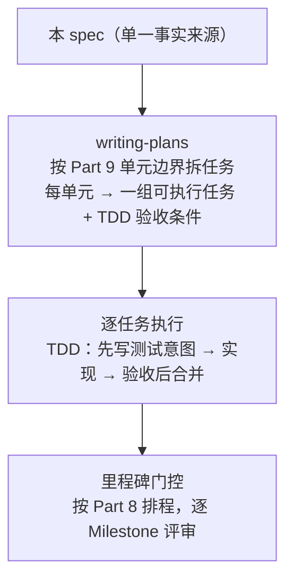


**关键参照 Part：**

- **Part 9（单元执行规格）** 是将本 spec 拆解为实现 plan 的**直接依据**。Part 9 定义了九个执行单元（download / probe / render / sketch / graph / train / build-artifact / serve / frontend）的边界、输入输出契约和验收条件。writing-plans 工具应以 Part 9 的单元边界为切割粒度生成任务列表。

- **Part 8（开发流程与时间线）** 是**排程依据**，定义里程碑（M0–M6）的依赖关系与时间预算。执行者在生成 plan 时应将 Part 9 的任务分配到 Part 8 的里程碑区间内，确保关键路径不被阻塞。

**执行原则：**

1. **TDD 优先**：每个任务先定义测试意图（输入 → 预期输出 / 断言），再实现，验收通过后方可标记完成。
2. **门控前置**：M0 环境对齐门（PyG ↔ torch 兼容性、faiss-gpu、`ort` ↔ CUDA 打包）须在 M1 数据落地前完成验证，未通过门控不得进入下一里程碑。
3. **spec 即合同**：若执行中发现 spec 内容与实际情况有冲突，应先更新 spec（提交记录变更原因），再继续执行，而不是静默偏离。
4. **阈值回填即时提交**：每次实验产出数据后，立即将对应 `[待回填]` 条目填入 spec 并提交，保持 spec 与实测状态同步。

**首批高优先级风险验证（M0 阶段）：**

在进入任何数据或训练任务之前，M0 阶段须验证以下三个已知风险点（详见 Part 10 风险登记册）：

- PyG（PyTorch Geometric）与 torch 2.8 的版本兼容性；
- faiss-gpu 在 CUDA 12.8 / RTX 5090 环境下的可用性；
- `onnxruntime`（`ort`）在 CUDA 12.8 + RTX 5090 环境下的打包与推理可用性。

以上三点任一未通过，须在 Part 10 的对应风险条目中记录缓解方案，并评估对后续里程碑的影响，再决定是否推进。

## 1. 背景与目标

### 1.1 任务定义

本系统解决的核心问题是：**给定一张 2D 草图，在 CAD 零件库中找到与之几何最匹配的具体零件实例**。

#### 检索类型：实例检索（Instance Retrieval）

本任务是**实例检索**，而非类别检索（Category Retrieval）。二者的根本区别在于检索粒度：

| 维度 | 类别检索 | 实例检索（本任务） |
|------|----------|-------------------|
| 检索目标 | 找到与 query 同类的任意样本 | 找到与 query 对应的**唯一正确模型** |
| 标签结构 | 多个样本共享同一类标签 | 每个 CAD 模型**自成一类** |
| 成功定义 | Top-K 中包含同类样本即算命中 | Top-K 中包含**那一个**正确模型才算命中 |
| 典型规模 | gallery 中同类样本 >> 1 | gallery 中每"类"恰好 = 1 |

**本库规模：** `num_classes = 8422`（来源：ABC_V2 chunk1 去重统计），即 gallery 中共有 8422 个零件，每个零件恰好是其自身那一类的唯一样本。

#### 用户交互流程

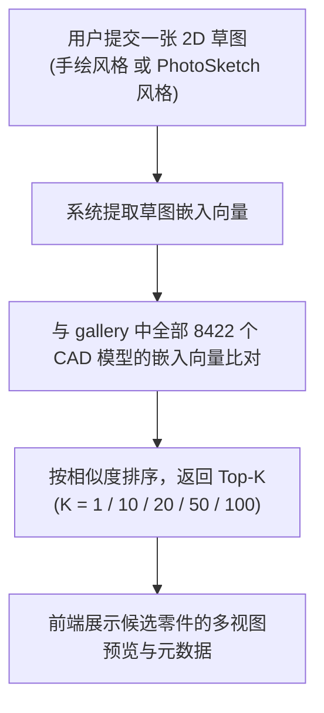

**草图来源的两种形态：**

- **手绘草图（Freehand Sketch）：** 用户以笔或触控板手绘的 2D 线稿，笔触有形变、缺失和抖动。
- **PhotoSketch 风格草图（PhotoSketch-style）：** 由 PhotoSketch 模型从 CAD 模型渲染图自动合成的草图，视觉上接近手绘，用于训练数据扩增与评估集构造。

系统需对两种草图形态均保持稳健的检索能力。

#### 主指标

本系统以以下五档 Top-K 检索准确率为主要评估指标：

| 指标名称 | 含义 | 用途 |
|----------|------|------|
| **Top-1 准确率** | 排名第 1 的结果即为正确模型的比例 | 最严格的精确度指标，消融决策主指标 |
| **Top-10 准确率** | 前 10 结果中包含正确模型的比例 | 交付级成功标准主指标之一 |
| **Top-20 准确率** | 前 20 结果中包含正确模型的比例 | 中间参考值，用于绘制召回曲线 |
| **Top-50 准确率** | 前 50 结果中包含正确模型的比例 | 宽松参考值，用于分析难例分布 |
| **Top-100 准确率** | 前 100 结果中包含正确模型的比例 | 上界估计，验证检索系统基础可用性 |

指标的绝对数值目标不在此处预设，由 Part 6 评估协议中的基线实验 + 决策规则确定（见 §0.3 魔法数禁令）。

---

### 1.2 为何采用双分支 + 消融驱动

本系统的方法架构由三条独立的正面理由支撑，三条理由共同决定了"双分支 CNN 为默认基线、B-rep GNN 为首选增强、消融驱动选主干"这一设计格局。

#### 理由 ①：实例检索拼精确几何，双分支天然贴合

实例检索的核心挑战是**区分外形相近但不完全相同的零件**。CAD 零件的几何信息同时存在于两个互补的表示层：

- **草图侧**：用户提交的 2D 线稿，携带轮廓、边缘、曲率走向等拓扑信息，但缺乏深度与体积。
- **CAD 模型侧**：多视图渲染图（12 视角：顶 6 + 底 6）提供正交方向的形状投影；B-rep（边界表示）几何图则编码精确的曲面、边、顶点拓扑，是最高精度的几何来源。

**双分支架构**将两侧分别用专用编码器处理，再在公共嵌入空间对齐：

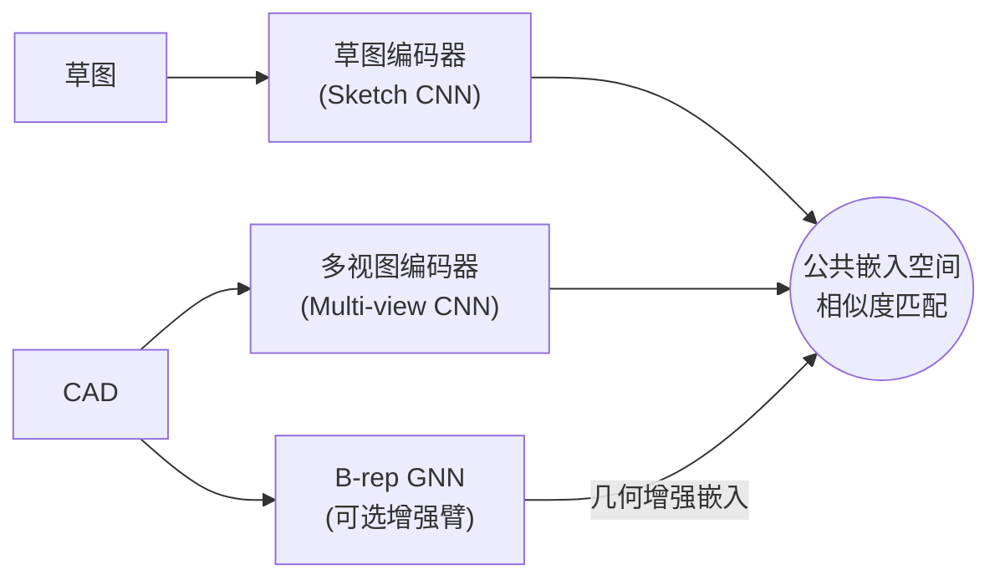

双分支架构同时利用草图的轮廓拓扑信息与多视图的立体投影信息，二者在公共嵌入空间互补，使模型获得更丰富的几何判别维度；B-rep 几何图进一步注入精确的曲面与边拓扑，在视角遮挡导致投影信息不足处提供精确补充。这是任务需求与架构设计之间的结构性匹配。

#### 理由 ②：PhotoSketch 消除合成草图的分布偏差

训练数据中的草图必须与推理时的真实用户草图在风格上尽可能接近，否则模型会学到"训练草图"的特定笔触伪特征而非真实几何。

**PhotoSketch** 是一个将真实照片/渲染图转化为手绘风格草图的神经网络模型，其输出在视觉上逼近人工手绘：笔触稀疏、线条抖动、局部缺失——与用户实际提交的草图分布高度一致。

使用 PhotoSketch 从 CAD 多视图渲染图自动生成训练草图，直接消除了自动合成草图与真实手绘草图之间的**域偏差（Domain Gap）**。PhotoSketch 是数据管线中的核心组件，不是可选优化。

#### 理由 ③：~8.4K 实例量级下，主干优劣无定论，消融驱动经验决定

在约 8422 个实例、12 视图渲染、中等规模 gallery 的条件下，理论上**无法先验地确定**哪种骨干网络（CNN vs ViT）在 Top-1 准确率上具有绝对优势：

- **CNN 双分支**：局部卷积感受野对工程制图风格的边缘、圆角、倒角有天然适配；在数据量有限时通常更稳定，不易出现注意力坍缩。
- **ViT + LoRA**：全局自注意力理论上能捕获草图的全局形状结构；但在小数据集上存在注意力坍缩风险，需要坍缩探针验证后方可推进。

因此，**本系统采用消融驱动（Ablation-Driven）策略**：

1. 以 CNN 双分支 + 域对抗为默认基线（计算成本明确、行为可预期）；
2. 以 B-rep GNN 几何增强为最值得验证的上行项（精确拓扑信息是实例检索天然所需的）；
3. 以 ViT + LoRA 为风险臂（须通过坍缩探针门后方可纳入消融矩阵）；
4. 消融结果出来后，由 §6 决策规则选定最终主干，而不是在数据看到之前预设答案。

这一策略的优点是：不论哪条臂在实测中胜出，系统都有一条有据可查的决策路径，不依赖任何无来源的直觉判断。

---

### 1.3 目标与非目标

#### 本期目标（In Scope）

| # | 目标项 | 具体内容 |
|---|--------|----------|
| G1 | **数据集补齐** | 检查 ABC_V2 ~8.4K 数据集的缺口（缺失渲染图、缺失草图、损坏模型），运行补全管线，使全量数据就绪 |
| G2 | **全流程跑通并交付** | 数据 → 训练 → 评估 → 部署 端到端管线一键可复现，产物契约清晰，无手工中断步骤 |
| G3 | **消融决定主干** | 按 §6 评估协议运行 CNN 双分支基线 + 消融臂，依决策规则选定最终骨干网络 |
| G4 | **在线检索服务** | 交付 `POST /search` 接口，单卡 RTX 5090 p95 延迟达到交互级（阈值见 Part 7） |
| G5 | **Astro 前端** | 交付可用的前端检索界面，支持草图上传与 Top-K 结果展示（含多视图预览） |
| G6 | **数据管线可扩展可复现** | 数据管线有完整文档与测试，可在新数据批次到来时以相同流程重新运行 |

#### 本期不做（Out of Scope）

以下内容**明确不在本期交付范围内**，在后续 Part 中不展开技术方案，遇到相关讨论时应引用此处边界定义：

| 非目标项 | 说明 |
|----------|------|
| **文本检索** | 不支持自然语言描述 → CAD 模型的检索路径 |
| **CAD 生成 / 编辑 / 参数化重建** | 系统只做检索，不生成或修改 CAD 模型 |
| **装配体级检索** | 本期仅支持零件（Part）级别；装配体（Assembly）为后续扩展项 |
| **分布式 / K8s / 多租户** | 部署目标是单机 GPU 服务，不引入容器编排或多租户隔离 |
| **实时草图流式处理** | 不支持流式/增量草图输入，每次请求为完整草图图像 |
| **模型版本在线热更新** | 不实现 zero-downtime 模型替换机制；更新需重启服务 |

---

### 1.4 交付级成功标准

本节定义判断系统"交付完成"的四类可验证标准。每条标准均应在 Part 12 验收清单中找到对应的核查项。

#### SC-1：全流程一键复现

在一台全新配置（已完成 M0 环境对齐）的 GPU 机上，执行单条顶层命令（或按顺序执行 Part 9 各单元的入口命令），可完整重现从"原始 ABC_V2 数据"到"可用检索服务"的全部产物，无需任何手工干预或未记录的环境配置。

具体验收条件：

- [ ] `~/data/abc_v2/` 目录结构与 Part 4 定义的数据管线输出契约一致；
- [ ] 训练日志与 checkpoint 存于 `~/data/runs/<实验ID>/`，可追溯；
- [ ] 评估报告（含 Top-1/10/20/50/100 各值）自动输出到 `~/data/runs/<实验ID>/eval.json`；
- [ ] 构建产物（ONNX 模型、gallery 特征矩阵、Rust 服务二进制）存于 Part 9 build-artifact 单元定义的输出路径；
- [ ] `POST /search` 服务可在执行 serve 单元后即刻启动。

#### SC-2：检索准确率达评审认可水平

选定主干（消融完成后由 §6 决策规则确定）在**留出草图集**（held-out sketch set，见 Part 6 评估协议）上的 Top-1 和 Top-10 准确率，须达到评审认可的水平。

**阈值的确定方式（形式 b，见 §0.3）：**

- 绝对数值目标在 M3 消融基线实验完成后，由评审人根据 CNN 双分支基线实测值 + §6 决策规则共同确定；
- 在基线数值确定之前，此处保留为 `[待回填 | 回填依据：M3 消融基线实验 Top-1/Top-10 实测值 + 评审确认]`；
- 止损线：选定主干的 Top-1 不低于 CNN 双分支基线，Top-10 同理（退化幅度容限 Δ 由 §6 消融决策规则定义）。

#### SC-3：`POST /search` 端到端可用，单卡 5090 p95 交互级

服务部署完成后，须通过以下端到端验收：

- [ ] `POST /search` 接口接受 Base64 编码草图图像，返回 Top-K 结果（含模型 ID、相似度分、多视图预览 URL）；
- [ ] 单卡 RTX 5090 热路径 p95 延迟 ≤ `[待回填 | 回填依据：Part 7 服务规格 + M5 上线压测]`；
- [ ] 错误输入（非图像、超大文件、空请求）返回规范的错误响应，不崩溃服务进程；
- [ ] Astro 前端可通过浏览器访问，草图上传后在交互可接受时延内渲染出 Top-10 结果卡片（前端 p50 目标 [待回填 | 回填依据：Part 7 服务规格 + M5 上线压测]）。

#### SC-4：交付物齐全（Part 12）

Part 12 交付清单中的全部必交项均已完成并可验证，包括但不限于：代码仓库、数据管线脚本、训练配置、评估报告、ONNX 模型、服务二进制、前端构建产物、操作手册。

---

### 1.5 术语与符号表

本节定义全文统一使用的术语与符号。后续所有 Part 在首次使用下列术语时，以此处定义为准，不再重复解释。

#### 核心概念术语

| 术语 | 定义 |
|------|------|
| **实例检索（Instance Retrieval）** | 在 gallery 中找到与 query 对应的唯一正确模型实例的任务。每个 CAD 模型自成一类（类数 = gallery 大小），正确答案唯一。 |
| **gallery** | 检索库，包含全部 `num_classes = 8422` 个 CAD 零件的预计算嵌入向量及元数据。查询时系统在 gallery 上执行暴力点积检索。 |
| **query** | 用户在单次检索请求中提交的 2D 草图图像。每次请求包含一个 query。 |
| **草图（Sketch）** | 表示 CAD 零件的 2D 线稿图像，包含手绘草图和 PhotoSketch 风格合成草图两种形态。 |
| **PhotoSketch 风格草图** | 由 PhotoSketch 神经网络模型从 CAD 渲染图自动合成的草图，视觉上接近手绘风格，用于训练数据生成与评估集构造。 |
| **视图（View）** | CAD 模型的一个渲染角度。本系统采用 **12 视图**方案：顶部 6 视角（Top-6）+ 底部 6 视角（Bottom-6），覆盖上下半球。 |
| **顶 6 / 底 6（Top-6 / Bottom-6）** | 12 视图方案的两组子集：顶部 6 个仰/俯角渲染图（含正上方视角），底部 6 个对称渲染图（含正下方视角）。 |
| **B-rep 图（B-rep Graph）** | 基于边界表示（Boundary Representation）构建的几何图，节点为 CAD 模型的面/边/顶点，边为拓扑邻接关系。由 B-rep GNN 编码为几何嵌入向量。 |
| **双分支（Dual-Branch）** | 本系统的默认基线架构：草图 CNN 分支 + 多视图 CNN 分支，二者在公共嵌入空间对齐。B-rep GNN 为可选第三臂。 |
| **域对抗（Domain Adversarial）** | 用于缩小草图域与多视图域之间特征分布差距的训练技术，通过梯度反转层使两个分支的嵌入在公共空间上不可分域。 |
| **公共嵌入空间（Common Embedding Space）** | 草图编码器与多视图编码器的输出被映射到同一向量空间，使得相同零件的草图与多视图嵌入相互邻近。 |

#### 消融与决策术语

| 术语 | 定义 |
|------|------|
| **消融轴（Ablation Axis）** | 消融实验中每次独立变化的单一变量维度，例如"是否启用 B-rep GNN"、"是否使用域对抗"、"主干网络类型（CNN / ViT）"。每次消融仅改变一个轴，其余固定。 |
| **消融驱动（Ablation-Driven）** | 以系统性消融实验的实测结果为唯一决策依据，而非依赖先验假设选定架构的方法论原则。 |
| **坍缩探针（Collapse Probe）** | 用于检测 ViT 等注意力模型是否发生表示坍缩（embeddings degenerate to near-constant vectors）的诊断工具。坍缩探针通过计算 batch 内嵌入向量的方差、近邻分布熵等指标判断是否坍缩。坍缩探针门：ViT + LoRA 臂须通过坍缩探针验证后方可纳入消融矩阵。 |
| **决策规则（Decision Rule）** | 在消融实验开始前预注册的、基于实测指标差值判断各消融臂是否晋级的规则。定义于 §6 评估协议。 |

#### 产物与质量术语

| 术语 | 定义 |
|------|------|
| **产物契约（Artifact Contract）** | 每个执行单元对其输出产物的形式化承诺，包括文件路径、格式规范、字段定义、完整性校验方式。下游单元以产物契约为输入规范。 |
| **止损线（Stop-Loss Line）** | 为防止某一指标退化超出可接受范围而预先设定的相对下界。以"不低于基线 −Δ pp（百分点）"形式表达，Δ 由消融决策规则定义。 |
| **关键路径（Critical Path）** | 从项目启动到最终交付的最长依赖链，决定总工期下界。本系统的关键路径为：M0 环境对齐 → M1 数据落地 → M2 B-rep 图补全 → M3 消融决策 → M4 建库 → M5 服务 → M6 前端。 |
| **留出草图集（Held-Out Sketch Set）** | 评估阶段使用的草图集合，在训练开始前分割出来，整个训练过程不可见。用于最终性能报告，防止过拟合评估集。 |
| **[待回填]** | 当前值为占位符的阈值标注。每处 `[待回填]` 旁标注回填依据（哪个实验阶段、哪项指标）。见 §0.2 约定 ③。 |

#### 系统与硬件符号

| 符号 / 缩写 | 含义 |
|-------------|------|
| `num_classes` | Gallery 中 CAD 零件实例总数，`num_classes = 8422`（ABC_V2 chunk1 去重统计值） |
| `deduplicate_ratio` | 检索去重倍率 = 2，即每个 model 在 gallery 中产生顶/底两条特征向量，检索时取 top-(2×k) 后按 model_id 合并去重取最优 |
| Top-K | 检索结果排名前 K 的集合，K ∈ {1, 10, 20, 50, 100} |
| CNN | Convolutional Neural Network，卷积神经网络，双分支默认主干 |
| ViT | Vision Transformer，视觉变换器，消融风险臂 |
| LoRA | Low-Rank Adaptation，低秩自适应微调，ViT 臂的参数高效训练方式 |
| GNN | Graph Neural Network，图神经网络，用于 B-rep 几何编码 |
| ONNX | Open Neural Network Exchange，模型互操作格式，用于训练→部署转换 |
| p95 / p50 | 第 95 / 50 百分位延迟，服务性能指标 |
| `~/data/` | GPU 机大盘根目录，所有大体量数据落盘位置（见 §0.2 路径约定） |
| RTX 5090 | 训练与推理使用的 GPU 型号；训练阶段使用 3× RTX 5090；服务热路径使用单卡 RTX 5090 |

## 2. 现状盘点

### 2.1 代码资产（逐模块表）

本系统的代码资产是一套完整可跑的双分支 sketch→CAD 实例检索代码库（`model-retrieval`）。各模块职责如下：

| 模块 | 文件 | 职责 |
|------|------|------|
| 训练入口 | `train.py` / `trainer.py` | 读取 config 展开超参、初始化模型与数据加载器、组装 loss、配置优化器与调度器、执行训练循环、按 epoch 存档 checkpoint |
| 测试检索 | `test.py` / `inference.py` | 加载 checkpoint、对全库视图提取特征、构建 FAISS 索引、对查询草图提取特征后执行检索、计算并报告 Top-K 精度指标 |
| 模型主干 | `model/Baseline/networks/baseline.py` | 定义双分支 `Baseline` 类（草图分支 + 视图分支共享 SE-ResNet50 骨架）；`baseline_step1`～`baseline_step5` 为渐进消融变体，逐步叠加 B-rep 图、跨模态注意力等组件 |
| CNN 骨架 | `model/Baseline/networks/`（SE-ResNet50） | 共享 SE-ResNet50 骨架（含 SE 通道注意力块），对单张图像（草图帧或视图帧）提取特征向量；草图分支与视图分支共享同一骨架权重 |
| 草图/视图编码器 | `model/Baseline/networks/` 内 encoder 子模块 | 封装共享骨架：草图分支直接编码单帧；多视图路径将 `n_views` 帧骨架特征经 max-pool 聚合为单条描述子 |
| B-rep 图编码器 | `model/Baseline/networks/complex_gnn.py` + `encoders/` | UV-Net 风格：对 B-rep 面/边的 UV-grid 采样特征分别建图、经 GNN 多轮消息传递后多聚合（mean/max/attention）输出固定维描述子；依赖外部预计算的 `graph*.pt` |
| 可选组件 | `cross_attention.py` / `channel_grouping.py` / `feature_fusion.py` / `domain_discriminator.py` | 跨模态注意力（草图↔视图对齐）；通道分组关键区域加权；多视图特征融合；域对抗（梯度反转层，使编码器对 sketch/view 域无关） |
| 损失函数 | `utils/loss.py` | `HardTripletMarginLoss`（V2 默认）；`InfoNCE`；`PairLoss`；`CorrLoss`；可按 config 组合叠加 |
| 数据集 | `data/retrieval/ABC/V2/dataset.py` | `ABC_V2Dataset`：读取 12 视图（顶6+底6，224²），按 config 中 `view_type`（top/bottom/both）取对应视图组；`collate_fn=abc_collate_fn_v2` 处理变长草图批次 |
| 配置 | `utils/config.py` | 统一管理所有超参与路径；是 §2.2 固定值的权威来源 |
| C++ 部署参考 | `C++/` | libtorch + OpenCV + hnswlib 组合的推理参考实现；演示从特征提取到近邻检索的完整 C++ 链路；新栈（Rust/axum）按此逻辑重写 |

### 2.2 关键事实（来自 config.py）

以下数值均有明确出处，非魔法数：

- **`num_classes = 8422`**：ABC 数据集第一个 STEP chunk 经两轮去重（来源：ABC_V2 chunk1 去重统计）后保留的 CAD 模型数量，约 ~8,422 件。
- **12 视图（顶6+底6，224²）**：每个模型渲染顶部6帧（仰视方向均匀分布）+ 底部6帧（俯视方向均匀分布），分辨率均为 224×224。（来源：config.py `n_views=6`，`view_type` 可取 `top`/`bottom`/`both`）
- **`n_views = 6`**：单次前向传播时传入编码器的视图帧数，顶或底各取一组6帧。（来源：config.py）
- **`deduplicate_ratio = 2`**：检索时顶/底视图各产出一条特征向量，同一模型在特征库中占2条记录；检索后按此比值折叠去重以对齐到模型级。（来源：config.py）
- **`collate_fn = abc_collate_fn_v2`**：数据集专用批次整理函数，处理草图分辨率变长、视图张量堆叠对齐。（来源：`data/retrieval/ABC/V2/dataset.py`）
- **特征描述子维度 = 512**：草图编码器与 CAD 编码器输出的嵌入向量维度，是公共嵌入空间的维度，也是特征库 `embeddings.npy` 的列数与检索索引的向量维度。（来源：`baseline.py` 编码器输出层 / 部署产物契约 §7）

这些值在整个 8.4K 阶段保持不变，后续扩展数据规模时需同步更新 `num_classes` 及相关路径。

### 2.3 数据资产

| 资产 | 位置 | 状态 | 用途 |
|------|------|------|------|
| 样例查询草图 | `data/retrieval/ABC/V2/input/` | 仓库内已有少量样例 | demo 演示 / 冒烟测试 |
| 渲染视图 | `~/data/abc_v2/renders/views/`（大盘） | **需获取或本地重建** | 训练/测试视图分支输入 |
| 合成草图 | `~/data/abc_v2/renders/sketches/`（大盘） | **需获取或本地重建** | 训练草图分支输入（PhotoSketch 产出） |
| 训练/测试分割 | `~/data/abc_v2/splits/train/` `test/`（大盘） | **需获取或本地重建** | 数据集划分索引 |
| B-rep 图数据 | `~/data/abc_v2/graphs/graph*.pt`（大盘） | **需生成**（最主要缺口） | B-rep 图编码器输入 |
| SE-ResNet50 预训练权重 | `model/Baseline/path_state_dict/seresnet50.a1_in1k.bin` | 需下载放置到该路径 | 骨架网络初始化 |
| PhotoSketch 推理权重 | `tool/PhotoSketch.zip` | 仓库内有打包存档 | 边缘图→草图风格化合成 |

训练/测试数据及图数据体量超出版本控制合理范围，均落 `~/data/` 大盘（见 §0.2 数据落盘约定），不入仓库。

### 2.4 可复用资产

以下资产在项目中已存在，可直接作为后续各里程碑的实现基础：

**OCC/OCP STEP 处理链**
`opencascade`（OCC）与 `OCP` Python 绑定提供 STEP→B-rep 解析、mesh 曲面化、边缘轮廓线提取的开源兼容层。B-rep 图提取器（缺口2）及渲染管线均以此为基础构建，无需引入额外 CAD 内核依赖。

**ABC 下载器**
项目内已有针对 ABC 数据集的批量下载脚本，具备：7z 归档头校验（防止部分下载被当完整文件处理）、5× 重试带指数退避、断点续传（resume）、代理透传支持。M1 数据落地阶段可直接复用，只需配置目标路径与代理参数。

**download-probe 规格**
download-probe 规格定义了基于 LanceDB manifest 的下载状态追踪与拓扑探查质量筛选接口：manifest 显式记录每个模型的下载状态、解析状态与质量标志，使失败与筛除可观测、可复现，避免隐式跳过带来的数据偏差。M1/M2 阶段按此规格实现。

**`web/` Astro 站点 + three.js 模型查看器**
前端代码库 `web/` 已包含基于 Astro 构建的静态站点骨架与 three.js 的 STEP/mesh 三维查看器组件。M6 前端交付阶段以此为基础，添加草图输入框、检索结果列表与相似度得分展示，复用已有的构建配置与组件约定。

### 2.5 缺口清单（按优先级）

1. **数据落地**：渲染视图（`views/`）、合成草图（`sketches/`）、训练/测试分割（`train/`/`test/`）均需从网盘获取或在 GPU 机本地重建。这是所有训练任务的前置条件，阻塞 M1 之后全部里程碑。

2. **B-rep 图数据（`graph*.pt`）**：8.4K 阶段最主要的补全项。需编写 STEP→图提取器，将 B-rep 面/边 UV-grid 预计算并序列化为 `graph*.pt`。提取失败（损坏 STEP、OCC 解析异常）的模型回退至 CNN-only 路径，不强制排除，但须在 manifest 中显式标记。

3. **环境对齐**：`timm`（SE-ResNet50 权重格式）、`PyG`（torch_geometric 及其 C++ 扩展）、`faiss-gpu` 在 RTX 5090 / CUDA 12.8 / torch 2.8 下的兼容性尚未验证。尤其 PyG↔torch 2.8 的 CUDA 扩展编译是已知风险点，M0 阶段须先行验证。

4. **质量/失败清单**：训练数据中损坏、几何退化、解析失败的模型需通过 manifest 显式记录并可按标志过滤，避免训练循环因隐式跳过而产生难以复现的数据偏差。

5. **导出与服务**：草图编码器需导出为 ONNX 并封装进 Rust/axum 服务（含热路径向量检索）。现有代码库仅提供 C++ 参考实现（libtorch + hnswlib），新服务栈需按参考逻辑从头实现，是**交付关键路径**上的主要工程量。

6. **评估留出集**：需按草图维度（非模型维度）划分 query 留出集，确保评估时查询草图不出现在训练集中。当前分割方式需核查是否满足此约束；若不满足，须重新划分并更新 manifest。

### 2.6 资产×缺口矩阵

| 缺口 | 可复用资产 | 需新建 | 关键路径? |
|------|-----------|--------|-----------|
| 1 数据落地（views/sketches/train/test） | ABC 下载器（7z校验+重试+resume）；download-probe manifest 设计 | 大盘目录结构初始化脚本；PhotoSketch 批量推理脚本（调用已有权重） | **是（8.4K 阶段关键路径）** |
| 2 B-rep 图数据（`graph*.pt`） | OCC/OCP STEP 处理链；download-probe manifest（记录提取状态） | STEP→UV-grid→`graph*.pt` 提取器；失败回退标记逻辑 | **是（8.4K 阶段关键路径）** |
| 3 环境对齐（timm/PyG/faiss/CUDA12.8） | 仓库现有 `requirements` 文件（作为起点） | 兼容性验证脚本（PyG C++ 扩展编译测试；faiss-gpu smoke test；ort CUDA12.8 推理测试） | 是（M0 风险门，阻塞训练） |
| 4 质量/失败清单（manifest） | download-probe manifest 设计；现有下载器失败日志结构 | manifest schema 扩展（增加解析状态、几何质量标志字段）；过滤工具 | 否（但影响可复现性） |
| 5 导出与服务（ONNX + Rust/axum） | C++ 部署参考（`C++/`，逻辑蓝本）；`web/` Astro 前端骨架 | ONNX 导出脚本；Rust/axum 服务（特征提取端点 + 暴力点积检索）；FastAPI 回退服务（逃生舱） | **是（交付关键路径）** |
| 6 评估留出集（按草图划分） | 现有 `train/test` 分割索引（核查起点） | 分割验证脚本（检查 query 草图泄漏）；必要时重新划分并更新 manifest | 否（但影响指标可信度） |

## 3. 系统架构

### 3.1 核心设计：不对称

系统的核心设计是**查询侧与建库侧的不对称**。

- **查询时**：只有草图编码器（ONNX 单模型）参与热路径。用户上传一张草图，Rust 服务对其做预处理，然后跑一次小 CNN 前向，得到一条 512-d 向量，再做一次矩阵乘（暴力点积），返回排名结果。整个路径无重型依赖、无 Python 运行时、无图神经网络。
- **建库时**：多视图 CNN 编码器、B-rep GNN（可选）、PhotoSketch 风格迁移全部离线运行，对 ~8.4K CAD 模型各自产出 512-d 描述子，写盘为 `embeddings.npy` 后任务完成，永不进入在线服务。

这个不对称是以下三项简化成立的根本原因：

| 简化 | 成立条件 |
|------|---------|
| ONNX 导出 | 只需导出草图编码器（单分支 CNN），避开 PyG `scatter_reduce` 等 ONNX 雷区 |
| Rust 服务 | 热路径无 Python 依赖；`ort` crate 加载 ONNX，`ndarray` 做矩阵乘，单二进制部署 |
| 暴力检索 | 库向量已在建库时算好并 L2 归一化；查询时一次 `embeddings · query` 即得排名，无需索引结构 |

所有后续章节（§4 数据管线、§5 模型训练、§7 部署）的设计均以此不对称为基础展开。

---

### 3.2 离线建库数据流

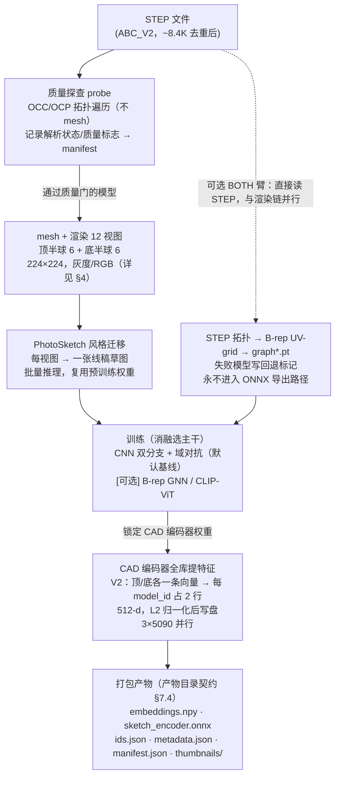


**关键说明：** GNN 及 CAD 编码器的输出（512-d 向量）在建库阶段完成使命后写入 `embeddings.npy`，此后不再参与任何在线路径。`serve` 单元加载的是产物目录，不依赖 Python 环境或 PyG。

---

### 3.3 在线查询数据流

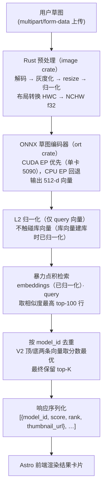


**热路径构成**：一次小 CNN 前向（草图编码器）+ 一次矩阵乘（点积）+ top-K 排序。无数据库查询、无重型框架、无额外网络跳转。单卡 5090 服务端延迟由这两步主导。

---

### 3.4 三单元两契约

系统由三个独立单元组成，通过两条显式契约解耦。

**三单元**

| 单元 | 运行时 | 职责 | 运行阶段 |
|------|--------|------|---------|
| **build** | Python（3×5090） | 数据处理 → 训练 → 全库提特征 → 打包产物 | 离线，按需重跑 |
| **serve** | Rust（axum + ort） | 加载产物目录 → 启动 HTTP 服务 → 处理 `/search` | 在线，持续运行 |
| **frontend** | Astro（Node SSR/静态） | 草图上传 UI → 调 `/search` → 展示结果卡片 | 在线，静态可分离部署 |

**两契约**

| 契约 | 连接方 | 内容 | 详细规格 |
|------|--------|------|---------|
| **产物目录契约** | build ↔ serve | `embeddings.npy` / `sketch_encoder.onnx` / `ids.json` / `metadata.json` / `manifest.json` / `thumbnails/` 的目录结构与文件格式 | §7.4 |
| **`/search` JSON 契约** | serve ↔ frontend | 请求（multipart 草图 + 可选 `top_k`）与响应（`[{model_id, score, rank, thumbnail_url}]`）的 HTTP API 规格 | §7.5 |

**独立替换保证**：任一单元可在不修改其他两个单元的前提下替换。例如，将 `serve` 从 Rust 回退至 FastAPI 逃生舱，只需保持产物目录契约和 `/search` API 不变，`build` 与 `frontend` 无需感知此变化。

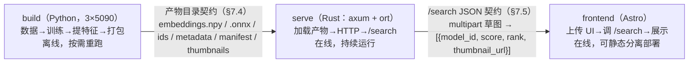

> 两条契约是单元间唯一的耦合面：契约不变，任一单元的内部实现（如 serve Rust↔FastAPI）可独立替换。


---

### 3.5 关键不变量

系统在整个生命周期内必须维持三条不变量。任何违反均视为构建错误，应在 `serve` 启动时或 CI 中检测并报错。

**不变量 1：维度一致**

```
ONNX 编码器输出维度
    == embeddings.npy 的列数
    == manifest.json 中的 dim 字段
```

`serve` 启动时校验（同一校验可在 build 产物后的 CI 中预先运行）上述三者，若不匹配则拒绝启动并输出明确错误信息。防止因建库与导出步骤不同步导致的静默错误。

**不变量 2：归一化位置**

- 库向量（`embeddings.npy`）在建库阶段写盘前已完成 L2 归一化，此后不再修改。
- `serve` 在热路径中只对 query 向量归一化一次，不在运行时对库向量做任何归一化操作。
- 禁止在查询路径中重复归一化或跳过归一化，两者均会破坏点积等价余弦相似度的前提。

**不变量 3：度量一致**

建库时的训练损失度量、全库提特征后的距离度量、`serve` 检索时的点积/距离度量，三处必须使用同一距离函数（cosine/IP 或 L2）。度量由 `manifest.json` 的 `metric` 字段声明，`serve` 读取该字段后按声明执行检索，不允许硬编码覆盖。

---

### 3.6 架构决策记录（ADR 汇总）

| 决策 | 前向理由 | 影响单元 |
|------|---------|---------|
| **不对称架构**：查询侧只跑草图编码器；CAD 侧离线完成 | 热路径缩减至一个小模型前向，使 ONNX 导出、Rust 服务、暴力检索均可成立；复杂模型（GNN、多视图 CNN）只在离线阶段运行，不影响服务延迟 | build、serve、frontend |
| **暴力检索优先**：`embeddings · query` 矩阵乘，不引入 ANN 索引 | 512-d 向量在单卡 GPU 上做暴力点积，到相当大的库规模仍满足延迟要求；避免引入 faiss/ScaNN 等索引的构建、版本和一致性开销；ANN 仅在规模超出暴力检索阈值时作为后续选项 | build（打包格式）、serve（检索逻辑） |
| **Rust 服务 + FastAPI 逃生舱**：默认 Rust/axum + ort，回退 FastAPI | 单二进制、无 GIL、ort 直接加载 ONNX；若 ort CUDA12.8/5090 打包受阻，FastAPI 逃生舱可快速顶上，`/search` API 契约不变，frontend 无感知 | serve |
| **消融驱动选主干**：不预设 CNN/ViT/GNN 优劣，由实验决定 | ~8.4K 量级无充分先验定论；CNN 双分支+域对抗为默认基线，B-rep GNN（BOTH 臂）和 CLIP-ViT+LoRA 为候选上行项；消融结果决定最终 ONNX 导出哪个主干 | build（训练配置）、build（导出步骤） |
| **B-rep GNN 离线-only**：GNN 只参与训练和全库提特征，不导出 ONNX | GNN 计算图依赖 PyG 专有算子，无标准 ONNX 等价表示；其输出已融合为 512-d 向量写入 embeddings.npy，serve 无需感知 GNN 的存在。 | build（GNN 隔离）、serve（不依赖 PyG） |

## 4. 数据管线

### 4.1 原则

本系统的数据管线并行维护两条产出同构数据的路径。**既有工具链路径**使用已集成、已验证的工具（含商业软件环节），覆盖 8.4K 数据集的生产；它产出完整的 `views/`、`sketches/`、`graph*.pt`，是当前数据集的生产路径。

**开源兼容层路径**为每个商业/专有环节提供开源等价实现，覆盖需要完全开源可复现的场景（无商业工具许可的环境、独立复现、规模扩展）。两条路径可按工具可用性自由选择，互为备份。

**两条路径产出同构数据**：目录布局、文件命名、张量格式完全一致（同样的 `views/<model>/`、`sketches/<model>/`、`graph*.pt` 结构），下游训练单元无需感知当前数据来自哪条路径。

两条路径的定位：

| 路径标签 | 适用场景 | 核心工具 |
|----------|----------|----------|
| **既有工具链路径**（商业工具路径） | 商业工具许可可用的环境；已集成验证的生产路径 | Crossmanager、Sketch3DToolkit、PhotoSketch |
| **开源兼容层** | 需完全开源可复现的环境；独立复现与规模扩展 | OCC/OCP、moderngl/pyrender、PhotoSketch（开源版） |

---

### 4.2 管线步骤与双路径

下表按步骤顺序列出整条管线，每步注明两条路径的具体工具与产物。

| 步骤 | 既有工具链路径（8.4K 沿用） | 开源兼容层（扩规模） | 产物 |
|------|-----------------------------|----------------------|------|
| **① 下载** | 校内网盘已有完整 ABC STEP 文件；直接挂载或拷贝至 `~/data/raw/step/` | `download.py`：从 ABC 官方 7z 分包下载，SHA-256 逐包校验，支持断点续传与代理 | `~/data/raw/step/**/*.step` |
| **② 去重 1（按文件大小）** | `FindDuplicatesByFileSize.ps1`：按字节数聚组，同组保留首个 | 同脚本跨平台 Python 等价实现（`os.stat` 遍历） | `~/data/interim/deduplicate1.txt`（剔除列表） |
| **③ 去重 2（按 JSD 散度）** | `FindDuplicatesByJSD.py`：对保留集计算面积/曲率 JSD，高相似对剔除次项 | 沿用同一脚本（已开源） | `~/data/interim/deduplicate2.txt`（剔除列表） |
| **④ 质量探查** | `download-probe`：拓扑遍历读取 `n_faces`、`file_size`、实体数，写 manifest | 同 `download-probe`；manifest 格式与既有路径一致 | `~/data/interim/manifest.lance`（含 `render_eligible` 标志） |
| **⑤ STEP → mesh** | Crossmanager（商业软件）：STEP → OBJ；`tools.py`：OBJ → OFF | OCC/OCP `STEPControl_Reader`：STEP → STL/OBJ → OFF；自动补全 OFF 转换 | `~/data/processed/off/<model>.off` 或 `mesh/<model>.*` |
| **⑥ 渲染视图** | Sketch3DToolkit：12 视图，顶 6 + 底 6，224×224 px，每视图 PNG | `moderngl` / `pyrender`：相同相机位姿矩阵，相同分辨率与命名约定 | `~/data/processed/views/<model>/<model>_{0..11}.png` |
| **⑦ 草图生成** | PhotoSketch 预训练 GAN，纯推理模式，对每视图做风格迁移 | 同 PhotoSketch 开源版（GitHub 官方仓库），推理脚本相同 | `~/data/processed/sketches/<model>/<model>_{0..11}.png` |
| **⑧ B-rep 图提取** | STEP 拓扑 → UV-grid 图；见 §4.4 规格 | OCC 拓扑遍历 + UV 采样；同规格，见 §4.4 | `~/data/processed/graph_train.pt` / `graph_test.pt` |
| **⑨ 切分** | `data_process.py`：10:2 比例，顶/底各保留 1 张 test 视图 | 沿用同脚本；评估协议对齐见 §6 | `~/data/processed/train/` / `test/` 子目录索引 |

**双路径汇入同构产物**（两条路径分别覆盖不同工具可用性场景，产出布局完全一致，下游训练无感来源）：

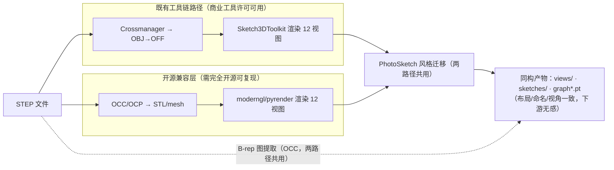

**目录树（落盘布局）：**

```
~/data/
├── raw/
│   └── step/                   # 原始 STEP 文件（按 ABC chunk 子目录）
│       └── <chunk>/
│           └── <model>.step
├── interim/
│   ├── deduplicate1.txt        # 去重1 剔除列表
│   ├── deduplicate2.txt        # 去重2 剔除列表
│   └── manifest.lance/         # 质量 manifest（LanceDB 格式）
└── processed/
    ├── off/                    # mesh 中间体
    │   └── <model>.off
    ├── views/                  # 多视图渲染
    │   └── <model>/
    │       ├── <model>_0.png
    │       ├── <model>_1.png
    │       └── ... (共12张)
    ├── sketches/               # 草图（与 views 一一对应）
    │   └── <model>/
    │       ├── <model>_0.png
    │       └── ... (共12张)
    ├── graph_train.pt          # B-rep 图（训练集）
    ├── graph_test.pt           # B-rep 图（测试集）
    ├── train/                  # 训练集索引
    └── test/                   # 测试集索引
```

---

### 4.3 视图与草图布局约定

#### 视图编号

每个模型渲染 **12 张视图**，按半球划分：

| 编号范围 | 所属半球 | 说明 |
|----------|----------|------|
| 0–5 | 顶半球（top） | 相机位于模型上方，6 个均匀方位角 |
| 6–11 | 底半球（bottom） | 相机位于模型下方，6 个均匀方位角 |

文件命名：`<model>_<idx>.png`，`idx` 为 0-based 整数，零填充无需统一（与既有工具链路径保持一致）。

#### 草图编号

草图与视图**一一对应**：`sketches/<model>/<model>_<idx>.png` 对应 `views/<model>/<model>_<idx>.png`，相同的 `idx`，相同的半球归属。PhotoSketch 对每张视图独立做风格迁移，不做跨视图融合。

#### 训练时采样逻辑

1. 从当前模型的草图库中**随机取一张草图**，编号为 `idx`。
2. 依 `idx` 判断所属半球：`idx < 6` → `from_top=True`；`idx >= 6` → `from_top=False`。
3. 取同半球的 **6 张视图**作为正样本视图组（`from_top=True` 取 views 0–5，否则取 6–11）。
4. CNN 多视图分支对 6 张视图分别提取特征后 **max-pool 为单条 512-d 特征向量**。

#### 检索时的双特征机制

检索时对每个入库模型**分别产出顶/底两条特征向量**，各自写入检索库。这直接导致 `deduplicate_ratio=2`（每个物理模型占用 2 条库条目）。查询时，草图推理路径依同样规则判 `from_top`，只对对应半球的库条目做检索。

来源确认：`deduplicate_ratio=2` 来自 Gitee `model-retrieval` 仓库 `data_process.py` 中的数据集构造逻辑，与上述半球双特征机制一致。

---

### 4.4 B-rep 图提取规格（最主要补全项）

#### ComplexGNN 期望的图结构

以下维度来自 `ComplexGNN/baseline.py` 及 `complex_gnn.py` 中对 `torch_geometric.data.Data` 的显式维度期望，**不是估计值**：

| 张量字段 | 形状（每模型） | 含义 |
|----------|---------------|------|
| `x`（node_attr） | `[N_face, 14]` | 面属性：`node_attr_dim=14`，包含面类型编码与几何参数属性（来自 ComplexGNN/baseline.py） |
| `x_grid`（node_grid） | `[N_face, 7, U, V]` | 面 UV-Net 风格网格，`node_grid_dim=7` 通道（来自 ComplexGNN/baseline.py） |
| `edge_attr` | `[N_edge, 15]` | 边属性：`edge_attr_dim=15`，包含邻接关系与几何属性（来自 ComplexGNN/baseline.py） |
| `edge_grid` | `[N_edge, 12, L]` | 边曲线 UV 网格，`edge_grid_dim=12` 通道（来自 ComplexGNN/baseline.py） |
| `edge_index` | `[2, N_edge]` | COO 格式面邻接关系 |

`N_face`、`N_edge`、`U`、`V`、`L` 均随模型几何复杂度变化，非固定值。

> **张量秩差异说明**：`node_grid`（`x_grid`）为 4D 张量、`edge_grid` 为 3D 张量，差异出于设计：面是 2D 参数曲面（UV 双向网格），边是 1D 参数曲线（单向 L 点采样），故 node_grid 需要 `[N_face, 7, U, V]` 四维，edge_grid 只需 `[N_edge, 12, L]` 三维。

#### 提取流程

提取器的处理步骤（plan 级描述，不贴实现代码）：

1. **读取 STEP**：OCC `STEPControl_Reader` 读入，`TransferRoot` + `Shape` 获取顶层 TopoDS_Shape。
2. **拓扑遍历**：`TopExp_Explorer` 分别遍历所有 `TopoDS_Face`（节点）和 `TopoDS_Edge`（边），建立 face-index 与 edge-index 映射。
3. **面属性提取**：对每个面，提取面类型（平面/柱面/锥面/环面/NURBS 等）的 one-hot 编码及几何参数，拼接为 14-d 向量。
4. **面 UV 网格采样**：对每个面，在 UV 参数域均匀采样网格点，计算 7 通道几何量（坐标 xyz + 法向量 nxnynz + 掩码），产出 node_grid 张量。
5. **边属性提取**：对每条边，提取邻接面对索引及边几何属性，产出 15-d 向量。
6. **边曲线 UV 网格采样**：对每条边曲线，均匀采样 L 个点，计算 12 通道几何量，产出 edge_grid 张量。
7. **构造 Data 对象**：将以上字段打包为 `torch_geometric.data.Data`，附加 `name` 字段。
8. **聚合写出**：多个 Data 对象聚合为 list，按训练/测试切分分别保存为 `graph_train.pt` / `graph_test.pt`。

#### 命名对齐

`inference.py` 在图检索时对图名做 `name.replace('step', 'trimesh')` 来与 `views/`、`sketches/` 的子目录名对齐。提取器写入 `name` 字段时**须遵循相同约定**，确保推理时替换后能正确找到对应的视图/草图目录。

建议 `name` 格式：`<model_id>.step`，使得 `replace('step', 'trimesh')` 后得到 `<model_id>.trimesh`，与 `views/<model_id>.trimesh/` 目录名一致（或按既有工具链路径的实际命名约定对齐，以已有 `views/` 目录名为准）。

#### 图提取失败处理

图提取失败（OCC 解析报错、拓扑退化、UV 采样异常等）的模型：

1. 将 `model_id` 的终态写入 manifest（`graph_status=cnn_only_fallback`），失败原因记入 `graph_error` 字段。
2. 该模型在 BOTH 消融分支中**回退为 CNN-only 模式**：图特征分支输出置零，与 CNN 特征 concat 后正常参与训练与检索。
3. **绝不丢弃该模型**：CNN 特征仍有效，该模型在检索库中保留完整条目。

图提取失败的模型由 manifest 的 `graph_status = cnn_only_fallback` 字段标识；训练单元的 data loader 据此字段识别缺图模型，在 BOTH 分支按目标形状零填充其图特征，无需在 `graph*.pt` 中占位。

回退可行性依据：ComplexGNN BOTH 分支的特征融合为 concat 结构，图特征子向量置零不影响 CNN 子向量的梯度与推理，concat 总维度保持不变。

---

### 4.5 质量筛选与失败清单（显式可复现）

#### 核心原则

质量筛选必须满足以下四条：

- **显式**：每个筛选决定有明确记录，可查询是哪条规则导致剔除。
- **廉价**：probe 阶段只做拓扑遍历，不做渲染或 mesh 生成，单模型耗时可控。
- **可解释**：筛选条件为人类可读的标志位（`too_complex`、`no_solid`、`degenerate`），而非隐式 timeout。
- **可复现**：给定同一 STEP 文件，probe 结果确定性一致；阈值存于配置文件，不硬编码。

**质量筛选不能是渲染 timeout 的隐式副产物**：若渲染因超时跳过某模型，该模型必须在 manifest 中显式标注 `render_status=timeout`，而非静默丢失。

#### Manifest 表结构

每个模型在 manifest 中占一行。存储格式为 LanceDB（或等价的可查询列式存储）。

| 字段 | 类型 | 说明 |
|------|------|------|
| `model_id` | string | 唯一标识，与 `views/`、`sketches/` 目录名对齐 |
| `src_path` | string | 原始 STEP 文件绝对路径 |
| `file_size_bytes` | int64 | 文件字节数（去重1依据） |
| `n_faces` | int32 | 拓扑面数（probe 读取，不 mesh） |
| `n_edges` | int32 | 拓扑边数 |
| `n_solids` | int32 | 实体数 |
| `quality_flags` | list\[string\] | 触发的质量标志：`too_complex` / `no_solid` / `degenerate` / `oversized` |
| `render_eligible` | bool | probe 通过后设为 `true`；任一 flag 触发则 `false` |
| `dedup1_status` | string | `kept` / `removed_size_dup` |
| `dedup2_status` | string | `kept` / `removed_jsd_dup` |
| `mesh_status` | string | `done` / `failed` / `skipped` |
| `render_status` | string | `done` / `failed` / `timeout` / `skipped` |
| `sketch_status` | string | `done` / `failed` / `skipped` |
| `graph_status` | string | `done` / `cnn_only_fallback` / `skipped`（`failed` 为待重跑瞬态，终态见 §9.5） |
| `split` | string | `train` / `test` / `excluded` |

> **manifest 字段随单元累积**：本表是核心字段集；Part 9 各单元在其 schema 中追加本单元的状态/错误列（如 download 的 `download_status`/`sha256`、probe 的 `probe_status`/`probe_error`、graph 的 `graph_error`）。完整字段集 = 本表 + 各单元 schema 之并集，以 `model_id` 为主键贯穿。

#### Probe 质量标志规则

| 标志 | 触发条件 | 处理 |
|------|----------|------|
| `too_complex` | `n_faces` 超过上限阈值 | `render_eligible=false`；写入失败清单 |
| `no_solid` | `n_solids == 0` | `render_eligible=false`；写入失败清单 |
| `degenerate` | 拓扑遍历报错或面积为零面比例超限 | `render_eligible=false`；写入失败清单 |
| `oversized` | `file_size_bytes` 超过上限阈值 | `render_eligible=false`；写入失败清单 |

**阈值均为配置项，不硬编码：**

```
n_faces 上限：[待回填 | 回填依据: 首跑后看 n_faces/file_size 真实直方图，取高端长尾截断点]
file_size 上限：[待回填 | 回填依据: 首跑后看 n_faces/file_size 真实直方图，取高端长尾截断点]
```

#### 各阶段写回机制

每个执行单元（mesh、render、sketch、graph）完成或失败后，**立即将状态写回 manifest 对应字段**。写回操作为 upsert，确保中断重跑后状态不丢失。

执行单元可据此按 status 字段过滤需要（重新）处理的模型，实现幂等重跑：

- 只处理 `render_status IS NULL OR render_status = 'failed'` 的行。
- 跳过 `render_eligible=false` 的行（无需尝试渲染）。

#### 失败清单查询示例（意图描述）

- 查 graph 提取失败但 CNN 可用的模型列表：`graph_status = 'cnn_only_fallback'`
- 查渲染 timeout 的模型及其面数：`render_status = 'timeout'`，输出 `model_id, n_faces`
- 查全链路通过的模型数：`split IN ('train', 'test') AND graph_status IN ('done', 'cnn_only_fallback')`

---

### 4.6 数据管线交付物

数据管线阶段结束时，须交付以下四类产物：

**① 完整数据集（8.4K 全量）**

```
~/data/processed/
├── views/                  # 每模型 12 视图，顶0-5底6-11
├── sketches/               # 每模型 12 草图，与 views 一一对应
├── train/                  # 训练集索引（含视图/草图路径列表）
├── test/                   # 测试集索引
├── graph_train.pt          # 训练集 B-rep 图（list of {name, graph}）
└── graph_test.pt           # 测试集 B-rep 图
```

数量预期：去重后约 8,400 个物理模型，每模型 12 视图 + 12 草图。`graph*.pt` 中包含全部可提取图的模型；图提取失败模型以 `cnn_only_fallback` 标注，不写入 `graph*.pt`（训练时置零填充）。

**② Manifest 表（质量 flag + 各阶段 status + 失败清单）**

```
~/data/interim/manifest.lance/
```

manifest 覆盖原始集合中的**所有模型**，包括被去重剔除、质量不合格、各阶段失败的模型，确保全链路可追溯。

**③ 几何复杂度分布直方图**

首次 probe 跑完后，对 `n_faces` 与 `file_size_bytes` 各绘制一张分布直方图，以 PNG 形式保存：

```
~/data/interim/histogram_n_faces.png
~/data/interim/histogram_file_size.png
```

用途：为 §4.5 中两个 `[待回填]` 阈值提供回填依据；同时作为扩规模评估的参考基准（判断新数据集的几何复杂度分布是否与 8.4K 集一致）。

**④ 开源兼容层脚本 + 一致性说明**

开源兼容层脚本纳入仓库版本控制，路径约定：

```
tools/
├── pipeline_oss/
│   ├── step_to_mesh.py         # OCC/OCP STEP→OFF/STL
│   ├── render_views.py         # moderngl/pyrender 渲染 12 视图
│   ├── extract_brep_graph.py   # OCC 拓扑→torch_geometric graph*.pt
│   └── consistency_check.py   # 验证开源路径产物与既有工具链路径产物的结构一致性
└── pipeline_oss/README.md      # 环境依赖、运行命令意图、已知差异说明
```

一致性说明须覆盖：

- 文件命名约定是否与既有工具链路径完全一致（`<model>_<idx>.png` 格式）。
- UV 采样精度/网格大小是否与 ComplexGNN 期望维度对齐。
- 已知可接受差异（如 mesh 面数因工具不同略有差异，但不影响视图渲染一致性）。
- 已知不可接受差异（如 `name` 字段命名规则偏差，会导致 `inference.py` 对齐失败）及修复方式。

---

## 5. 模型与训练

### 5.1 为何不预设主干（前向论证）

本系统数据集规模约 **~8.4K CAD 实例 / ~10 万渲染视图**。这一量级是方法选型的核心支点：足以训练轻量 CNN，不足以让大型 ViT 在无充分预训练迁移的情况下收敛稳定；几何信息（B-rep 图）在 CAD 实例检索中的边际价值尚无在此规模上的定论。因此，**spec 固化"如何决定主干"，而非"决定了什么主干"**。

三个候选的前向定位如下：

| 候选 | 定位 | 风险 |
|------|------|------|
| **CNN 双分支 + 域对抗**（SE-ResNet50 双分支，可选域判别器） | **默认基线**：相近规模草图检索的成熟配方，数据高效，仓库代码已全量支持，有可比部署参考 | 上限受 CNN 感受野约束，精细结构辨别力弱于 Transformer |
| **B-rep 几何（GNN / BOTH 分支）** | **最值得验证的上行项**：CAD 侧输入为精确几何，零草图域差，结构上最可能在实例检索维度赢得增益 | STEP→PyG 预处理一次性成本高；GNN 与 CNN 联合训练需调优 |
| **CLIP-ViT + LoRA** | **风险臂，须先过坍缩探针门**：小规模细粒度集上注意力坍缩风险已知，须以嵌入有效秩与随机对余弦作前置探针；若探针通过则放行，否则保持低优先级 | 注意力坍缩风险；LoRA 超参需额外调优轮次 |

**结论：** 在 ~8.4K 实例量级，主干优劣无先验定论，故由消融经验决定。坍缩探针是针对 CLIP-ViT 臂的**前置风控措施**，而非事后补救。

---

### 5.2 消融轴

完整析因网格为 2×3×2×2 = **24 run**，不全跑。采用**部分析因 + 单轴扫描**策略：每轴至少触碰 2 次，关键轴（草图主干、CAD 分支）优先。

| 消融轴 | 取值 | 仓库支持点 |
|--------|------|-----------|
| **草图主干** | SE-ResNet50 / CLIP-ViT+LoRA | `backbone` 参数；CLIP 臂需对 CNN 分支基类做小幅扩展（接口已预留） |
| **CAD 分支** | CNN-only / GNN-only / BOTH | `branch∈{CNN,GNN,BOTH}` 三路已在仓库中支持；GNN 使用 ComplexGNN |
| **域损失** | 开 / 关 | `WithDomainLoss` 标志 + `domain_discriminator` 模块已支持 |
| **对比损失** | HardTripletMarginLoss / InfoNCE | `utils/loss.py` 两种已实现；HardTripletMarginLoss 为 V2 默认并返回 batch 内 accuracy |

---

### 5.3 阶段化执行 A / B / C / D

消融按 A→B→C→D 四阶段推进，先用 < 1 h 的探针给 CLIP 臂把门，再逐步展开矩阵，最后定稿复现：

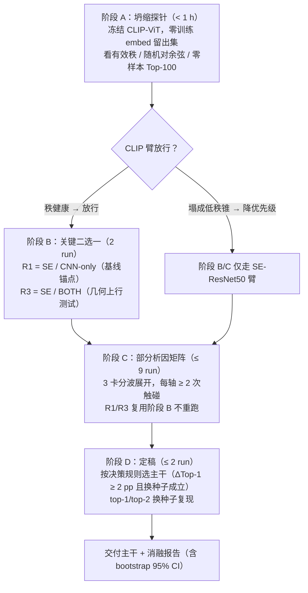

#### 阶段 A — 坍缩探针（< 1 h，先于任何训练）

**目的：** 在任何 GPU 训练资源消耗前，以不到 1 小时的代价判断 CLIP-ViT 臂是否可行。

**操作：**

1. 冻结 CLIP-ViT 权重，**零训练**（不微调）。
2. 对 ~2K 留出草图（不参与训练集）提取嵌入，同时对对应模型视图提取嵌入。此 ~2K 探针留出集为 §5.5 评估 query 集的固定子集（与训练集不重叠），阶段 A 探针与 §5.7 训练中周期探针复用同一集合，确保坍缩判断与最终评估口径一致。
3. 运行 FAISS 暴力检索，记录**零样本 Top-100 召回率**。
4. 计算嵌入矩阵**有效秩**（奇异值能量集中度），以及随机草图对之间的**平均余弦相似度**。

**判据：**

- 若随机对平均余弦 ≥ 0.90（嵌入塌成低秩锥）→ CLIP 臂降低优先级，阶段 C 中 R4/R5/R8/R9 推迟至阶段 C 末尾或跳过。
- 若零样本 Top-100 非平凡（显著优于随机基线）且有效秩健康（能量未高度集中于前 3 奇异向量）→ CLIP 臂放行，阶段 C 正常执行所有 R 编号。

**输出：** `~/data/runs/probe-A/probe_result.json`，记录三项指标及放行/降级决策。

---

#### 阶段 B — 关键二选一（2 run，占 2 卡 ≈ 半日）

**目的：** 以最低风险代码路径回答最关键的设计问题：精确几何（B-rep GNN）是否在实例检索上带来可测量增益？

| Run | 草图主干 | CAD 分支 | 域损失 | 对比损失 | 目的 |
|-----|---------|---------|--------|---------|------|
| **R1** | SE-ResNet50 | CNN-only | 关 | HardTripletMargin | 基线锚点 |
| **R3** | SE-ResNet50 | BOTH（CNN⊕GNN） | 关 | HardTripletMargin | 几何上行测试 |

R1 与 R3 同时在两张卡上运行（各占一卡）。B 阶段结束后即可得到 ΔTop-1(R3−R1)，依据 §5.5 决策规则初步判断 BOTH 分支是否值得在阶段 C 中展开。

---

#### 阶段 C — 按决策规则展开矩阵（≤ 9 run，部分析因）

**目的：** 系统覆盖四个消融轴，每轴至少触碰 2 次；CLIP 臂是否执行依阶段 A 探针结果。

| # | 草图主干 | CAD 分支 | 域损失 | 对比损失 | 目的 |
|---|---------|---------|--------|---------|------|
| **R1** | SE-ResNet50 | CNN-only | 关 | HardTripletMargin | 基线锚点（复用阶段 B） |
| **R2** | SE-ResNet50 | GNN-only | 关 | HardTripletMargin | CAD 分支轴：纯几何 |
| **R3** | SE-ResNet50 | BOTH | 关 | HardTripletMargin | 几何上行（关键，复用阶段 B） |
| **R4** | CLIP-ViT+LoRA | CNN-only | 关 | HardTripletMargin | 草图主干轴（须探针放行） |
| **R5** | CLIP-ViT+LoRA | BOTH | 关 | HardTripletMargin | 双优候选叠加 |
| **R6** | SE-ResNet50 | BOTH | 开 | HardTripletMargin | 域损失轴 |
| **R7** | SE-ResNet50 | BOTH | 关 | InfoNCE | 对比损失轴 |
| **R8** | CLIP-ViT+LoRA | BOTH | 开 | InfoNCE | 叠加最优候选 |
| **R9** | CLIP-ViT+LoRA | GNN-only | 关 | HardTripletMargin | ViT 在纯几何 CAD 侧是否仍有用 |

**执行节奏：** 每波最多 3 run 同时分配到 3 卡（一卡一 run）。R1/R2/R3 第一波；R4/R5/R6 第二波（R4/R5 依探针决策）；R7/R8/R9 第三波。若 CLIP 臂被降级，R4/R5/R8/R9 跳过或延后，阶段 C 实际 run 数可降至 5。

---

#### 阶段 D — 定稿（≤ 2 run，双卡并行 ≈ 半日）

1. 按 §5.5 决策规则在 R1–R9 中选出**最优配置**（及次优备选）。
2. 对最优配置更换随机种子重跑一次（与原 run 双卡并行），验证结果稳定性。
3. 两 run 均通过决策规则 → 以最优配置 checkpoint 作为**交付模型**，导出至 `~/data/runs/final/`。
4. 若换种子后 ΔTop-1 不再成立 → 升级次优配置重复 D 步骤。

---

### 5.4 训练配置基线

以下配置为各消融 run 的共同基线，消融轴之外的超参保持固定。

**预训练骨架**

- SE-ResNet50 路径：`seresnet50.a1_in1k.bin`，partial pretrain（加载 ImageNet 权重，跳过输出头）。
- CLIP-ViT 路径：OpenAI ViT-B/32 公开权重，LoRA 仅注入 Q/V projection（rank 待探针后定）。

**输入预处理**

- 分辨率：224 × 224。
- 草图为单通道灰度图，经 `Grayscale(num_output_channels=3)` 转为 3 通道后输入（与仓库 `abc_transform_v2` 一致）。
- 草图增强（训练时）：随机旋转 ±15°、颜色抖动（亮度/对比度）、随机水平翻转；对应仓库 `abc_transform_v2` 数据增强配置。
- 视图（CAD 渲染图）使用 test transform（无随机增强），保持几何一致性。

**优化器与调度器**

- 使用 `timm.optim.create_optimizer` + `timm.scheduler.create_scheduler`：AdamW 优化器 + cosine LR 衰减。
- 起点学习率：≈ 1e-3（来源：仓库 V2 配置文件，有明确注释）。
- batch size：视显存动态调整；RTX 5090（32 GB）可比仓库默认 batch=32 取更大值（预估 64–128），具体由 M3 消融时实测 OOM 边界确定。

**损失函数**

- 默认：`HardTripletMarginLoss`（V2 默认），batch 内挖掘最难负样本，同时返回 batch 内检索 accuracy 用于训练监控。
- 消融臂：InfoNCE（对称对比损失），在 R7/R8 中替换。

**B-rep 图网络**

- 使用仓库 `ComplexGNN`；`graph_hidden_dim=512`（来源：仓库注释标注为 5090 显存优化推荐值）。
- GNN 前向通过 PyG 完成；STEP→图预处理为**一次性离线**操作，不在每 run 中重复。

**存档与恢复**

- 使用仓库 `trainer.py` checkpoint 机制，每 epoch 保存 `best_model.pth`（按验证集 Top-1 保留最优）。
- 支持断点续训（`--resume` 参数）。
- 导出时使用 `extract_mode='separate'`，分别导出 `sketch_model` 与 `view_model` 两个独立权重文件，供后续 ONNX 转换和服务层使用。

---

### 5.5 评估协议与决策规则

#### 划分策略

**按草图划分，而非按模型划分。**

- Gallery：全部 ~8.4K CAD 模型的视图嵌入（+ B-rep 几何嵌入，若 BOTH 分支）均入库。
- Query：每个模型留出 **1 张草图**作为检索 query（共 ~8.4K query）；其余草图用于训练。
- 划分在所有 run 中保持**完全固定**（固定随机种子生成一次，持久化为 `~/data/eval/query_split.json`）。

**目的：** 实例检索要求每个模型在 gallery 中都有对应项，按草图划分确保 gallery 完整、query 分布真实。

#### 固定协议

跨所有 R1–R9 run 及阶段 D 复现：

- 同一 FAISS 索引（brute-force L2 / 内积，索引结构不变）。
- 同一 query 集（`query_split.json`）。
- 同一随机种子（`seed=42` 默认（种子取任意固定值即可，此处 42/137 仅为示例，关键是跨 run 与跨阶段保持同一组），阶段 D 第二次用 `seed=137`）。

#### 报告指标

报告 Top-1 / Top-10 / Top-20 / Top-50 / Top-100 命中率（Hit@k，即 query 对应的真实模型出现在检索结果前 k 名的比例）。

- **主指标：Top-1**，用于决策规则判断。
- **Top-10：** 平手区分辅助 + 坍缩探测（若 Top-10 远高于 Top-1 但 Top-1 极低，提示嵌入已部分坍缩）。

#### 决策规则

差异判定为"真实差异"的充要条件：

> **ΔTop-1 ≥ 2 绝对百分点**，**且**换第二随机种子（阶段 D）后差异仍成立。

**统计依据（非魔法数）：** 在 ~8.4K query 规模下，bootstrap 95% 置信区间半宽约为 1 个百分点。取 2 倍 CI 半宽作为显著性门槛，即 ΔTop-1 ≥ 2 pp 在此样本量下具有统计可辩护性。所有 run 均报告 bootstrap 95% CI。

**奥卡姆倾向：** 若差异低于此门槛，优先选择**更简单/更便宜**的架构：CNN-only 优于 BOTH；SE-ResNet50 优于 CLIP-ViT+LoRA。

#### 精度目标

Top-1 / Top-10 精度目标：`[待回填 | 回填依据：阶段 B R1 实测基线确立后填入方向性下限]`

---

### 5.6 算力预算（3× RTX 5090）

#### 单 run 时间估算

| 阶段 | 估算 | 备注 |
|------|------|------|
| 阶段 A 坍缩探针 | < 1 h | 零训练，仅推理 ~2K 样本 |
| 单 run（SE-R50 + CNN-only，triplet） | ≈ 2–3 h / run | 骨架基本冻结，数据量小 |
| 单 run（任意配置 + BOTH 分支） | ≈ 2.5–4 h / run | GNN 前向约增加 +30% 时间 |
| STEP→PyG 图预处理（一次性离线） | ≈ 数小时 | 仅执行一次，不计入每 run |
| 阶段 D 换种子复现（2 run 双卡并行） | ≈ 半日 | 与最优配置同时运行 |

#### 3 卡并行编排

**核心原则：单个 run 使用 1 张卡**（数据量级不需要 DDP）。并行收益来自**卡间分配不同 run**，而非单 run 内多卡。

| 阶段 | 并行编排 | 估算墙钟时间 |
|------|---------|-------------|
| **阶段 B**（2 run） | R1 → 卡 0；R3 → 卡 1；卡 2 空闲 | ≈ 半日（取 R3 BOTH 较长者） |
| **阶段 C 第一波**（R1/R2/R3） | R2（新 run）占一卡；R1、R3 复用阶段 B 已完成结果，无需重跑（故第一波实际仅 R2 一个新 run，另两卡可提前启动第二波） | ≈ 4 h（含 R2 完成后即启动第二波） |
| **阶段 C 第二波**（R4/R5/R6，依探针） | 3 run 分占 3 卡（若 CLIP 臂降级则仅 R6 + 补充） | ≈ 4 h |
| **阶段 C 第三波**（R7/R8/R9，依探针） | 3 run 分占 3 卡（若 CLIP 臂降级则减少） | ≈ 4 h |
| **阶段 C 合计** | 3 波 × 3 卡并行 | ≈ 0.5–0.7 天纯算力 |
| **阶段 D**（2 run） | top-1 + top-2 配置各占一卡 | ≈ 半日 |

**单卡基线对照：** 阶段 C 9 run 串行（单卡）≈ 1.5–2 天。3 卡并行将此压缩至 0.5–0.7 天，收益约 3×。

**总体预算（探针通过 CLIP 臂，9 run 满跑）：** 阶段 B + 阶段 C + 阶段 D ≈ **2–3 天墙钟**，含阶段 A 探针和一次性图预处理。若 CLIP 臂降级（仅 5 run），阶段 C 减至 2 波，总计 ≈ **1.5 天**。

---

### 5.7 坍缩与退化检测（贯穿训练）

坍缩是小规模细粒度嵌入训练的主要失效模式。以下检测在**所有 run 中默认开启**，不仅限于 CLIP 臂。

**训练中实时监控**

- `HardTripletMarginLoss` 和 `InfoNCE` 均返回 batch 内检索 accuracy；训练日志按 step 记录，tensorboard 可视化。
- 若 batch accuracy 在前 N epoch 始终 < 随机基线（1/batch_size），视为早期坍缩信号，记录告警。

**周期性留出集探针（每 5 epoch）**

- 对固定留出集（~2K 草图 + 对应视图）提取全量嵌入。
- 计算嵌入矩阵**有效秩**（前 k 奇异值累积能量达 90% 所需的 k）。
- 计算随机草图对平均余弦相似度。
- 若有效秩持续下降（< 10）或随机对余弦持续攀升（> 0.85）→ 停止该 run，记录失效状态，不纳入决策矩阵。（§5.3 阶段 A 的 0.90 是训练前的严格准入门；本节 0.85 是训练中更早触发的退化预警线——训练已投入算力，故宁可更早停训止损。两个阈值的差异是有意为之。）

**硬停止条件**

- Loss 出现 NaN → 仓库已有异常抛出机制，直接停训并记录 checkpoint 状态。
- 连续 10 epoch validation Top-1 无改善且绝对值低于随机基线 → 视为训练失效，提前终止。

**产物**

每 run 在 `~/data/runs/<run_id>/collapse_log.json` 中记录每次周期探针的三项指标，供阶段 D 定稿时回溯参考。

---

## 6. 评估协议

> 本节固化评估对象、划分协议、目标指标（数据驱动留白 + 相对止损线）、统计方法与坍缩检测规范。Part 9 train / build-artifact 单元的验收标准以本节为准。

---

### 6.1 评估对象

评估分**两类**，重要性不同，测量时机不同。

#### 6.1.1 离线检索评估（主，贯穿全训练流程）

**定义：** 在固定 gallery（全部 ~8.4K CAD 模型的嵌入库）上，用留出 query 草图集跑全库最近邻检索，计算 Hit@k 命中率。

**用途：**

- **选主干**：阶段 B / C 各配置的 Top-1 直接进入 §5.5 决策矩阵，决定进入阶段 D 的候选。
- **定阈值**：阶段 B R1 的实测基线值是 §6.3 所有止损线的绝对锚点，回填后固化进本节表格。
- **触发回退**：任意候选配置的 Top-1 低于基线锚点 ΔTop-1 ≥ 2 pp，即依 §6.3 止损规则触发 Part 10 记录。

**执行频率：** 每 run 完成训练后执行一次完整评估；阶段 D 换种子复现时再执行一次，共两次（seed=42 + seed=137）。

**标准输入：**

| 项目 | 描述 |
|------|------|
| Gallery 嵌入库 | 全部 ~8.4K 模型视图嵌入（BOTH 分支时还包含 B-rep 几何嵌入） |
| Query 草图集 | `~/data/eval/query_split.json` 固化的留出集，~8.4K 条 |
| 索引结构 | FAISS flat（暴力搜索），离线评估不使用近似索引 |
| 度量函数 | 由 `manifest.metric` 声明，triplet 损失配置→ L2，InfoNCE/cosine 配置 → 内积（IP）；三处一致：建库、训练、检索 |

#### 6.1.2 真实草图小评估（辅，部署可用性信号）

**定义：** 收集 30–50 张**人工手绘**草图，每张标注其对应的 CAD 模型 ID，在同一 gallery 上跑检索，计算 Hit@10。

**用途：**

本评估是"训练分布 vs 部署分布"差异的**早期前向信号**。PhotoSketch 生成的合成草图与真实手绘草图在线条风格、噪声模式、笔划不完整程度上存在系统性差异；在合成草图上训练的模型投入实际使用时，这一差异决定了系统的实际可用性。真实草图小评估量化该差距，为部署决策提供依据。

**执行时机：** 仅在阶段 D 定稿配置确定后执行一次（非每 run 重复）。

**结果用途：**

- 报告"合成草图 Top-10"与"真实草图 Top-10"的绝对差距（Δ pp），写入交付报告。
- 该差距是**部署可用性参考值**，不触发配置回退（样本量 30–50 张，统计置信不足以作为决策门槛）。
- 若差距超出预期，记录为部署风险，在 Part 10 风险登记册中标注。

**手绘草图来源：** 由项目成员手绘，覆盖多类 CAD 形状（方形、圆柱、异形零件等），标注格式与 `query_split.json` 一致（`query_id`、`model_id`）。

---

### 6.2 划分与协议（固化为评估规范）

本节是 §5.5 划分策略的**评估侧固化版本**，明确执行规范。本节固化评估执行规范（指标如何计算与报告）；§5.5 与本节描述同一评估协议，二者一致。若就评估指标的计算/报告口径出现表述差异，以本节为准。

#### 6.2.1 Gallery 构成

| 字段 | 规格 |
|------|------|
| 模型总量 | ~8,422 模型（ABC_V2 去重后，来源：Gitee model-retrieval 仓库 ABC chunk1 去重，去重比 ratio=2） |
| 视图嵌入 | 每模型 12 视图（顶 6 + 底 6），全部入库 |
| B-rep 几何嵌入 | 仅 BOTH 分支配置时追加；CNN-only 配置时 gallery 仅含视图嵌入 |
| 检索单位 | 以 **model_id** 为单位；多视图 / 多几何特征归属同一 model_id |

**去重聚合规则：** 检索时先取 top-(ratio × k) 个候选，ratio=2（即取前 2k 个），再按 model_id 聚合取最优分数，最终保留 top-k 个不重复模型。ratio=2 是 ABC_V2 去重比的实测值，来源同上。

#### 6.2.2 Query 集

| 字段 | 规格 |
|------|------|
| 数量 | ~8.4K query（每个 CAD 模型恰好留出 1 张草图） |
| 留出方式 | 每模型从合成草图集中随机留出 1 张；其余草图用于训练 |
| 选取倾向 | 优先混合顶视图草图与底视图草图，使 query 分布覆盖两类视角；具体比例在生成时记录至 `query_split.json` |
| 持久化 | `~/data/eval/query_split.json`，生成一次，跨所有 run **固定不变** |
| 随机种子 | 划分生成时使用 seed=42；文件落盘后不再依赖种子（文件即固化） |

#### 6.2.3 索引与度量

| 项目 | 离线评估规范 |
|------|-------------|
| 索引结构 | FAISS IndexFlatL2 或 IndexFlatIP（暴力搜索，无近似误差） |
| 度量选择 | 由 `manifest.metric` 字段声明：`"l2"` 或 `"ip"` |
| 三处一致性 | 建库脚本、训练损失函数、检索脚本均读取同一 `manifest.metric`，不允许三处分别硬编码 |
| 嵌入归一化 | InfoNCE / cosine 配置时嵌入在入库前做 L2 归一化，使内积等价于余弦相似度；triplet 配置不归一化 |

#### 6.2.4 报告指标集

对每个 run 报告以下全套指标，不得仅报告 Top-1：

| 指标 | 说明 |
|------|------|
| **Top-1** | 主决策指标，进入 §5.5 决策矩阵 |
| **Top-10** | 平手区分辅助；坍缩探测（若 Top-10 >> Top-1 且 Top-1 极低，提示嵌入部分坍缩） |
| Top-20 | 辅助分布理解 |
| Top-50 | 辅助分布理解 |
| Top-100 | 辅助分布理解 |
| **Bootstrap 95% CI** | 对所有 Hit@k 均报告，采样单位为 query（见 §6.4） |

---

### 6.3 目标指标（数据驱动留白 + 相对止损线）

> **核心约定：本节不预设任何魔法数字。** 所有绝对精度目标在阶段 B R1 完成后由实测基线回填；在回填完成之前，系统行为以相对止损线（见下）为准。

#### 6.3.1 方向性目标表

下表给出各指标的方向性目标；`[待回填]` 项在阶段 B R1 评估完成后由工程师填入实测值并提交 spec 更新。

| 指标 | 方向性目标 | 回填状态 |
|------|------------|----------|
| **Top-1（合成草图，阶段 B R1 基线）** | 经评审认可的可运作水平，作为后续所有配置的绝对锚点 | `[待回填 \| 回填依据：阶段 B R1 实测基线]` |
| **Top-1（合成草图，最优配置）** | ≥ 阶段 B R1 基线，且消融决策规则选出（ΔTop-1 ≥ 2 pp 有意义差异） | `[待回填 \| 回填依据：阶段 C/D 消融结果]` |
| **Top-10（合成草图，最优配置）** | 显著高于 Top-1（Top-10 远高于 Top-1 是正常的；若 Top-10 ≈ Top-1，提示嵌入坍缩） | `[待回填 \| 回填依据：同 Top-1 最优配置]` |
| **Top-10（真实手绘草图）** | 报告与合成草图 Top-10 的绝对差距（Δ pp），作为部署可用性参考；不设硬性通过门槛 | `[待回填 \| 回填依据：阶段 D 定稿后真实草图小评估]` |
| **p95 检索延迟** | 交互级（具体数值见 Part 7 §7.x 服务性能目标） | 以 Part 7 为准 |

#### 6.3.2 相对止损线（立即生效，无需等待回填）

以下止损线不依赖绝对数字，在阶段 B R1 实测基线确立前即可执行：

**主止损线：**

> 若任意候选配置（R2–R9）的 Top-1 低于**阶段 B R1 实测基线锚点** 达 **ΔTop-1 ≥ 2 pp**，该配置即触发回退，不进入阶段 D，并在 Part 10 风险登记册中记录。

**统计依据（非魔法数）：** 在 ~8.4K query 规模下，bootstrap 95% CI 半宽约为 1 pp（来源：§5.5 决策规则）。取 2 倍 CI 半宽作为显著性门槛，即 ΔTop-1 ≥ 2 pp 在此样本量下具有统计可辩护性。

**阶段 D 换种子止损：**

> 阶段 D 换 seed=137 复现时，若最优配置的 Top-1 相对 seed=42 结果波动超过 2 pp，视为复现不稳定，记录告警，不直接触发回退但需人工审核。

#### 6.3.3 最终交付阈值的确定方式

**最终交付阈值 = 阶段 B 实测基线 + 消融决策规则选出的最优配置实测值**，写入交付报告。具体流程：

1. 阶段 B R1 完成 → 回填 §6.3.1 表格中"阶段 B R1 基线"行。
2. 阶段 C 完成 → 依 §5.5 决策规则选出最优配置 → 回填"最优配置"行。
3. 阶段 D 换种子复现通过 → 最终交付阈值确定，写入 Part 12 交付清单。

---

### 6.4 统计方法

#### 6.4.1 Bootstrap 置信区间

**计算对象：** 所有 Hit@k 指标（Top-1 / Top-10 / Top-20 / Top-50 / Top-100）均报告 bootstrap 95% CI。

**采样单位：** 以单条 **query** 为采样单位对 query 集进行有放回重采样，而非对模型或视图重采样。

**操作规范：**

| 参数 | 规格 |
|------|------|
| 重采样次数 | 1,000 次（默认）；若需更紧 CI 可提至 5,000 |
| CI 类型 | 百分位法（percentile bootstrap），取 2.5% 和 97.5% 分位 |
| 随机种子 | bootstrap 采样使用固定种子，与训练种子独立，记录至评估日志 |
| 报告格式 | `Hit@k = X.X% [95% CI: A.A%–B.B%]` |

**半宽预估：** 在 ~8.4K query 规模下，Hit@k 的 bootstrap 95% CI 半宽约为 1 pp（与 §5.5 一致）。当两配置的 Top-1 差值超过 2 pp（即 2 倍 CI 半宽），判定为真实差异。

#### 6.4.2 ΔTop-1 ≥ 2 pp 判据的使用规范

- 比较对象：任意候选配置 vs 阶段 B R1 基线，或任意两配置之间（阶段 C 内部比较）。
- 判定一个架构差异为"真实"需同时满足两个**必要条件**：① ΔTop-1 ≥ 2 pp；② 在阶段 D 换第二随机种子（seed=137）后该差异仍成立。两条件缺一不可（即二者的合取为判定的充分条件）。
- 奥卡姆倾向：若差异低于 2 pp，优先选更简单架构（CNN-only 优于 BOTH；SE-ResNet50 优于 CLIP-ViT+LoRA）。

#### 6.4.3 换种子复现要求

**目的：** 排除随机初始化带来的偶然性，确认最优配置的优势不依赖特定种子。

| 要求 | 规格 |
|------|------|
| 种子组合 | seed=42（阶段 B/C 全程）+ seed=137（阶段 D 复现） |
| 复现范围 | 仅最优配置 + top-2 配置（不重跑全部 9 run） |
| 通过判据 | seed=137 下 Top-1 与 seed=42 结果差异 < 2 pp |
| 记录 | 两次结果并列写入交付报告，差值明确标注 |

#### 6.4.4 坍缩量化指标的报告方式

以下两项坍缩量化指标需在每次周期评估中计算并记录：

**有效秩（Effective Rank）**

- 定义：嵌入矩阵奇异值分解后，前 k 个奇异值的累积能量达 90% 所需的最小 k 值。
- 报告格式：`effective_rank = k`（整数）；趋势曲线按 epoch 绘制。
- 健康水平：数值明显大于 1，具体下限见 §6.5.2 评估侧判据。

**随机对平均余弦相似度（Mean Pairwise Cosine of Random Pairs）**

- 定义：从嵌入集中随机采样若干对（不同模型的草图 / 视图嵌入），计算余弦相似度均值。
- 采样数量：每次探针采样 1,000 对。
- 报告格式：`mean_random_cosine = X.XX`；趋势曲线按 epoch 绘制。
- 健康水平：接近 0 表示嵌入空间均匀分布；持续接近 1 表示坍缩。

---

### 6.5 坍缩与退化检测（评估侧固化）

> 本节与 §5.7 呼应，但侧重点不同：§5.7 描述训练侧的检测机制；**本节将其固化为评估规范**，规定**何时测、测什么、判据是什么**，使评估行为在所有 run 中可审计、可复现。

#### 6.5.1 训练中实时监控（评估视角的规范）

**测量时机：** 每个训练 step 记录 batch 内检索准确率（由损失函数返回）。

**判据：**

| 信号 | 判据 | 动作 |
|------|------|------|
| batch 内检索准确率 < 随机基线（1/batch_size）持续 ≥ 前 N epoch 全程 | 早期坍缩信号 | 记录告警至 `collapse_log.json`；不立即停训，等待周期性探针确认 |
| Loss 出现 NaN | 硬停止 | 立即停训，记录 checkpoint 状态，该 run 标记为 FAILED，不纳入决策矩阵 |
| 连续 10 epoch validation Top-1 无改善且绝对值低于随机基线 | 训练失效 | 提前终止，记录，不纳入决策矩阵 |

**可视化：** batch accuracy 和 loss 趋势通过 tensorboard 可视化，路径 `~/data/runs/<run_id>/tb_logs/`。

#### 6.5.2 周期性留出集探针（评估侧规范）

**执行频率：** 每 **5 epoch** 执行一次，覆盖所有 run（不仅限于 CLIP 臂）。

**探针输入：** 固定留出集（~2K 草图 + 对应视图嵌入），从 `query_split.json` 中抽取子集，生成一次后固定。

**测量项目与判据：**

| 测量项 | 计算方式 | 退化判据 | 动作 |
|--------|----------|----------|------|
| 有效秩 | 嵌入矩阵 SVD，前 k 奇异值累积能量达 90% 的 k 值 | 持续下降且 < 10 | 停止该 run，记录 COLLAPSED，不纳入决策矩阵 |
| 随机对平均余弦 | 随机采样 1,000 对，计算余弦均值 | 持续攀升且 > 0.85 | 同上 |
| Validation Top-1 | 对留出集跑全量检索 | 连续 10 epoch 无改善且低于随机基线 | 提前终止，记录 FAILED |

> **阈值说明：** §5.3 阶段 A 坍缩探针使用随机对余弦 > 0.90 作为训练前的严格准入门；本节 0.85 是训练中更早触发的退化预警线。两处阈值的差异是有意为之：训练已投入算力，故宁可以更低阈值更早止损。

#### 6.5.3 产物规范

每 run 产生以下评估侧产物，路径和格式固化，不允许各 run 自行约定：

| 产物 | 路径 | 格式 | 内容 |
|------|------|------|------|
| 周期探针日志 | `~/data/runs/<run_id>/collapse_log.json` | JSON 数组，每条对应一次探针 | epoch、effective_rank、mean_random_cosine、val_top1、状态标记 |
| 完整评估结果 | `~/data/runs/<run_id>/eval_results.json` | JSON | Top-1/10/20/50/100 + bootstrap 95% CI，seed，run_id，manifest_metric |
| Tensorboard 日志 | `~/data/runs/<run_id>/tb_logs/` | tfevents | batch accuracy、loss、学习率曲线 |

**`collapse_log.json` 最小 Schema：**

```json
{
  "run_id": "string",
  "seed": 42,
  "entries": [
    {
      "epoch": 5,
      "effective_rank": 38,
      "mean_random_cosine": 0.12,
      "val_top1": 0.231,
      "status": "ok"
    }
  ]
}
```

（`status` 取值：`"ok"` / `"warn"` / `"collapsed"` / `"failed"`）

#### 6.5.4 与 Part 10 的联动

任意 run 的 `collapse_log.json` 中出现 `"status": "collapsed"` 或 `"status": "failed"` 条目，需在 Part 10 风险登记册对应风险项下记录：run_id、失效 epoch、失效指标值，供事后分析。

---

## 7. 部署与服务

本节覆盖从 PyTorch 模型导出到线上服务的完整路径，包括 ONNX 导出规格、向量检索方案、产物交接契约、API 全契约、前端集成、安全要求和回退判定。Part 9 的 build-artifact / serve / frontend 三个执行单元直接据本节展开。

---

### 7.1 推理路径（PyTorch → ONNX）

#### SE-ResNet50 草图编码器导出

SE-ResNet50 草图编码器的计算图由纯 conv / BN / ReLU / SE（squeeze-excitation）/ 池化 / linear 算子构成，所有算子均有成熟 ONNX 映射，导出路径干净。

导出规格：

| 参数 | 值 |
|------|----|
| opset | 17 或以上 |
| 动态轴 | 仅 batch 维（axis 0） |
| H / W | 固定 224 × 224 |
| 输入 dtype | float32，NCHW |
| 输出 dtype | float32，shape [batch, 512] |

导出后必须执行 **PyTorch ↔ ONNX 数值对齐测试**，通过条件：

- 同批次输入的 mean cosine similarity > 0.999
- top-K 排名完全一致（以 K=10 为基准）

两项均通过才允许将该 .onnx 文件纳入产物。

#### CLIP-ViT + LoRA（若消融选中）

若消融结果选定 CLIP-ViT+LoRA 主干，导出前必须先执行 `merge_and_unload()`，将 LoRA adapter 权重合并回基座，产出一个**单一标准 ViT 权重**，再对这个合并后的模型执行 ONNX 导出。严禁将 adapter 作为独立分支挂在导出图之外——双分支结构会让 serve 侧依赖训练框架，破坏单二进制部署目标。

导出附加约束：

- 输入固定方形尺寸，不开启动态分辨率
- 关闭所有异型 attention kernel（flash-attention、memory-efficient attention 等），确保算子落在标准 ONNX MultiHeadAttention / MatMul 路径上
- 同样执行上述数值对齐测试，通过后方可放行

#### B-rep GNN 确认离线-only

B-rep GNN（PyG 实现）中的 `scatter_reduce` 等图聚合算子是 ONNX 的雷区——PyG 的图形聚合没有官方 ONNX 算子映射，强行导出会产生不可维护的自定义 op 或导出失败。

**B-rep GNN 严格限定为离线建库阶段使用**：在建库时对 CAD 文件提取几何特征向量，将结果向量写入 embeddings.npy，此后 GNN 不参与任何在线推理路径，永不进入 ONNX 图，永不出现在 Rust serve 进程中。

#### 关于"烘进图"

首版不做任何算子烘焙（graph constant folding / operator fusion by hand）。归一化层（减均值除标准差）可在后期以 2 个前缀算子（Sub + Div）折叠进图，作为可选优化项，但不是 V1 的交付条件。

---

### 7.2 向量检索

#### 首版：暴力点积

建库阶段对所有向量做 L2 归一化，serve 阶段只执行点积（等价于 cosine similarity），取 top-K。

```
score[i] = embeddings[i, :] · query[:]   # embeddings 已 L2 归一化，query 已 L2 归一化
```

实现形式：在内存中加载 `embeddings.npy`（float32 [N, 512] 行主序），推理时做单次矩阵-向量乘，argsort 取 top-K。

#### 规模阈值与 ANN 切换

512 维暴力点积的实际规模上限有来源依据：usearch 文档和 FAISS 基准测试均表明，512 维、CPU 端、百万量级时暴力检索延迟在毫秒到十几毫秒区间，GPU 端（单卡）几乎可以无限扩展到本系统可触及的库规模。[待回填|回填依据：实测 N=8K/100K/1M 三档延迟后补充]

切换判定规则：

- N ≤ ~1M，或 serve 在 GPU 上执行：保持暴力点积
- N 超过 ~1M **且** CPU 受限（serve 必须跑在纯 CPU 环境）：引入 ANN

ANN 选型：**usearch**（Rust 原生 crate，支持 cosine / IP 距离）。不在 Rust 侧集成 FAISS——FAISS 的 Rust 绑定维护状态弱，在 Windows / Linux 混合环境下链接问题频发。

#### V2 视角去重

V2 扩展时，同一模型的顶视角和底视角可能各自出现在检索结果中。去重逻辑在 top-100 候选之上执行（按 model_id 折叠，保留最高分视角），与底层是否使用 ANN 无关。

---

### 7.3 服务形态（Rust / axum）

#### 启动加载序列

服务启动时按以下顺序加载产物：

1. 读取 `manifest.json`，提取 schema_version / dim / metric / count / preprocess 参数
2. 加载 `sketch_encoder.onnx`（ort crate，优先 CUDA EP，CUDA EP 不可用时自动回退 CPU EP）
3. mmap 打开 `embeddings.npy`，验证 shape [N, dim]
4. 加载 `ids.json` 和 `metadata.json` 到内存
5. 执行**启动完整性校验**（见下节）

#### 启动完整性校验

校验失败时拒绝启动，输出明确错误信息：

| 校验项 | 期望值 | 失败动作 |
|--------|--------|----------|
| ONNX 模型输出维度 | == manifest.dim（dim 运行时从 manifest 读取，不在代码中硬编码） | panic，拒启动 |
| embeddings.npy 列数 | == manifest.dim（dim 运行时从 manifest 读取，不在代码中硬编码） | panic，拒启动 |
| embeddings.npy 行数 | == ids.json 长度 | panic，拒启动 |
| manifest.metric | "ip" 或 "l2" | panic，拒启动 |
| manifest.schema_version | 已知版本号 | panic，拒启动 |

#### HTTP 端点

| 方法 | 路径 | 功能 |
|------|------|------|
| GET | `/healthz` | 就绪探针；启动校验通过后返回 200 + `{"status":"ok", "artifact_version":"<manifest.schema_version>"}` |
| POST | `/search` | multipart 草图上传 → 编码 → 检索 → 返回 top-K JSON |
| GET | `/models/:id/thumbnail` | 返回指定 model_id 的缩略图（路径白名单校验） |

#### Rust 端预处理

预处理完全在 Rust 侧执行（`image` crate），不依赖 Python 运行时：

1. 解码上传图片（MIME 白名单，解码后分辨率上限校验）
2. 转灰度（channels 由 manifest.preprocess.channels 决定）
3. resize 到 manifest.preprocess.input_size（[224, 224]），resize_mode 由 manifest 指定
4. 归一化：`(pixel - mean) / std`，参数来自 manifest.preprocess
5. 转 NCHW float32 tensor，送入 ONNX 推理

所有预处理参数**均来自 manifest.json**，serve 二进制不硬编码任何数值。

---

### 7.4 产物交接契约（build → serve，全 schema）

#### 产物目录树

```
artifact/
├── manifest.json          # 版本门，serve 启动第一读
├── sketch_encoder.onnx    # 草图编码器，opset 17+
├── embeddings.npy         # float32 [N, 512]，L2 归一化，行主序
├── ids.json               # [N] 字符串，row index → model_id
├── metadata.json          # model_id → 元数据对象
└── thumbnails/
    ├── <model_id>_top.jpg
    ├── <model_id>_bot.jpg
    └── ...
```

#### manifest.json schema

```json
{
  "schema_version": "1",
  "dim": 512,
  "metric": "ip",
  "count": 8422,
  "encoder": "se_resnet50_sketch",
  "normalized": true,
  "preprocess": {
    "input_size": [224, 224],
    "channels": 1,
    "mean": "<待回填|回填依据：训练 transform 配置 (abc_transform_v2)>",
    "std": "<待回填|回填依据：训练 transform 配置 (abc_transform_v2)>",
    "resize_mode": "bilinear"
  }
}
```

字段说明：

| 字段 | 类型 | 约束 |
|------|------|------|
| schema_version | string | serve 拒绝未知版本 |
| dim | integer | 必须为 512；与 .npy 列数、ONNX 输出维一致 |
| metric | string | "ip"（内积，适用于已归一化向量）或 "l2" |
| count | integer | 等于 embeddings.npy 行数和 ids.json 长度 |
| encoder | string | 标识主干，用于日志/诊断，不影响运行时逻辑 |
| normalized | boolean | true 表示 embeddings 已 L2 归一化，serve 只做点积 |
| preprocess.input_size | [h, w] | 固定 [224, 224] |
| preprocess.channels | integer | 1（灰度）或 3（RGB） |
| preprocess.mean / std | float[] | 长度等于 channels；由训练配置决定，建库时写入，serve 严格照此执行 |
| preprocess.resize_mode | string | "bilinear" 或 "nearest" |

#### embeddings.npy

- dtype: float32
- shape: [N, 512]，行主序（C order）
- 每行已 L2 归一化（‖v‖₂ = 1）
- 由建库阶段（build-artifact 单元）写入，serve 只读

#### ids.json

```json
["abc_00001_top", "abc_00001_bot", "abc_00002_top", ...]
```

- 长度 N，与 embeddings.npy 行数严格对应
- 每个 id 格式：`<model_id>_<slot>`，slot 为 "top" 或 "bot"
- 用于检索结果中的 model_id 回溯

#### metadata.json

```json
{
  "abc_00001": {
    "name": "abc_00001",
    "step_path": "data/abc/abc_00001.step",
    "thumbnail_path": "thumbnails/abc_00001_top.jpg",
    "view_count": 12,
    "source": "ABC_V2"
  }
}
```

键为 model_id（不含 slot 后缀），值字段：

| 字段 | 说明 |
|------|------|
| name | 可读标识 |
| step_path | STEP 文件相对路径（供 3D 查看器用） |
| thumbnail_path | 默认展示缩略图相对路径 |
| view_count | 该模型渲染视角数 |
| source | 数据来源标识，如 "ABC_V2" |

#### thumbnails/

JPEG 格式，文件名规则：`<model_id>_<slot>.jpg`。`<slot>` 对应顶视角（top）或底视角（bot）。serve 通过 `/models/:id/thumbnail` 暴露，路径访问受白名单限制（见 §7.7）。

#### 契约核心规则

1. **建库时归一化**：embeddings.npy 写入前完成 L2 归一化，serve 侧只执行点积，不再做归一化。
2. **manifest 是版本门**：schema_version / dim / metric 任一不匹配，serve 拒绝启动。
3. **热数组与映射分离**：embeddings.npy 走 mmap 热路径，ids.json / metadata.json 走 HashMap 查询，两者独立加载，互不耦合。
4. **主干透明替换**：换主干（SE-ResNet50 → ViT 或反向）只需重新产出 sketch_encoder.onnx 和 embeddings.npy，manifest.encoder 字段更新，serve 代码无需改动。

---

### 7.5 /search API 全契约

#### 请求

```
POST /search
Content-Type: multipart/form-data

字段:
  image   (必填) 草图图片文件，MIME 白名单见 §7.7
  k       (可选, integer) 返回结果数，默认 10，上限 100
```

#### 响应 JSON schema

```json
{
  "query_id": "string",
  "results": [
    {
      "model_id": "string",
      "score": "number (float, 0–1 当 metric=ip 且已归一化)",
      "rank": "integer (1-based)",
      "thumbnail_url": "string (相对路径或绝对 URL)",
      "metadata": {
        "name": "string",
        "step_path": "string",
        "view_count": "integer",
        "source": "string"
      }
    }
  ]
}
```

#### 具体响应示例

```json
{
  "query_id": "q_1719542400_0001",
  "results": [
    {
      "model_id": "abc_03821",
      "score": 0.9412,
      "rank": 1,
      "thumbnail_url": "/models/abc_03821/thumbnail",
      "metadata": {
        "name": "abc_03821",
        "step_path": "data/abc/abc_03821.step",
        "view_count": 12,
        "source": "ABC_V2"
      }
    },
    {
      "model_id": "abc_00774",
      "score": 0.9187,
      "rank": 2,
      "thumbnail_url": "/models/abc_00774/thumbnail",
      "metadata": {
        "name": "abc_00774",
        "step_path": "data/abc/abc_00774.step",
        "view_count": 12,
        "source": "ABC_V2"
      }
    }
  ]
}
```

> **说明**：响应中的 `metadata` 对象是 §7.4 `metadata.json` 对应条目的子集；`thumbnail_path` 不在响应内重复暴露，缩略图统一由顶层 `thumbnail_url` 字段提供。

#### 错误响应

| HTTP 状态码 | 触发条件 | 响应体示例 |
|-------------|----------|------------|
| 400 | 图片解码失败 / 字段缺失 | `{"error":"decode_failed","message":"..."}` |
| 413 | 请求体超过 body-size 上限 | `{"error":"payload_too_large","message":"..."}` |
| 415 | MIME 类型不在白名单 | `{"error":"unsupported_media_type","message":"..."}` |
| 429 | 触发限流 | `{"error":"rate_limited","message":"...","retry_after":60}` |
| 503 | 服务未就绪（启动校验未通过）| `{"error":"not_ready","message":"..."}` |
| 504 | 端到端处理超时（编码或检索超过配置时限） | `{"error":"timeout","message":"..."}` |

**此表是 serve ↔ frontend 的唯一契约**。前端不依赖任何其他 serve 内部结构。

**`/search` 请求时序**（成功路径 + 安全前置校验）：

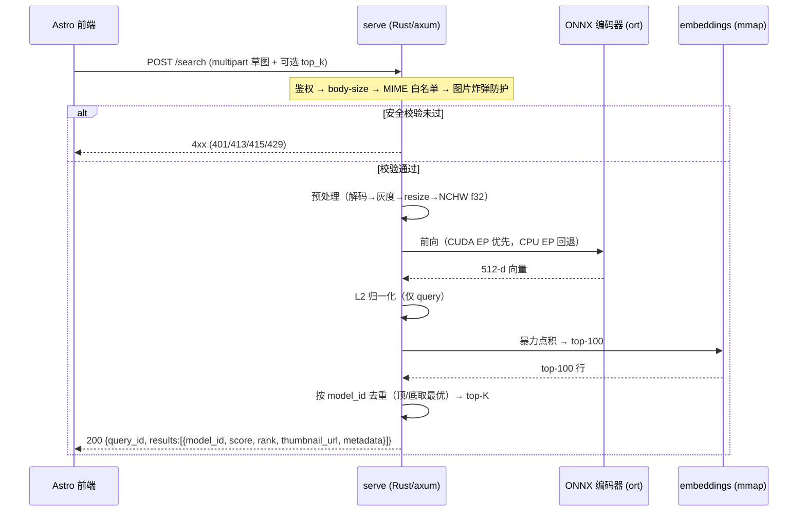

---

### 7.6 前端（Astro）

前端复用 `web/` 目录下已有的 Astro demo（包含 three.js 3D 查看器、结果网格组件、文件上传栏）。

#### 集成改动点

| 位置 | 改动 |
|------|------|
| 上传栏 | 接收草图图片（JPEG / PNG），打包为 multipart/form-data |
| fetch 逻辑 | `POST /search`，携带 image 字段和可选 k 值 |
| 结果网格 | 渲染 `results[]` 中每项的 thumbnail_url + score + rank |
| 3D 查看器 | 点击结果项 → 以 step_path 加载 3D 模型（复用现有 three.js 查看器逻辑） |
| 错误处理 | 展示 4xx / 5xx 错误码对应的用户友好提示 |

> **3D 模型加载说明**：草图检索本身不依赖 STEP 文件下载。前端 three.js 查看器若需加载原始 STEP/mesh，须经一个独立的、受同等鉴权与路径白名单保护的端点（如 `GET /models/:id/geometry`）；该端点的细化定义归入 Part 9 serve / frontend 单元，不属于 §7.3 的核心检索端点集合。

前端与 serve 之间**仅经由 `/search` JSON 接口通信**，不依赖 serve 的内部实现语言（Rust 或 Python），serve 侧语言切换对前端透明。

---

### 7.7 安全（网络暴露前必做）

> **⚠️ 强制要求：在任何网络暴露（局域网或公网）前，以下安全措施必须全部到位。不允许以任何形式在公网开放无鉴权端点。未完成本节要求的部署视为未完成交付。**

#### 输入限制

| 防护项 | 具体要求 | 说明 |
|--------|----------|------|
| body-size 上限 | [待回填\|回填依据：实测典型草图大小后定，参考上限 10 MB] | 在 HTTP 层拒绝，返回 413 |
| 解码后分辨率上限 | 解码后像素总数 ≤ [待回填\|回填依据：防图片炸弹，参考上限 4096×4096] | 解码前读取元信息，超限返回 400 |
| MIME 白名单 | image/jpeg, image/png（最小集，可按需扩展） | 非白名单 MIME 返回 415 |
| 请求超时 | 端到端 ≤ [待回填\|回填依据：实测 P99 推理延迟后定] | 超时返回 504 |

**图片炸弹（image bomb）防护说明**：攻击者可发送一张极小的压缩文件（几 KB），解码后展开为数百 MB 的大图，耗尽服务内存。防护方式：在完整解码前先读取图片头部元信息，获取声明的宽高；若声明尺寸超限则直接拒绝，不执行完整解码。

#### 鉴权与限流

| 防护项 | 最低要求 | 说明 |
|--------|----------|------|
| 鉴权 | 共享 token（Bearer Token 或自定义 header） | 所有非 /healthz 端点均需鉴权；token 通过环境变量注入，不硬编码 |
| 限流 | 按 IP 和/或用户限制请求速率 | 触发后返回 429 + Retry-After header |

**明确声明**：向公网暴露无鉴权端点是严重安全风险，本系统不允许此类部署。即便是内网暴露，也应在上线前评估是否需要鉴权。

#### 文件访问限制

- **缩略图**：`/models/:id/thumbnail` 仅允许访问 `thumbnails/` 目录下以 model_id 命名的白名单文件，禁止路径穿越（path traversal）。实现时对 `:id` 做严格字符校验（仅允许字母数字和下划线），不接受 `../`、绝对路径或其他特殊字符。
- **STEP / CAD 文件**：serve 进程不暴露任意 CAD 文件下载端点。3D 查看器若需加载 STEP 文件，需走独立的、同样受鉴权保护的端点，且路径同样做白名单校验。
- **内部路径不外泄**：错误响应中不包含服务器文件系统路径、堆栈跟踪或内部 ID 枚举信息。

#### 安全检查清单（上线前逐项确认）

- [ ] body-size 限制已配置并实测
- [ ] 解码前分辨率检查已实现
- [ ] MIME 白名单已启用
- [ ] 请求超时已配置
- [ ] 鉴权中间件已启用，/search 无法在无 token 情况下响应
- [ ] 限流已启用，429 响应已验证
- [ ] 缩略图路径穿越已测试（尝试 `../` 等构造，确认返回 400/404）
- [ ] serve 错误响应不含内部路径信息

---

### 7.8 诚实回退判定

#### Rust / axum 的实际收益评估

本系统的热路径结构是：单张草图图片 → 单个小型编码器（SE-ResNet50 或 ViT-B）→ 512 维向量 → 暴力点积 → top-K JSON。推理本身由 ONNX Runtime（ort）执行，Rust 运行时本身对推理延迟的影响有限。

Rust 相对于 FastAPI+Python 的真实收益主要体现在：

| 收益点 | 说明 |
|--------|------|
| 单一静态二进制 | 部署无需 Python 环境，容器镜像更小，冷启动更快 |
| 无 GIL | 并发请求不受 Python GIL 限制，多核利用更充分 |
| 低空闲内存 | Rust 进程空闲时内存占用显著低于 Python 进程 |
| 内存安全 | mmap embeddings.npy 的并发读写不需要显式锁 |

相对地，**单请求延迟优势有限**：推理延迟由 GPU 执行时间主导，HTTP 框架（axum vs uvicorn）的差异在整体延迟中占比极小。

#### 回退触发条件

回退触发的唯一条件是：**`ort` crate 与 CUDA EP 在 RTX 5090（Blackwell 架构 / CUDA 12.x）上链接或打包不顺**——包括但不限于：ort 版本未支持 Blackwell SM 架构、CUDA EP 在 Windows 环境下动态链接失败、ort + cuDNN + TensorRT 版本矩阵不兼容。

此条件在 M0 环境对齐阶段（风险点 R-ENV-01）提前验证。

#### 回退路径：FastAPI + onnxruntime-gpu

回退方案使用 FastAPI（Python）+ onnxruntime-gpu，提供**完全相同的 `/search` API 契约**（见 §7.5）。

回退的三个关键属性：

1. **前端无感**：前端仅依赖 `/search` JSON 接口，serve 侧语言切换对前端完全透明。
2. **零能力损失**：推理结果由 ONNX Runtime 执行，Python 和 Rust 使用同一个 .onnx 文件，检索结果完全一致。
3. **逃生舱，非降级**：回退是一个有触发条件的工程决策，在触发条件不发生时 Rust 路径保持首选；触发后 FastAPI 以等效能力接替，不存在功能缩水。

#### 决策节点

```
M0 环境对齐阶段:
  ort + CUDA EP 在 5090 上链接 OK ?
    ├─ YES → 继续 Rust / axum 路径
    └─ NO  → 切换 FastAPI + onnxruntime-gpu 路径
             （/search 契约不变，后续步骤无需修改）
```

---

## 8. 开发流程与时间线

本章是项目的**排程依据**：把 Part 1–7 描述的技术内容编排成可执行的里程碑序列，并给出依赖关系、关键路径、3 卡并行调度与缓冲节奏。Part 9 的九个执行单元按本章的里程碑区间分配，使关键路径不被阻塞。

### 8.1 时间线约定

- **工期单位 = 工作日（work-day, WD）**。本章所有工期均为**相对工期**，相对于各里程碑的进入时刻计，**不绑定日历日期**——项目起始日变动时，整套排程依然有效，无需重排。
- **工期以区间给出**（如 `2–3 WD`），是基于任务规模与已知风险的**估算/指导值**，非承诺值；实际值随 M0 的依赖验证结果与 M1 的数据获取方式收敛。
- **硬件 = 3× RTX 5090**（32 GB each，Blackwell，CUDA 12.8）。训练与建库阶段可并行使用 3 卡；在线服务（M5/M6）只用 1 卡。
- **开发模式 = 单人开发**：里程碑串行推进为主，卡间并行仅在 M3 消融阶段（同时跑多个独立 run）显著生效。
- **退出门（exit gate）**：每个里程碑出口设一道完成判据（见 §8.4 各里程碑「完成判据」与 Part 9 各单元验收）。**不过门不进入下一里程碑**——这是防止缺陷向下游里程碑扩散的硬约束。

### 8.2 里程碑总览表

| 里程碑 | 内容 | 工期(WD，估算) | 前置 | 可并行项 |
|--------|------|----------------|------|----------|
| **M0 环境对齐** | 装齐训练/推理栈；验证 3 个已知依赖风险（PyG↔torch2.8、faiss-gpu、`ort`↔CUDA12.8） | 2–3 | 无 | 无（依赖验证是后续一切的前提） |
| **M1 数据落地** | 取/重建 `views`·`sketches`·`train`·`test`（8.4K）；建 manifest + 质量探查 + 复杂度直方图 | 3–5 | M0 | M2 提取器开发可在 probe 完成后并行启动 |
| **M2 B-rep 图补全** | STEP→UV-grid 图提取器；产 `graph*.pt`；失败清单 + 回退 CNN-only | 3–4 | M1（probe 完成即可起步） | 与 M1 的 render/sketch 重叠；与 M3 阶段 A 重叠 |
| **M3 消融决策** | 阶段 A 探针 → B（R1/R3）→ C（矩阵）→ D（定稿）；选主干 + 换种子复现 | 3–4 | M2、M1 | **3 卡并行跑 run（本里程碑并行收益主战场）** |
| **M4 建库与产物** | 用选定主干对全库提特征；打包 `artifact/`（Part 7.4 契约） | 2 | M3 | 无（依赖定稿主干） |
| **M5 服务上线** | 导出 ONNX + 对齐门；Rust/axum `/search`（或回退 FastAPI） | 4–6（回退 2–3） | M4 | Rust 脚手架可对 mock artifact 先写 |
| **M6 前端联调** | Astro 接 `/search`；上传草图 → 看结果 → 查 3D | 2 | M5 | 可对 mock `/search` 先接 |

> 表中工期为单人 + 3 卡条件下的估算区间。最大不确定度集中在 **M5**（Rust/`ort` 在 5090 上是否顺利）与 **M1**（网盘直取 vs 开源兼容层重建的工作量差异）。

**里程碑甘特图**（轴为**相对工作日 WD**，非日历日期；条长取工期区间上端作保守排期，里程碑标记表示退出门）：

```mermaid
gantt
    title 里程碑甘特（横轴 = 相对 WD，第 N 个工作日；非日历日期）
    dateFormat X
    axisFormat %s
    todayMarker off

    section M0 环境对齐
    装栈 + 三依赖验证 (PyG/faiss/ort)  :m0, 0, 3d
    M0 退出门                          :milestone, gate0, after m0, 0d

    section M1 数据落地
    取/重建 views·sketches·train·test  :m1, after m0, 5d
    M1 退出门 (probe 完成)             :milestone, gate1, after m1, 0d

    section M2 B-rep 图补全
    STEP→UV-grid 提取器 + graph*.pt    :m2, after gate1, 4d
    M2 退出门                          :milestone, gate2, after m2, 0d

    section M3 消融决策
    阶段 A 坍缩探针 (早启, 仅需视图+草图) :a3, after gate1, 1d
    阶段 B→C→D (3 卡并行, 见 §8.6)      :m3, after m2, 4d
    M3 退出门 (选主干+复现)            :milestone, gate3, after m3, 0d

    section M4 建库与产物
    全库提特征 + 打包 artifact         :m4, after gate3, 2d
    M4 退出门 (过启动校验)             :milestone, gate4, after m4, 0d

    section M5 服务上线
    ONNX 导出+对齐门 + Rust/axum serve  :m5, after gate4, 6d
    M5 退出门 (端到端+安全项)          :milestone, gate5, after m5, 0d

    section M6 前端联调
    Astro 接 /search                  :m6, after gate5, 2d
    M6 退出门 (demo 完整流程)          :milestone, gate6, after m6, 0d
```

> 重叠说明：M3 阶段 A 探针只需视图+草图，故在 M1 退出门后即并行启动（甘特中 `a3` 早于 M2 完成）；M5 的 Rust 脚手架、M6 的 mock 联调可分别压在 M4、M5 之上（见 §8.3 DAG）。甘特按串行退出门绘制，重叠为额外提前量，非额外工期。


### 8.3 依赖 DAG

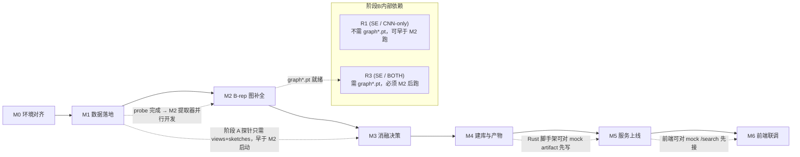


**主链（关键路径）**：`M0 → M1 → M2 → M3 → M4 → M5 → M6`，串行不可跳。
**重叠机会**：① M2 提取器开发压在 M1 的 render/sketch 之上（probe 一完成即可起步）；② M3 阶段 A 探针只需视图+草图，可早于 M2 启动；③ M5 的 Rust 服务脚手架可对 mock artifact 先写，待 M4 真产物就绪再替换；④ M6 前端可对 mock `/search` 先接，待 M5 真服务就绪再切。

### 8.4 逐里程碑展开

#### M0 — 环境对齐

- **进入条件**：仓库代码就位；3× RTX 5090 主机可访问；大数据盘 `~/data` 挂载。
- **任务清单（映射 Part 9 单元）**：装齐 Python 3.12 + PyTorch 2.8（CUDA 12.8）+ timm + torch_geometric + faiss + tensorboardX + thop + warmup_scheduler；放置 `seresnet50.a1_in1k.bin` 与 PhotoSketch 权重；跑通仓库 `train.py --debug` 与 `test.py` 的最小流程。（前置所有单元，尤其 train / graph / serve 的依赖。）
- **工期估计**：2–3 WD。
- **完成判据（退出门）**：`train.py --debug` 能跑通一个 mini-batch；`test.py` 能跑通提特征+检索；3 个已知依赖风险点各有一条明确结论（通过 / 需回退）。
- **可并行编排**：无——依赖验证是后续一切的前提，必须先收敛。
- **触发风险点（→ Part 10）**：PyG↔torch2.8 不兼容、faiss-gpu 不可用、`ort`↔CUDA12.8（5090）打包不顺——三者任一不过，按 Part 10 对应条目处理（如先只跑 CNN 分支、推迟 GNN；M5 预备走 FastAPI）。

#### M1 — 数据落地

- **进入条件**：M0 退出门通过。
- **任务清单（映射 download / probe / render / sketch 单元）**：取/重建 `views/`、`sketches/`、`train/`、`test/`（8.4K 全量）；建 manifest 并写入质量探查（probe）结果；产出几何复杂度分布直方图供阈值回填。
- **工期估计**：3–5 WD（区间宽度主要来自「网盘直取」与「开源兼容层重建」两种路径的工作量差异）。
- **完成判据（退出门）**：8.4K 模型的视图+草图齐备；manifest 每模型有质量 flag 与各阶段 status；复杂度直方图产出，且据此回填 probe 阈值（`[待回填]` → 实测值）。
- **可并行编排**：probe 一完成，M2 的图提取器开发即可并行启动（不必等 render/sketch 全部完成）。
- **触发风险点（→ Part 10）**：网盘数据不可得 → 走开源兼容层重建（工期上移至区间高端）；渲染失败率高 → 失败模型记入 manifest、不阻塞全流程。

#### M2 — B-rep 图补全

- **进入条件**：M1 的 probe 完成（render/sketch 可仍在进行）。
- **任务清单（映射 graph 单元）**：实现 STEP→UV-grid 图提取器（OCC 拓扑遍历 + UV 采样，节点/边维度见 §4.4）；产出 `graph*.pt`；建立失败清单与 CNN-only 回退标记。
- **工期估计**：3–4 WD。
- **完成判据（退出门）**：`ComplexGNN` 能加载产出的图并完成一次前向；图名与 `views/`、`sketches/` 子目录可对齐；图提取失败的模型在 manifest 标记 `graph_status=cnn_only_fallback` 且仍可被检索（绝不丢弃）。
- **可并行编排**：与 M1 的 render/sketch 重叠；与 M3 阶段 A 坍缩探针重叠（探针不依赖图）。
- **触发风险点（→ Part 10）**：图提取失败率高 → 失败模型回退 CNN-only；若失败率高到 BOTH 分支无统计意义 → 全流程先跑 CNN-only，GNN 推迟。

#### M3 — 消融决策

- **进入条件**：M2 完成（阶段 B 的 R3 及后续 BOTH 臂需要 `graph*.pt`）；M1 数据齐备。注：阶段 A 探针与 R1 可在 M2 完成前先启动。
- **任务清单（映射 train 单元）**：阶段 A 坍缩探针 → 阶段 B（R1 基线锚点 / R3 几何上行）→ 阶段 C（部分析因矩阵，≤9 run）→ 阶段 D（按决策规则定稿 + 换种子复现）；产出消融报告（含 bootstrap 95% CI）。
- **工期估计**：3–4 WD（3 卡并行下，纯算力约 0.5–0.7 天，余下时间在探针、分析、复现与报告）。
- **完成判据（退出门）**：按 §5.5 决策规则（ΔTop-1 ≥ 2 pp 且换种子成立）选出主干；最优配置换第二种子复现一致；消融报告产出。
- **可并行编排**：**3 卡并行跑 run，是本里程碑并行收益的主战场**（详见 §8.6 调度表）。
- **触发风险点（→ Part 10）**：CLIP 臂坍缩（探针拦截，走 SE-ResNet50）；几何无显著增益（取更简单的 CNN-only，省 graph 单元后续维护）。

#### M4 — 建库与产物

- **进入条件**：M3 退出门通过（主干已定稿并复现）。
- **任务清单（映射 build-artifact 单元）**：用选定主干对全库提特征（512-d，V2 顶/底各一条）；L2 归一化写盘；导出 `sketch_encoder.onnx` 并过 PyTorch↔ONNX 对齐门；打包 `artifact/`（Part 7.4 契约）。
- **工期估计**：2 WD。
- **完成判据（退出门）**：`artifact/` 六项齐全（manifest/embeddings/ids/metadata/onnx/thumbnails）；通过 serve 启动校验（维度/行数/映射一致）；ONNX 对齐门通过（mean cosine > 0.999 且 top-K 一致）。
- **可并行编排**：无（依赖定稿主干）；但 M5 的 Rust 脚手架可在本里程碑期间对 mock artifact 先行开发。
- **触发风险点（→ Part 10）**：ViT-LoRA 导出数值漂移（对齐门拦截）→ 取 CNN 主干（导出风险低）。

#### M5 — 服务上线

- **进入条件**：M4 产出 `artifact/` 并通过启动校验。
- **任务清单（映射 serve 单元）**：Rust/axum 加载产物、实现 `/healthz` 与 `/search`、Rust 端预处理、暴力点积 + 去重、安全项（限 body/分辨率/MIME/超时 + 鉴权 + 限流）；或在回退触发时改用 FastAPI + onnxruntime-gpu（`/search` API 不变）。
- **工期估计**：4–6 WD；回退 FastAPI 路径 2–3 WD。
- **完成判据（退出门）**：端到端 `/search` 返回正确 top-K；单卡 5090 p95 延迟达交互级；安全项全部到位（无鉴权端点不得上线）。
- **可并行编排**：Rust 脚手架可对 mock artifact 先写（压在 M4 之上）。
- **触发风险点（→ Part 10）**：`ort`+CUDA EP 在 5090 打包/链接不顺 → 回退 FastAPI + onnxruntime-gpu，`/search` API 完全一致、前端无感、零能力损失。

#### M6 — 前端联调

- **进入条件**：M5 的 `/search` 端到端可用（或 mock `/search` 已就绪用于先行联调）。
- **任务清单（映射 frontend 单元）**：复用 `web/` Astro demo；上传草图 → fetch multipart 到 `/search` → 渲染 top-K 缩略图+分数 → 点击查看 3D。
- **工期估计**：2 WD。
- **完成判据（退出门）**：demo 可演示完整查询流程（上传 → 结果 → 3D 查看）；对 mock `/search` 与真实 serve 均可跑；serve 不可用时前端友好降级。
- **可并行编排**：可对 mock `/search` 先接（压在 M5 之上），待真服务就绪再切。
- **触发风险点（→ Part 10）**：与 serve 经 `/search` JSON 解耦，serve 换实现（Rust↔FastAPI）前端无感。

### 8.5 关键路径 (CPM)

**关键路径**：`M0 → M1 → M2 → M3 → M4 → M5 → M6`，七个里程碑首尾相接，无可跳过项。

- **朴素串行求和**（各里程碑工期区间相加，不计任何重叠）：约 **19–26 WD**。
- **计入重叠后的关键路径**：约 **16–21 WD**。重叠来源：
  - M2 提取器开发压在 M1 的 render/sketch 之上（probe 完成即起步）；
  - M3 阶段 A 探针与部分 R1 早于 M2 完成即启动；
  - M3 内部 3 卡并行把 ≤9 run 的纯算力从串行 ~1.5–2 天压到 ~0.5–0.7 天；
  - M5 的 Rust 脚手架压在 M4 之上（对 mock artifact 先写）；
  - M6 前端压在 M5 之上（对 mock `/search` 先接）。
- **最大不确定度**集中在两处：
  - **M5**：`ort` + CUDA EP 在 5090（Blackwell/CUDA 12.x）上的打包/链接是否顺利——顺则 4–6 WD，回退 FastAPI 则 2–3 WD。
  - **M1**：数据获取走「网盘直取」还是「开源兼容层重建」——后者把 M1 推向区间高端。

> 关键路径上的任一里程碑退出门未过，则后续里程碑不得启动；重叠仅适用于「开发可提前」的部分，**退出门判据本身不重叠**。

### 8.6 三卡并行调度方案（M3）

M3 是并行收益的主战场。**单个 run 使用 1 张卡**（~8.4K 数据量级不需要 DDP），并行收益来自**卡间分配不同 run**，而非单 run 内多卡。下表给出 M3 各阶段在 3 卡上的调度（与 §5.6 算力预算一致）：

| 阶段 | 卡 0 | 卡 1 | 卡 2 | 墙钟（估算） |
|------|------|------|------|--------------|
| **A 坍缩探针** | CLIP-ViT 零样本探针 | 空闲 / 预热 | 空闲 | < 1 h |
| **B 关键二选一** | R1（SE-ResNet50 / CNN-only） | R3（SE-ResNet50 / BOTH） | 空闲（或备份种子） | ~半日（取 BOTH 较长者） |
| **C 第一波** | R2（新 run） | （R1、R3 复用阶段 B 结果，不重跑） | 可提前启动第二波的 run | ~2–4 h |
| **C 第二波** | R4（须探针放行） | R5 | R6 | ~2–4 h |
| **C 第三波** | R7 | R8（须探针放行） | R9（须探针放行） | ~2–4 h |
| **D 定稿复现** | top-1 配置换种子 | top-2 配置换种子 | 空闲 | ~半日 |

> **并行收益**：单卡跑满 9 run 串行 ≈ **1.5–2 天**；3 卡分波后纯算力压到 ≈ **0.5–0.7 天**。M3 余下工期花在阶段 A 探针、结果分析、定稿复现与消融报告撰写。
> **CLIP 臂条件性**：若阶段 A 探针判定 CLIP-ViT 臂降优先级，则 R4/R5/R8/R9 跳过或延后，阶段 C 实际 run 数可降至 5，C 阶段压缩为 2 波。

**M3 三卡调度甘特图**（横轴 = **相对小时**，非日历；三 section 对应三张卡；CLIP 臂相关 run 标为 `crit` 提示条件性）：

```mermaid
gantt
    title M3 三卡并行调度（横轴 = 相对小时；CLIP 臂 run 须经阶段 A 探针放行）
    dateFormat X
    axisFormat %sh
    todayMarker off

    section 卡 0
    A 探针 (CLIP 零样本)      :a, 0, 1
    B R1 (SE / CNN-only)      :b0, after a, 3
    C波1 R2                   :after b0, 3
    C波2 R4 (探针放行)         :crit, 7, 3
    C波3 R7                   :10, 3
    D top-1 换种子            :13, 4

    section 卡 1
    B R3 (SE / BOTH)          :b1, after a, 4
    C波2 R5                   :crit, 7, 3
    C波3 R8 (探针放行)         :crit, 10, 3
    D top-2 换种子            :13, 4

    section 卡 2
    C波1 预启动               :5, 2
    C波2 R6                   :7, 3
    C波3 R9 (探针放行)         :crit, 10, 3
```

> 读图：阶段 A 探针（卡 0，1h）先于一切训练；阶段 B 的 R1/R3 分占卡 0/卡 1；阶段 C 按波次铺满三卡（标 `crit` 的 R4/R5/R8/R9 依赖探针放行，CLIP 臂降级时跳过）；阶段 D 双卡并行复现 top-2。横轴小时数为估算量级，非承诺值。


### 8.7 阶段分带（高层视图）

把七个里程碑归纳为五个高层「带」，每带有一个明确出口，便于在粗粒度上跟踪进度：

| 带 | 覆盖里程碑 | 出口标志 |
|----|-----------|----------|
| **① 打地基** | M0 + M1 起步 | 仓库能在 debug 模式跑通一个 mini-batch；8.4K 数据可见、manifest 初具 |
| **② 补几何** | M1 收尾 + M2 | `ComplexGNN` 能加载图并前向；失败模型已记录并回退 CNN-only |
| **③ 定主干** | M3 | 按决策规则选出主干并换种子复现；消融报告产出 |
| **④ 上服务** | M4 + M5 | `/search` 端到端返回正确 top-K；单卡 5090 p95 交互级 |
| **⑤ 交付** | M6 + 复现演练 + 清单核对 | demo 可演示完整查询流程；全交付物齐备（见 Part 12） |

### 8.8 缓冲与回顾节奏

- **退出门即回顾点**：每个里程碑出口设一道退出门，判据指向 Part 9 对应单元的量化验收。不过门不进下一里程碑。
- **M0 依赖三连是最早的风险闸**：PyG↔torch2.8、faiss-gpu、`ort`↔CUDA12.8 三个验证点任一不过，立即触发 Part 10 对应回退——
  - PyG 不兼容 → 先只跑 CNN 分支（不依赖 PyG），GNN 推迟到兼容组合锁定后；
  - `ort` 打包不顺 → M5 直接走 FastAPI + onnxruntime-gpu，`/search` API 不变。
- **缓冲分配**：关键路径每一带预留约 **15%（估算）** 缓冲，主要吸收 M1（数据获取路径不确定）与 M5（Rust/`ort` 打包不确定）两处的波动。缓冲是吸收已知不确定度的显式余量，不是隐式拖延。
- **回退不波及邻接单元**：所有回退都通过契约（产物契约 / `/search` API）隔离——某单元回退到更简单实现时，上下游单元因契约不变而无感（详见 Part 10 回退总原则）。

## 9. 单元执行规格

本章把系统拆成 **9 个可独立开发、独立测试、独立重跑的执行单元**，每个单元按统一的 9 维模板展开。本章是 writing-plans 把本 spec 拆解为实现 plan 的**直接依据**：每个单元对应一组可执行任务，任务边界即单元边界。

### 9.0 单元总览

**9 维模板**（每个单元逐一填实，下文各单元复用此结构）：

1. **职责** — 一句话边界 + 明确「不做什么」。
2. **输入 / 输出** — 精确路径与数据形态。
3. **接口契约** — 消费上游什么、产出下游什么（字段名/类型/路径布局），与相邻单元的耦合点。
4. **任务分解（checkbox）** — 该单元拆成的可执行子任务，单动作粒度，供 writing-plans 直接采用。
5. **量化验收** — 客观可验证的完成判据（数值或可程序化检查），不用「足够/充分」含糊词。
6. **命令意图** — 跑什么、看什么输出（意图，非可复制脚本）。
7. **测试矩阵** — 表格：用例 / 输入 / 期望 / 失败信号；含正常路径 + 边界 + 失败注入。
8. **失败处理** — 每类失败如何检测、记录（manifest status）、是否阻塞、如何重跑。
9. **回退** — 该单元的降级路径（→ Part 10），及通过哪个契约与上下游隔离。

**单元导航表**：

| 单元 | 职责 | 输入 | 输出 | 依赖 |
|------|------|------|------|------|
| download / ingest | 取 STEP、登记 manifest | ABC chunk / 网盘 | `step/**`、manifest 初始行 | 代理、py7zr |
| probe | 拓扑探查、质量 flag（不 mesh） | manifest pending 行 | probe 列、`render_eligible` | OCC |
| render | STEP/mesh → 12 视图 | `render_eligible` STEP | `views/` | Sketch3DToolkit / moderngl |
| sketch | 视图 → 草图 | `views/` | `sketches/` | PhotoSketch |
| graph | STEP → UV-grid 图 | `render_eligible` STEP | `graph*.pt`、失败清单 | OCC + torch_geometric |
| train | 消融训练、选主干 | views/sketches/graph | 主干 checkpoint、消融报告 | 仓库 trainer |
| build-artifact | 提特征、打包 | 主干 + 全库 | `artifact/`（§7.4 契约） | 仓库 inference + ONNX 导出 |
| serve | 在线检索 | `artifact/` + 上传草图 | `/search` JSON | ort / onnxruntime |
| frontend | 上传与展示 | `/search` | 浏览器 UI | Astro |

九个单元通过两个契约解耦（产物目录契约 §7.4、`/search` JSON 契约 §7.5），任一单元可独立替换实现而不波及其余。

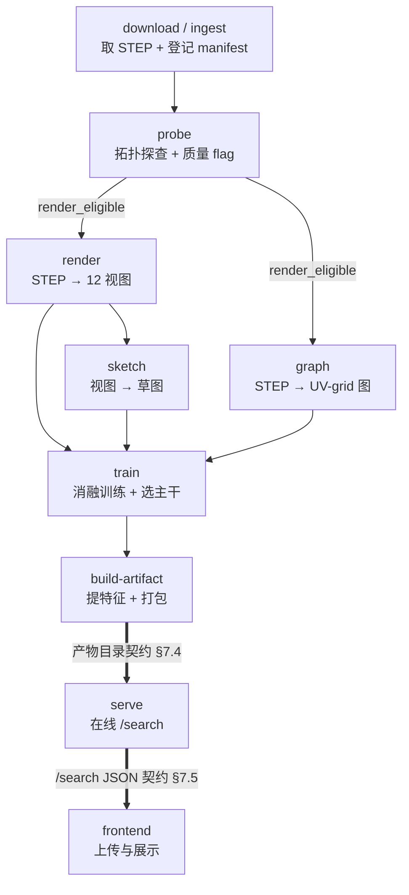

> 粗线（`==`）标出两条解耦契约的位置：build-artifact→serve 与 serve→frontend。契约左侧是离线 build 域，右侧是在线服务域。


### 9.1 download / ingest 单元

**职责**：从 ABC chunk / 网盘取得 STEP 文件，登记进 manifest。**不做**质量判断（那是 probe 单元的职责），只负责「拿到字节 + 校验完整性 + 登记存在」。

**输入 / 输出**：
- 输入：ABC 官方 7z 分包（开源路径）或校内网盘已有 STEP（既有工具链路径）。
- 输出：`~/data/raw/step/<chunk>/<model>.step`；manifest 每模型一初始行（`model_id`、`src_path`、`download_status`）。

**接口契约**：
- 消费：无上游单元（管线起点）；消费外部数据源 + 代理配置。
- 产出（下游 probe / graph 消费）：`step/**/*.step` 文件路径；manifest 行的 `model_id`（后续所有单元的主键）与 `src_path`。

**任务分解（checkbox）**：
- [ ] 复用下载器：7z header 校验（防止部分下载被当完整文件）、5× 重试带指数退避、断点续传、代理透传。
- [ ] manifest 初始化：为每个目标 `model_id` 写入初始行（`download_status=pending`）。
- [ ] 下载完成后将对应行置 `download_status=ok`，记录落盘 `src_path` 与字节数。
- [ ] 断点续传：重跑时跳过已 `ok` 的行，只补 `pending` / `failed`。

**量化验收**：8.4K 目标模型的 STEP 全部落盘；manifest 每行有 `src_path` + `download_status ∈ {ok, failed}`；无 `pending` 残留。

**命令意图**：运行下载器指向目标 chunk 与大盘路径；完成后查 manifest 中 `download_status` 分布，确认 `ok` 数 == 目标数、`failed` 数有明细。

**测试矩阵**：

| 用例 | 输入 | 期望 | 失败信号 |
|------|------|------|----------|
| 正常下载 | 完好 7z 分包 | STEP 落盘、行置 ok | 文件缺失或 status 未更新 |
| 损坏 7z | header 校验不过的包 | 重试后记 download_failed | 把损坏文件当完整处理 |
| 网络中断 | 下载中途断开 | resume 续传补齐 | 从头重下或半文件残留 |
| 代理失效 | 代理不可达 | 重试 5 次后记 failed + 明细 | 静默挂起无超时 |

**失败处理**：校验/网络失败 → 重试 5 次（指数退避）→ 仍失败记 manifest `download_failed` + 原因；**不阻塞**其他模型；失败行可单独重跑。

**回退**：校内网盘直取失败 → 切换开源路径从 ABC 官方 7z 下载（两路径产出同构 `step/`）。通过 `step/` 文件布局契约隔离，下游 probe / graph 无感来源差异。

**manifest 初始行 schema**（download 写入，下游所有单元的主键载体）：

```json
{
  "model_id": "abc_00001234",          // 全局主键，贯穿所有单元
  "src_path": "~/data/raw/step/00/abc_00001234.step",
  "src_origin": "netdisk" | "abc_official",  // 来源路径标识
  "file_size_bytes": 184320,
  "sha256": "<7z 解包后 STEP 的内容哈希，用于幂等重跑>",
  "download_status": "pending" | "ok" | "download_failed",
  "download_attempts": 0,              // 重试计数，达 5 记 failed
  "download_error": null               // failed 时记原因字符串
}
```

**实现任务序列（TDD）**：

- [ ] T1 写失败测试：`test_manifest_init_creates_pending_rows` —— 给定 N 个目标 model_id，初始化后 manifest 有 N 行且全为 `download_status=pending`。
- [ ] T2 实现 manifest 初始化，跑 T1 至通过。
- [ ] T3 写失败测试：`test_7z_header_validation_rejects_truncated` —— 喂一个被截断的 7z，校验函数返回 invalid 而非把它当完整文件。
- [ ] T4 实现 7z header 校验 + 解包，跑 T3 至通过。
- [ ] T5 写失败测试：`test_resume_skips_completed_rows` —— 已 `ok` 的行在重跑时不重新下载（用下载计数断言）。
- [ ] T6 实现断点续传逻辑，跑 T5 至通过。
- [ ] T7 写失败测试：`test_retry_then_mark_failed` —— 持续失败的源在 5 次重试后置 `download_failed` 且记 `download_error`。
- [ ] T8 实现重试 + 失败登记，跑 T7 至通过。
- [ ] T9 集成验证：对一个小 chunk 端到端跑通，确认 manifest `download_status` 分布符合预期。

**量化验收（细化）**：8.4K 目标模型 STEP 全部落盘；manifest 每行有 `src_path` + `download_status ∈ {ok, failed}`，无 `pending` 残留；每个 `ok` 行有非空 `sha256`；`failed` 行有非空 `download_error`；重跑幂等（同样输入二次运行不改变 `ok` 行）。

**测试矩阵（细化）**：

| 用例 | 输入 | 期望 | 失败信号 |
|------|------|------|----------|
| 正常下载 | 完好 7z 分包 | STEP 落盘、行置 ok、有 sha256 | 文件缺失或 status 未更新 |
| 损坏 7z（截断） | header 不完整的包 | 校验拒绝、重试、记 download_failed | 把截断文件当完整处理 |
| 损坏 7z（CRC 错） | 内容 CRC 不符 | 解包失败、记 failed + 原因 | 落盘损坏 STEP |
| 网络中断 | 下载中途断开 | resume 续传补齐 | 从头重下或半文件残留 |
| 代理失效 | 代理不可达 | 重试 5 次后记 failed + 明细 | 静默挂起无超时 |
| 重跑幂等 | 已 ok 的集合二次运行 | 跳过、不重新下载 | 重复下载浪费带宽 |
| 部分失败混合 | ok+failed 混合集 | 各行 status 独立正确 | 一个失败拖垮整批 |
| 磁盘满 | 大盘写满 | 明确报错、不写半文件 | 静默截断 |

### 9.2 probe 单元

**职责**：对每个 STEP 做**廉价拓扑探查**（只遍历拓扑，**不 mesh**），产出几何质量指标与 `render_eligible` 标志。**不做**渲染、不做图提取——只做「这个模型值不值得进入昂贵的渲染/图阶段」的判定。

**输入 / 输出**：
- 输入：manifest 中 `download_status=ok` 的行对应的 STEP。
- 输出：manifest 新增 probe 列（`n_faces`、`n_solids`、退化指标、`quality_flags`、`render_eligible`）。

**接口契约**：
- 消费（来自 download）：`step/**` + manifest `download_status=ok` 行。
- 产出（下游 render / graph 消费）：`render_eligible` 布尔——render 与 graph 只处理 `render_eligible=true` 的模型。

**任务分解（checkbox）**：
- [ ] 用 OCC `STEPControl_Reader` 读 STEP，`TopExp_Explorer` 遍历拓扑（不调用 mesh）。
- [ ] 采集 `n_faces`、`n_solids`、退化几何指标（零面积面、开放壳等）。
- [ ] 按致命 flag 集判定：无实体 → `no_solid`、面数过多 → `too_complex`、退化 → `degenerate`。
- [ ] 写 `quality_flags` 与 `render_eligible`（无致命 flag 则 true）。
- [ ] **首跑后**看 `n_faces` / `file_size` 真实直方图，回填 `too_complex` 阈值 `[待回填 | 回填依据：n_faces/file_size 直方图高端长尾截断点]`。

**量化验收**：每个 `download_status=ok` 模型都有 probe_* 指标 + `render_eligible` 布尔；致命 flag 集判定可复核；阈值以配置形式存在（非硬编码）。

**命令意图**：运行 probe 指向 manifest；完成后导出 `n_faces` / `file_size` 直方图，据此回填阈值并重跑判定；查 `render_eligible` 分布。

**测试矩阵**：

| 用例 | 输入 | 期望 | 失败信号 |
|------|------|------|----------|
| 正常实体 | 单实体 STEP | render_eligible=true、指标齐 | 误判 / 指标缺失 |
| 无实体 | 仅曲面无 solid | flag=no_solid、eligible=false | 误放行 |
| 面数过多 | 超阈值面数 | flag=too_complex、eligible=false | 进入渲染后 OOM/超时 |
| 退化几何 | 零面积面/开放壳 | flag=degenerate | 静默通过 |
| STEP 解析失败 | 损坏 STEP | 记 probe_failed、不阻塞他模型 | 整批中断 |

**失败处理**：解析失败 → 记 manifest `probe_failed` + 原因；**不阻塞**其他模型；可单独重跑。

**回退**：阈值过严导致误筛（合格模型被标 too_complex）→ 看直方图放宽阈值（阈值是 `[待回填]` 配置项，非硬编码）。通过 manifest `render_eligible` 列隔离，调整阈值只需重跑 probe，不动 download。

**manifest probe 列 schema**（probe 追加，下游 render/graph 读 `render_eligible`）：

```json
{
  "model_id": "abc_00001234",
  "probe_status": "ok" | "probe_failed",
  "n_faces": 312,                  // 拓扑面数
  "n_edges": 894,                  // 拓扑边数
  "n_solids": 1,                   // 实体数；0 → no_solid
  "n_shells": 1,
  "has_degenerate": false,         // 零面积面 / 开放壳等退化
  "quality_flags": [],             // 致命 flag 子集，如 ["too_complex"]
  "render_eligible": true,         // 无致命 flag 则 true
  "probe_error": null
}
```

**致命 flag 集与判据**：

| flag | 触发条件 | 后果 |
|------|----------|------|
| `no_solid` | `n_solids == 0`（仅曲面无实体） | render_eligible=false |
| `too_complex` | `n_faces > [待回填 \| 回填依据：n_faces 直方图高端长尾截断点]` | render_eligible=false |
| `degenerate` | `has_degenerate == true`（零面积面 / 开放壳） | render_eligible=false |
| `oversized` | `file_size_bytes > [待回填 \| 回填依据：file_size 直方图截断点]` | render_eligible=false |

**实现任务序列（TDD）**：

- [ ] T1 写失败测试：`test_probe_single_solid_eligible` —— 标准单实体 STEP → render_eligible=true、n_solids==1、flags 为空。
- [ ] T2 实现 OCC 拓扑遍历 + 指标采集，跑 T1 至通过。
- [ ] T3 写失败测试：`test_no_solid_flagged` —— 仅曲面 STEP → flag=no_solid、eligible=false。
- [ ] T4 实现致命 flag 判据，跑 T3 至通过。
- [ ] T5 写失败测试：`test_too_complex_uses_config_threshold` —— 阈值作为配置注入（非硬编码），超阈值面数 → too_complex。
- [ ] T6 实现阈值配置化，跑 T5 至通过。
- [ ] T7 写失败测试：`test_parse_failure_records_not_blocks` —— 损坏 STEP → probe_failed，不抛出阻断整批。
- [ ] T8 实现失败隔离，跑 T7 至通过。
- [ ] T9 集成：跑全库 probe，导出 n_faces/file_size 直方图，回填阈值后重跑判定。

**量化验收（细化）**：每个 `download_status=ok` 模型都有完整 probe_* 指标 + `render_eligible` 布尔；致命 flag 判据可由配置复现；阈值以配置项存在且有 `[待回填]` 标注；解析失败模型记 `probe_failed` 且不影响其他模型的处理。

**测试矩阵（细化）**：

| 用例 | 输入 | 期望 | 失败信号 |
|------|------|------|----------|
| 正常单实体 | 单 solid STEP | eligible=true、指标齐 | 误判 / 指标缺失 |
| 多实体 | 含多个 solid | eligible=true、n_solids 正确 | n_solids 计数错 |
| 无实体 | 仅曲面无 solid | flag=no_solid、eligible=false | 误放行进渲染 |
| 面数过多 | 超阈值面数 | flag=too_complex | 进渲染后 OOM/超时 |
| 退化几何 | 零面积面/开放壳 | flag=degenerate | 静默通过致渲染异常 |
| 超大文件 | 超 file_size 阈值 | flag=oversized | 渲染耗时失控 |
| STEP 解析失败 | 损坏 STEP | probe_failed、不阻塞他模型 | 整批中断 |
| 阈值放宽重跑 | 调整配置后重跑 | 仅重算判定、download 不动 | 误改上游数据 |

### 9.3 render 单元

**职责**：把 `render_eligible` 的 STEP 渲染为 12 视图（顶 6 + 底 6，224×224）。**不做**草图生成（sketch 单元）、不做图提取（graph 单元）。

**输入 / 输出**：
- 输入：`render_eligible=true` 的 STEP（或其 mesh 中间体）。
- 输出：`~/data/processed/views/<model>/<model>_{0..11}.png`（索引 0–5 顶半球、6–11 底半球，见 §4.3）。

**接口契约**：
- 消费（来自 probe）：`render_eligible` STEP。
- 产出（下游 sketch / train 消费）：`views/<model>/<model>_<idx>.png` 布局，编号 0–11 与半球约定固定。

**任务分解（checkbox）**：
- [ ] STEP → mesh：既有工具链用 Crossmanager（→OBJ→OFF），开源层用 OCC/OCP（→STL/mesh）。
- [ ] 渲染 12 视图：顶半球 6 视角 + 底半球 6 视角，相机位姿矩阵固定，224×224。
- [ ] 双路径产同构布局校验：开源层与既有工具链产出的 `views/` 目录结构、命名、视角对应一致。
- [ ] 渲染结果写盘并在 manifest 置 `render_status`。

**量化验收**：每个 eligible 模型产出恰好 12 张视图；文件名合规（`<model>_{0..11}.png`）；双路径产物布局逐文件一致（抽样比对）。

**命令意图**：运行渲染指向 `render_eligible` 集合；完成后查每模型视图计数 == 12、命名合规；对若干模型并跑两条路径比对布局一致性。

**测试矩阵**：

| 用例 | 输入 | 期望 | 失败信号 |
|------|------|------|----------|
| 正常渲染 | eligible 单实体 | 12 视图、命名合规 | 视图数 ≠ 12 / 命名错 |
| mesh 失败 | mesh 化报错的 STEP | 记 render_failed、不入训练集 | 静默产出空图 |
| 视图缺失 | 渲染中途失败 | 该模型标记不完整、可重跑 | 部分视图当完整用 |
| 双路径一致性 | 同模型走两路径 | 布局/命名/视角对应一致 | 下游训练因布局差异出错 |

**失败处理**：渲染失败 → 记 manifest `render_failed` + 原因；该模型**不进入训练集**（缺视图无法构成正样本组）；可单独重跑。

**回退**：既有工具链（Sketch3DToolkit/Crossmanager）不可用 → 切换开源 moderngl/pyrender 路径（产出同构 `views/`）。通过 `views/` 布局契约隔离，sketch / train 无感来源差异。

**视图产物布局契约**（render 产出，sketch/train 消费）：

```
~/data/processed/views/<model_id>/
  <model_id>_0.png   # 顶半球视角 0
  <model_id>_1.png   # 顶半球视角 1
  ...
  <model_id>_5.png   # 顶半球视角 5
  <model_id>_6.png   # 底半球视角 0
  ...
  <model_id>_11.png  # 底半球视角 5
```

- 相机位姿：顶/底半球各 6 个固定视角，位姿矩阵在两条路径间一致（开源层须复刻既有工具链的相机参数）。
- 分辨率 224×224；通道按 manifest.preprocess 约定（灰度或 RGB）。
- manifest 追加 `render_status ∈ {ok, render_failed, incomplete}` 与 `view_count`。

**实现任务序列（TDD）**：

- [ ] T1 写失败测试：`test_render_produces_12_views` —— eligible 模型渲染后目录恰有 12 张、命名 `<id>_0..11.png`。
- [ ] T2 实现 STEP→mesh→12 视图渲染，跑 T1 至通过。
- [ ] T3 写失败测试：`test_view_naming_hemisphere_order` —— 0–5 为顶、6–11 为底（用已知模型的视角内容断言）。
- [ ] T4 校准相机位姿与编号映射，跑 T3 至通过。
- [ ] T5 写失败测试：`test_render_failure_records_not_in_trainset` —— mesh 失败模型记 render_failed 且不进训练集索引。
- [ ] T6 实现失败登记 + 训练集排除，跑 T5 至通过。
- [ ] T7 写失败测试：`test_dual_path_layout_identical` —— 同模型两路径产出的目录结构/命名/视图数一致。
- [ ] T8 对齐开源层与既有工具链布局，跑 T7 至通过。
- [ ] T9 集成：抽样模型并跑两路径，逐文件比对布局与视角对应。

**量化验收（细化）**：每个 eligible 模型产出恰好 12 张视图、命名合规；`view_count==12`；双路径产物布局逐文件一致（抽样比对通过）；渲染失败模型 `render_status=render_failed` 且不在训练集索引中；不完整渲染（< 12 张）标 `incomplete` 不被当完整使用。

**测试矩阵（细化）**：

| 用例 | 输入 | 期望 | 失败信号 |
|------|------|------|----------|
| 正常渲染 | eligible 单实体 | 12 视图、命名合规、view_count=12 | 视图数 ≠ 12 / 命名错 |
| 半球编号 | 已知朝向模型 | 0–5 顶、6–11 底正确 | 顶底视角错位致训练标签错 |
| mesh 失败 | mesh 化报错的 STEP | render_failed、不入训练集 | 静默产出空图 |
| 视图缺失 | 渲染中途失败 | 标 incomplete、可重跑 | 部分视图当完整用 |
| 双路径布局一致 | 同模型走两路径 | 布局/命名/视角对应一致 | 下游因布局差异出错 |
| 双路径视觉近似 | 同模型两路径 | 同视角图像内容近似（非逐像素） | 相机位姿不一致 |
| 大模型渲染 | 高面数 eligible | 正常产出（或超时记 failed） | 静默挂起 |
| 重跑幂等 | 已 ok 模型重跑 | 跳过或覆盖一致 | 视图错乱 |

### 9.4 sketch 单元

**职责**：把每张视图风格迁移为线稿草图。**不做**渲染（render 单元），只对已有视图逐张做 PhotoSketch 推理。

**输入 / 输出**：
- 输入：`views/<model>/<model>_{0..11}.png`。
- 输出：`~/data/processed/sketches/<model>/<model>_{0..11}.png`，与视图一一对应、同样 0–11 编号。

**接口契约**：
- 消费（来自 render）：`views/` 布局。
- 产出（下游 train 消费）：`sketches/` 布局，编号与视图严格对齐（`from_top` 判定依编号，见 §4.3）。

**任务分解（checkbox）**：
- [ ] PhotoSketch 预训练权重就位（`tool/PhotoSketch.zip` 解包到约定路径）。
- [ ] 逐视图风格迁移：对每个模型的 12 张视图各产一张草图，纯推理模式。
- [ ] 编号对齐校验：`sketches/<model>/<model>_<idx>.png` 与 `views/` 同名同编号。
- [ ] 在 manifest 置 `sketch_status`。

**量化验收**：每个有视图的模型产出 12 张草图；编号与视图一一对应；草图风格抽检通过（线条稀疏、笔触风格符合手绘分布）。

**命令意图**：运行 PhotoSketch 批量推理指向 `views/`；完成后查每模型草图计数 == 视图数、编号对齐；抽样目视核对风格。

**测试矩阵**：

| 用例 | 输入 | 期望 | 失败信号 |
|------|------|------|----------|
| 正常迁移 | 完整 12 视图 | 12 草图、编号对齐 | 草图数 ≠ 视图数 |
| 权重缺失 | 未解包权重 | 明确报错并停 | 静默产出空白草图 |
| 编号错位 | 视图编号异常 | 校验拦截 | 草图与视图错配致训练标签错 |
| 空白草图 | 风格迁移退化 | 抽检发现并标记 | 全黑/全白草图入训练集 |

**失败处理**：迁移失败 → 记 manifest `sketch_failed` + 原因；该模型缺草图无法构成训练对，标记不完整；可单独重跑。

**回退**：本步两条路径同用 PhotoSketch（开源可复现），无商业依赖；若权重损坏 → 从官方仓库重新获取权重。通过 `sketches/` 布局契约隔离。

**草图产物布局契约**（sketch 产出，train 消费）：

```
~/data/processed/sketches/<model_id>/
  <model_id>_0.png   # 对应 views/<model_id>/<model_id>_0.png 的草图
  ...
  <model_id>_11.png  # 与视图严格同名同编号
```

- 草图与视图一一对应、同编号；`from_top` 判定依编号（0–5 顶、6–11 底，见 §4.3），故编号错位会直接破坏训练正样本组的半球归属。
- manifest 追加 `sketch_status ∈ {ok, sketch_failed, incomplete}`。

**实现任务序列（TDD）**：

- [ ] T1 写失败测试：`test_sketch_count_matches_views` —— 有 N 张视图的模型产出 N 张草图。
- [ ] T2 实现 PhotoSketch 批量推理，跑 T1 至通过。
- [ ] T3 写失败测试：`test_sketch_naming_aligns_view` —— `sketches/<id>/<id>_k.png` 与 `views/<id>/<id>_k.png` 同编号。
- [ ] T4 实现编号对齐 + 校验，跑 T3 至通过。
- [ ] T5 写失败测试：`test_missing_weight_fails_loud` —— 权重缺失时明确报错并停，不产出空白草图。
- [ ] T6 实现权重存在性前置检查，跑 T5 至通过。
- [ ] T7 写失败测试：`test_blank_sketch_detected` —— 退化输出（全黑/全白）被抽检标记。
- [ ] T8 实现退化输出检测，跑 T7 至通过。
- [ ] T9 集成：全库迁移，抽样目视核对风格逼近手绘分布。

**量化验收（细化）**：每个有视图的模型产出与视图等数的草图；编号与视图一一对应（校验通过）；草图风格抽检通过（线条稀疏、笔触抖动、局部缺失符合手绘分布）；权重缺失时明确失败而非静默产出空白；退化草图被检出不入训练集。

**测试矩阵（细化）**：

| 用例 | 输入 | 期望 | 失败信号 |
|------|------|------|----------|
| 正常迁移 | 完整 12 视图 | 12 草图、编号对齐 | 草图数 ≠ 视图数 |
| 权重缺失 | 未解包权重 | 明确报错并停 | 静默产出空白草图 |
| 权重损坏 | 损坏的权重文件 | 加载失败、明确报错 | 产出乱码草图 |
| 编号错位 | 视图编号异常 | 校验拦截 | 草图与视图错配致标签错 |
| 空白草图 | 风格迁移退化 | 抽检发现并标记 | 全黑/全白入训练集 |
| 部分失败 | 部分视图迁移失败 | 标 incomplete、可重跑 | 缺草图模型当完整 |
| 风格一致性 | 多模型迁移 | 风格分布稳定逼近手绘 | 风格漂移致域差扩大 |
| 重跑幂等 | 已 ok 模型重跑 | 跳过或覆盖一致 | 草图错乱 |

### 9.5 graph 单元

**职责**：把 `render_eligible` 的 STEP 提取为 UV-grid B-rep 图（GNN / BOTH 分支的输入）。**这是 8.4K 阶段最主要的补全项**。**不做**渲染/草图，只产 `graph*.pt` 与失败清单。

**输入 / 输出**：
- 输入：`render_eligible=true` 的 STEP。
- 输出：`~/data/processed/graph_train.pt` / `graph_test.pt`（list of `{name, graph}`）；失败清单（manifest `graph_status`）。

**接口契约**：
- 消费（来自 probe）：`render_eligible` STEP。
- 产出（下游 train 消费）：`graph*.pt`，图结构维度严格符合 `ComplexGNN` 期望（节点 `node_attr_dim=14` + `node_grid_dim=7`；边 `edge_attr_dim=15` + `edge_grid_dim=12`，见 §4.4）；`name` 字段与 `views/`、`sketches/` 子目录可对齐。

**任务分解（checkbox）**：
- [ ] OCC `STEPControl_Reader` 读 STEP，`TopExp_Explorer` 遍历面/边。
- [ ] 每面采 UV 网格（7 通道，UV-Net 风格）+ 14 维拓扑属性；每边采 UV 曲线网格（12 通道）+ 15 维属性。
- [ ] 存为 `torch_geometric` Data，聚合成 `graph*.pt`（list of `{name, graph}`）。
- [ ] 命名对齐：产出 `name` 使其经 `inference.py` 的 `replace('step','trimesh')` 后与 `views/`、`sketches/` 子目录名一致。
- [ ] 失败模型：在 manifest 置 `graph_status=cnn_only_fallback`，不写入 `graph*.pt`。

**量化验收**：成功模型的图能被 `ComplexGNN` 加载并完成一次前向（维度匹配）；`name` 与 views/sketches 可对齐；失败模型在失败清单且标记 `cnn_only_fallback`（仍可被检索，绝不丢弃）。

**命令意图**：运行图提取指向 `render_eligible` 集合；完成后用 `ComplexGNN` 加载 `graph*.pt` 跑一次前向验证维度；查 `graph_status` 分布与失败清单。

**测试矩阵**：

| 用例 | 输入 | 期望 | 失败信号 |
|------|------|------|----------|
| 正常提取 | 标准实体 STEP | 图维度匹配 ComplexGNN、可前向 | 维度不符致 GNN 报错 |
| 提取失败回退 | OCC 解析异常 STEP | 标 cnn_only_fallback、不入 graph*.pt | 整批中断 / 模型被丢弃 |
| 命名对齐 | 任意模型 | name 经 replace 后对齐 views | 训练时图与视图错配 |
| 维度匹配 | 提取的图 | node 14+7 / edge 15+12 | 通道数错致 GNN 维度异常 |
| 空图 | 退化拓扑 | 标记失败、回退 CNN-only | 空图致训练 NaN |

**失败处理**：图提取失败 → 记 manifest `graph_status=cnn_only_fallback`；训练单元 data loader 据此字段在 BOTH 分支按目标形状零填充该模型图特征（concat 结构天然支持），**绝不丢弃、不阻塞**；可单独重跑。

**回退**：图提取失败率高到 BOTH 分支无统计意义 → 全流程先跑 CNN-only（不依赖 `graph*.pt`），GNN 推迟到提取率改善后（→ Part 10）。通过 `graph_status` 字段 + BOTH 分支零填充隔离，train 单元无需特殊处理缺图模型。

**torch_geometric Data 字段 schema**（graph 产出，ComplexGNN 消费）：

```
Data(
  x:         FloatTensor [N_face, 14],        # node_attr_dim=14 面属性
  x_grid:    FloatTensor [N_face, 7, U, V],   # node_grid_dim=7 面 UV 网格（2D 曲面）
  edge_index:LongTensor  [2, N_adj],          # 面邻接边索引
  edge_attr: FloatTensor [N_edge, 15],        # edge_attr_dim=15 边属性
  edge_grid: FloatTensor [N_edge, 12, L],     # edge_grid_dim=12 边曲线网格（1D 曲线）
  name:      str                              # 经 replace('step','trimesh') 后对齐 views/sketches 子目录
)
```

> 维度均来自 ComplexGNN/baseline.py 期望（sourced）。`x_grid` 为 4D（面是 2D 参数曲面，UV 双向），`edge_grid` 为 3D（边是 1D 参数曲线，单向 L 点采样）——阶数不对称是有意为之。

**graph_status 取值**（manifest，与 §4.5 字段表一致）：

| 值 | 含义 | 下游处理 |
|----|------|----------|
| `done` | 图成功提取并写入 `graph*.pt` | BOTH 分支正常用其图特征 |
| `cnn_only_fallback` | 提取失败，模型保留但不写入 `graph*.pt` | data loader 据此零填充图特征分支 |
| `skipped` | 非 `render_eligible`，未进入图提取 | 不参与 BOTH 分支 |

> 说明：图提取一旦发生错误，该模型的终态直接记为 `cnn_only_fallback`（保留 + 零填充），不停留在中间的 `failed` 态——`failed` 仅用于「提取中途异常待重跑」的瞬态。

**实现任务序列（TDD）**：

- [ ] T1 写失败测试：`test_graph_dims_match_complexgnn` —— 提取的 Data 各张量阶数/通道符合 ComplexGNN 期望（14/7/15/12）。
- [ ] T2 实现 OCC 遍历 + UV 采样 → Data，跑 T1 至通过。
- [ ] T3 写失败测试：`test_complexgnn_forward_on_extracted` —— `ComplexGNN` 能加载产出图并完成一次前向无维度错。
- [ ] T4 对齐张量布局到 ComplexGNN 输入约定，跑 T3 至通过。
- [ ] T5 写失败测试：`test_name_alignment_after_replace` —— `name` 经 `replace('step','trimesh')` 后等于对应 views 子目录名。
- [ ] T6 实现命名规则，跑 T5 至通过。
- [ ] T7 写失败测试：`test_extract_failure_marks_fallback_not_drop` —— OCC 解析异常 → manifest `graph_status=cnn_only_fallback`，模型不被丢弃、不写入 `graph*.pt`。
- [ ] T8 实现失败标记 + 不丢弃，跑 T7 至通过。
- [ ] T9 写失败测试：`test_loader_zero_fills_fallback` —— train data loader 对 fallback 模型在 BOTH 分支按目标形状零填充图特征。
- [ ] T10 实现 loader 零填充逻辑，跑 T9 至通过。
- [ ] T11 集成：全库提取，用 ComplexGNN 加载 `graph*.pt` 验证，统计 `graph_status` 分布与失败率。

**量化验收（细化）**：成功模型的图被 `ComplexGNN` 加载并前向通过（维度匹配 14/7/15/12）；`name` 经 replace 后与 views/sketches 子目录逐一对齐；失败模型在失败清单且标 `cnn_only_fallback`，既不写入 `graph*.pt` 也不从库中丢弃；train loader 对 fallback 模型零填充验证通过；图提取失败率被记录（供 R-04 决策是否推迟 GNN）。

**测试矩阵（细化）**：

| 用例 | 输入 | 期望 | 失败信号 |
|------|------|------|----------|
| 正常提取 | 标准实体 STEP | 图维度匹配、ComplexGNN 可前向 | 维度不符致 GNN 报错 |
| 维度匹配 | 提取的图 | node 14+7 / edge 15+12 | 通道数错致维度异常 |
| 命名对齐 | 任意模型 | name 经 replace 后对齐 views | 训练时图与视图错配 |
| 提取失败回退 | OCC 解析异常 STEP | 标 cnn_only_fallback、不入 graph*.pt | 整批中断 / 模型被丢弃 |
| loader 零填充 | fallback 模型 | BOTH 分支图特征按形状置零 | 缺图致 loader 崩溃 |
| 空图 | 退化拓扑（无面/无边） | 标记失败、回退 CNN-only | 空图致训练 NaN |
| 超大图 | 极高面数模型 | 正常提取或超时标 failed | 内存耗尽 |
| 边曲线采样 | 含复杂曲线边 | edge_grid [N_edge,12,L] 正确 | L 维采样错 |
| 高失败率场景 | 失败率超阈值 | 失败率记录、触发 R-04 决策 | 静默低质量 BOTH 训练 |

### 9.6 train 单元

**职责**：执行 §5 的消融实验（A→B→C→D），按决策规则选出主干，产出主干 checkpoint 与消融报告。**不做**建库提特征（build-artifact 单元）。

**输入 / 输出**：
- 输入：`views/`、`sketches/`、`graph*.pt`、`train/`/`test/` 划分。
- 输出：各 run 的 checkpoint；选定主干的定稿 checkpoint；消融报告（含 bootstrap 95% CI）。

**接口契约**：
- 消费（来自 render/sketch/graph）：视图、草图、图、划分；消费 §5.2 消融轴配置。
- 产出（下游 build-artifact 消费）：定稿主干的 `sketch_model` / `view_model`（可 `extract_mode='separate'` 分离导出）。

**任务分解（checkbox）**：
- [ ] 阶段 A 坍缩探针：冻结 CLIP-ViT 零训练，embed ~2K 留出草图 + 视图，跑零样本 Top-100 + 有效秩 / 随机对余弦，判 CLIP 臂放行/降优先级。
- [ ] 阶段 B：R1（SE-ResNet50/CNN-only/triplet 基线锚点）+ R3（SE-ResNet50/BOTH/triplet 几何上行），2 卡并行。
- [ ] 阶段 C：按决策规则展开 ≤9 run 部分析因矩阵，3 卡分波（R1/R3 复用阶段 B 不重跑）。
- [ ] 阶段 D：按 §5.5 决策规则选主干，对最优配置换第二种子复现。
- [ ] 产出消融报告：各 run 的 Top-1/10/20/50/100 + bootstrap 95% CI + 决策依据。
- [ ] 训练中监控：batch 内检索准确率、周期性留出集有效秩/随机对余弦、Loss NaN 即停。

**量化验收**：按 §5.5 决策规则（ΔTop-1 ≥ 2 pp 且换种子成立）选出主干；最优配置换种子复现一致；消融报告产出且每 run 报告 CI；坍缩检测无未处理异常。

**命令意图**：依阶段顺序运行训练（探针 → B → C 分波 → D）；每 run 完成查 Top-K 与 CI；定稿后 `extract_mode='separate'` 导出 sketch/view 编码器。

**测试矩阵**：

| 用例 | 输入 | 期望 | 失败信号 |
|------|------|------|----------|
| 探针放行/降级 | 冻结 CLIP embed | 依秩/余弦判据给放行或降优先级 | 坍缩臂烧算力进入完整训练 |
| 单 run 收敛 | 一组消融配置 | Top-K + CI 产出 | 不收敛 / 指标异常 |
| NaN 停训 | 触发 NaN 的配置 | 抛异常停训 | 静默产出 NaN 权重 |
| 断点续训 | 中断的 run | 从 checkpoint 续 | 从头重训 |
| 3 卡并行无冲突 | 3 run 分占 3 卡 | 互不干扰、各自存档 | 卡间数据/存档串扰 |

**失败处理**：CLIP 坍缩（探针判据）→ 降 CLIP 臂优先级走 SE-ResNet50；Loss NaN → 抛异常停训（仓库已有）；单 run 失败不影响其他 run（独立存档）。

**回退**：几何无显著增益（R3 对 R1 ΔTop-1 < 2 pp）→ 取更简单的 CNN-only，省去 graph 单元后续维护（→ Part 10）。通过定稿主干的分离编码器契约隔离，build-artifact 只认 `sketch_model`，不关心主干是哪条臂胜出。

**run 配置 schema**（每个消融 run 的输入，对应 §5.2 四轴 + §5.3 R1–R9）：

```json
{
  "run_id": "R3",
  "sketch_backbone": "se_resnet50" | "clip_vit_lora",
  "cad_branch": "CNN" | "GNN" | "BOTH",
  "domain_loss": false,                  // 域对抗开/关
  "contrastive_loss": "hard_triplet" | "infonce",
  "seed": 42,                            // 阶段 D 复现用 137
  "card": 0,                             // 3 卡并行时的卡分配
  "graph_hidden_dim": 512,               // 5090（sourced）
  "lr": 1e-3                             // V2 起点（sourced）
}
```

**消融报告 schema**（每 run 一条，train 产出）：

```json
{
  "run_id": "R3",
  "top1": "<实测>", "top10": "<实测>", "top20": "<实测>",
  "top50": "<实测>", "top100": "<实测>",
  "ci95_halfwidth": "<bootstrap 95% CI 半宽>",
  "delta_top1_vs_R1": "<相对基线锚点>",
  "effective_rank": "<留出集 embedding 有效秩>",
  "random_pair_cosine": "<随机草图对平均余弦>"
}
```

**实现任务序列（TDD / 按阶段）**：

- [ ] T1 写失败测试：`test_collapse_probe_judges_clip` —— 冻结 CLIP embed 后，低秩锥输入 → 判降优先级；健康秩 → 放行。
- [ ] T2 实现阶段 A 探针（有效秩 + 随机对余弦 + 零样本 Top-100），跑 T1 至通过。
- [ ] T3 写失败测试：`test_stage_b_two_runs_parallel` —— R1/R3 分占两卡、各自独立存档无串扰。
- [ ] T4 实现阶段 B 双卡编排，跑 T3 至通过。
- [ ] T5 写失败测试：`test_decision_rule_delta_and_seed` —— 仅当 ΔTop-1≥2pp 且换种子成立才判「真」。
- [ ] T6 实现决策规则判定，跑 T5 至通过。
- [ ] T7 写失败测试：`test_nan_loss_aborts` —— 触发 NaN 的配置 → 抛异常停训，不产出 NaN 权重。
- [ ] T8 接入 NaN 守卫，跑 T7 至通过。
- [ ] T9 写失败测试：`test_resume_from_checkpoint` —— 中断的 run 从 checkpoint 续训而非重头。
- [ ] T10 实现断点续训，跑 T9 至通过。
- [ ] T11 集成：跑探针 → B → C 分波 → D，产出消融报告，按决策规则选主干并换种子复现。

**量化验收（细化）**：按 §5.5 决策规则选出主干（ΔTop-1≥2pp 且换种子成立）；最优配置换第二种子复现一致；消融报告每 run 含 Top-1/10/20/50/100 + bootstrap 95% CI；坍缩检测（有效秩 / 随机对余弦）无未处理异常；3 卡并行各 run 独立存档无串扰；定稿主干可 `extract_mode='separate'` 分离导出 sketch/view 编码器。

**测试矩阵（细化）**：

| 用例 | 输入 | 期望 | 失败信号 |
|------|------|------|----------|
| 探针放行 | 健康秩 CLIP embed | 放行进入消融矩阵 | 误降级或误放行 |
| 探针降级 | 低秩锥 embed（余弦≈0.9+） | 降 CLIP 臂优先级 | 坍缩臂烧算力 |
| 单 run 收敛 | 一组消融配置 | Top-K + CI 产出 | 不收敛 / 指标异常 |
| 决策规则真差异 | ΔTop-1≥2pp 且换种子成立 | 判「真」、采纳 | 噪声当真实差异 |
| 决策规则平手 | ΔTop-1<2pp | 取更简单/便宜架构 | 过拟合复杂度偏好 |
| NaN 停训 | 触发 NaN 的配置 | 抛异常停训 | 静默产出 NaN 权重 |
| 断点续训 | 中断的 run | 从 checkpoint 续 | 从头重训 |
| 3 卡并行无冲突 | 3 run 分占 3 卡 | 互不干扰、各自存档 | 卡间数据/存档串扰 |
| 分离导出 | 定稿主干 | sketch/view 编码器可单独导出 | 导出耦合无法分离 |
| 换种子复现 | 最优配置 seed=137 | 差异仍成立 | 结果不可复现 |

### 9.7 build-artifact 单元

**职责**：用选定主干对全库提特征，导出查询侧 ONNX 编码器，打包成 `artifact/` 目录（§7.4 契约）。**不做**训练（train 单元）、不做在线服务（serve 单元）。

**输入 / 输出**：
- 输入：定稿主干 checkpoint（`sketch_model` / `view_model`）+ 全库视图/图。
- 输出：`artifact/`（`manifest.json`、`embeddings.npy`、`ids.json`、`metadata.json`、`sketch_encoder.onnx`、`thumbnails/`，见 §7.4）。

**接口契约**：
- 消费（来自 train）：定稿主干的分离编码器。
- 产出（下游 serve 消费）：§7.4 产物目录契约——`embeddings.npy` 为 float32 `[N,512]` 行主序 L2 归一化；`ids.json` 行→model_id（含 slot top/bottom）；`manifest.json` 是版本门（`schema_version`/`dim`/`metric` 不匹配则 serve 拒启动）。

**任务分解（checkbox）**：
- [ ] 用 CAD 编码器对全库提特征：每模型顶/底各一条 512-d 向量（V2 → 每 model_id 占 2 行）。
- [ ] L2 归一化后写 `embeddings.npy`（float32 `[N,512]` 行主序）。
- [ ] 导出 `sketch_encoder.onnx`：SE-ResNet50 直接导出（opset 17+，batch-only 动态轴）；CLIP-ViT+LoRA 先 `merge_and_unload()` 再导出。
- [ ] PyTorch↔ONNX 对齐门：mean cosine > 0.999 且 top-K 一致，否则阻断打包。
- [ ] 写 `manifest.json`（schema_version/dim/metric/count/encoder/normalized/preprocess）、`ids.json`、`metadata.json`；生成 `thumbnails/`。

**量化验收**：`artifact/` 六项齐全；通过 serve 启动校验（ONNX 输出维 == embeddings 列数 == manifest.dim、行数 == ids 长度、每行可映射模型）；对齐门通过（cosine > 0.999 且 top-K 一致）。

**命令意图**：运行提特征 + 打包指向定稿主干；导出后跑对齐测试比对 PyTorch 与 ONNX 输出；用 serve 的启动校验对 `artifact/` 做一次 dry-run。

**测试矩阵**：

| 用例 | 输入 | 期望 | 失败信号 |
|------|------|------|----------|
| CNN 导出 | SE-ResNet50 主干 | 干净导出、对齐门过 | 算子不支持 / 漂移 |
| CLIP 导出 | merge_and_unload 后 | 对齐门过 | adapter 未合并致结构错 |
| 对齐门失败拦截 | 漂移的导出 | cosine<0.999 阻断打包 | 漂移产物进入服务 |
| manifest 版本门 | 维度/metric 不匹配 | serve dry-run 拒启动 | 不匹配产物上线 |
| 维度不匹配检出 | ONNX 维 ≠ embeddings 列 | 校验拦截 | 检索结果错乱 |

**失败处理**：对齐 cosine < 0.999 → 阻断打包、不产出 artifact；维度/映射不一致 → 校验失败、记录差异；均可在修正后重跑（只重跑提特征+打包，不重训）。

**回退**：ViT-LoRA 导出数值漂移 → 取 CNN 主干（导出风险低，对齐门易过，→ Part 10）。通过 §7.4 产物契约隔离：换主干只要产出同样的 `.npy` + `.onnx`，serve 完全无感。

**对齐门契约**（PyTorch↔ONNX 数值一致性，build-artifact 内置）：

```json
{
  "parity_gate": {
    "mean_cosine": "<PyTorch 与 ONNX 输出的平均余弦，须 > 0.999>",
    "topk_agreement": "<同一批查询 top-K 一致比例，须 == 1.0>",
    "sample_count": "<对齐测试用的查询样本数>",
    "verdict": "pass" | "fail"        // fail → 阻断打包，不产出 artifact
  }
}
```

**实现任务序列（TDD）**：

- [ ] T1 写失败测试：`test_extract_features_two_rows_per_model` —— V2 每 model_id 在 embeddings 中占 2 行（顶/底）。
- [ ] T2 实现全库提特征，跑 T1 至通过。
- [ ] T3 写失败测试：`test_embeddings_l2_normalized` —— `embeddings.npy` 每行 L2 范数 ≈ 1。
- [ ] T4 实现 L2 归一化写盘，跑 T3 至通过。
- [ ] T5 写失败测试：`test_onnx_parity_gate_blocks_on_drift` —— 人为引入漂移 → 对齐门 fail、阻断打包。
- [ ] T6 实现对齐门（mean cosine>0.999 且 top-K 一致），跑 T5 至通过。
- [ ] T7 写失败测试：`test_clip_export_requires_merge` —— CLIP-ViT+LoRA 未 `merge_and_unload()` 即导出 → 校验拦截。
- [ ] T8 实现 merge 前置 + 导出，跑 T7 至通过。
- [ ] T9 写失败测试：`test_manifest_version_gate_fields` —— manifest 含 schema_version/dim/metric，serve dry-run 对不匹配拒启动。
- [ ] T10 实现 manifest 写入 + 版本门字段，跑 T9 至通过。
- [ ] T11 集成：用定稿主干端到端打包，serve dry-run 校验 artifact 一致性。

**量化验收（细化）**：`artifact/` 六项齐全（manifest/embeddings/ids/metadata/onnx/thumbnails）；`embeddings.npy` 为 float32 `[N,512]` 行主序、每行 L2 范数≈1；每 model_id 占 2 行（顶/底）；对齐门通过（mean cosine>0.999 且 top-K 一致）；manifest 含版本门字段（schema_version/dim/metric）；通过 serve 启动校验（维度/行数/映射一致）。

**测试矩阵（细化）**：

| 用例 | 输入 | 期望 | 失败信号 |
|------|------|------|----------|
| CNN 导出 | SE-ResNet50 主干 | 干净导出、对齐门过 | 算子不支持 / 漂移 |
| CLIP 导出 | merge_and_unload 后 | 对齐门过 | adapter 未合并致结构错 |
| 未 merge 拦截 | LoRA 未合并即导出 | 校验拦截 | adapter 当独立分支导出 |
| 对齐门失败拦截 | 漂移的导出 | cosine<0.999 阻断打包 | 漂移产物进入服务 |
| top-K 不一致拦截 | top-K 顺序变化 | 对齐门 fail | 排序错乱产物上线 |
| 双行/模型 | V2 提特征 | 每 model_id 占 2 行 | 行数错致去重失效 |
| L2 归一化 | 写盘的 embeddings | 每行范数≈1 | serve 点积语义错 |
| manifest 版本门 | 维度/metric 不匹配 | serve dry-run 拒启动 | 不匹配产物上线 |
| 维度不匹配检出 | ONNX 维 ≠ embeddings 列 | 校验拦截 | 检索结果错乱 |
| 重跑一致 | 同主干二次打包 | 产物等价 | 不可复现 |

### 9.8 serve 单元

**职责**：加载 `artifact/`，提供在线检索 `/search`。**不做**建库（build-artifact 单元）、不跑任何离线模型（CAD 编码器 / GNN 永不进 serve）。

> **安全前提**：本单元接受任意上传图片并可能网络暴露。**在任何网络暴露前，§7.7 的安全项必须全部到位；不允许在公网开放无鉴权端点。**

**输入 / 输出**：
- 输入：`artifact/` + 用户上传草图（multipart）。
- 输出：`/search` JSON 响应（§7.5 契约）。

**接口契约**：
- 消费（来自 build-artifact）：§7.4 产物目录。
- 产出（下游 frontend 消费）：§7.5 `/search` JSON——`{query_id, results:[{model_id, score, rank, thumbnail_url, metadata}]}`。

**任务分解（checkbox）**：
- [ ] 启动加载：ONNX 编码器（`ort`，CUDA EP 优先 CPU EP 回退）+ `embeddings.npy`（mmap）+ `ids` + `metadata`。
- [ ] 启动校验：维度/行数/映射一致，否则拒启动。
- [ ] Rust 端预处理（`image` crate：解码→灰度→resize→归一化→NCHW f32），参数照 manifest.preprocess。
- [ ] 暴力点积 top-100 + 按 model_id 去重（V2 顶/底取最优）→ top-K。
- [ ] 端点：`GET /healthz`、`POST /search`、缩略图（静态或 `GET /models/:id/thumbnail`）。
- [ ] 安全：限 body / 解码分辨率（图片炸弹防护）/ MIME 白名单 / 超时；鉴权（≥ 共享 token）+ 限流（按 IP/用户）；路径白名单。

**量化验收**：`/search` 端到端返回正确 top-K；单卡 5090 p95 延迟交互级；启动校验拒绝不匹配 artifact；§7.7 安全项全部到位（无鉴权端点不上线）。

**命令意图**：起服务指向 `artifact/`；查 `/healthz`；用样例草图打 `/search` 核对 top-K 与延迟；用不匹配 artifact 验证拒启动；用超大/非法图片验证安全拦截。

**测试矩阵**：

| 用例 | 输入 | 期望 | 失败信号 |
|------|------|------|----------|
| 正常查询 | 合法草图 | 正确 top-K + JSON 契约 | 结果错 / 格式不符 |
| 维度不匹配拒启动 | 错配 artifact | 启动校验 panic 拒启 | 错配产物服务 |
| 图片炸弹防护 | 小压缩包解码巨图 | 解码前按头部拦截 (400) | 内存耗尽 |
| 超 body 限 | 超大上传 | 413 | 接受并 OOM |
| 非法 MIME | 非图片类型 | 415 | 尝试解码崩溃 |
| 限流 | 高频请求 | 429 + Retry-After | 无限流被打挂 |
| CUDA EP 回退 CPU | CUDA EP 不可用 | 回退 CPU EP 仍可服务 | 启动失败 |

**失败处理**：artifact 不匹配 → 拒启动并报差异；CUDA EP 失败 → 回退 CPU EP；上传异常 → 对应错误码（400/413/415），不崩进程。

**回退**：`ort` + CUDA EP 在 5090 打包/链接不顺 → 回退 FastAPI + onnxruntime-gpu，`/search` API 完全一致（→ Part 10）。通过 §7.5 `/search` JSON 契约隔离：换服务实现，frontend 无感、零能力损失。

**端点契约汇总**（serve 暴露）：

| 端点 | 方法 | 输入 | 输出 | 鉴权 |
|------|------|------|------|------|
| `/healthz` | GET | 无 | `{status:"ok", artifact_version}` | 否 |
| `/search` | POST | multipart（image + 可选 k） | §7.5 JSON | 是 |
| `/models/:id/thumbnail` | GET | model_id | 缩略图字节 | 是 |
| `/models/:id/geometry` | GET | model_id | STEP/mesh（路径白名单） | 是 |

**启动校验序列**（任一不过即 panic 拒启动）：

```
1. 读 manifest.json → 校验 schema_version 在支持集内
2. 校验 ONNX 输出维度 == manifest.dim == embeddings.npy 列数
3. 校验 embeddings.npy 行数 == ids.json 长度
4. 校验每个 ids 行可映射到 metadata.json 条目
5. 校验 manifest.metric ∈ {ip, l2} 且与 embeddings 归一化状态一致
6. 加载 ONNX 编码器：CUDA EP 优先，失败回退 CPU EP（记日志）
全部通过 → 进入 serving；任一失败 → panic + 明确差异信息
```

**实现任务序列（TDD）**：

- [ ] T1 写失败测试：`test_startup_rejects_dim_mismatch` —— ONNX 维 ≠ embeddings 列 → 启动 panic。
- [ ] T2 实现启动校验序列，跑 T1 至通过。
- [ ] T3 写失败测试：`test_search_returns_topk_contract` —— 合法草图 → §7.5 JSON 形状正确、top-K 有序。
- [ ] T4 实现 `/search`（预处理 + 点积 + 去重），跑 T3 至通过。
- [ ] T5 写失败测试：`test_dedup_by_model_id_top_bottom` —— 顶/底两条向量按 model_id 取最优后 top-K 无重复 model_id。
- [ ] T6 实现去重逻辑，跑 T5 至通过。
- [ ] T7 写失败测试：`test_image_bomb_rejected_before_decode` —— 小压缩包声明巨尺寸 → 解码前按头部拒绝（400）。
- [ ] T8 实现图片炸弹防护，跑 T7 至通过。
- [ ] T9 写失败测试：`test_oversize_413_bad_mime_415_ratelimit_429` —— 各安全边界返回正确错误码。
- [ ] T10 实现 body 限/MIME 白名单/限流，跑 T9 至通过。
- [ ] T11 写失败测试：`test_unauth_request_rejected` —— 非 `/healthz` 端点无 token → 401/403。
- [ ] T12 实现鉴权中间件，跑 T11 至通过。
- [ ] T13 集成：起服务、走完整查询、验证延迟与全部安全项。

**量化验收（细化）**：`/search` 端到端返回正确 top-K（无重复 model_id）；单卡 5090 p95 延迟交互级；启动校验拒绝任一不匹配 artifact；§7.7 安全项全部到位（body/分辨率/MIME/超时/鉴权/限流/路径白名单）；CUDA EP 不可用时回退 CPU EP 仍可服务；**无鉴权端点不上线**。

**测试矩阵（细化）**：

| 用例 | 输入 | 期望 | 失败信号 |
|------|------|------|----------|
| 正常查询 | 合法草图 | 正确 top-K + JSON 契约 | 结果错 / 格式不符 |
| model_id 去重 | 顶/底两条命中同模型 | top-K 无重复 model_id | 同模型重复占位 |
| 维度不匹配拒启动 | 错配 artifact | 启动 panic 拒启 | 错配产物服务 |
| 行数不匹配拒启动 | embeddings 行 ≠ ids 长 | panic | 越界访问 |
| 图片炸弹防护 | 小包解码巨图 | 解码前拒绝（400） | 内存耗尽 |
| 超 body 限 | 超大上传 | 413 | 接受并 OOM |
| 非法 MIME | 非图片类型 | 415 | 尝试解码崩溃 |
| 限流 | 高频请求 | 429 + Retry-After | 无限流被打挂 |
| 无鉴权请求 | 缺 token | 401/403 | 无鉴权访问数据 |
| 路径穿越 | `../` 注入 id | 路径白名单拒绝 | 任意文件读取 |
| CUDA EP 回退 CPU | CUDA EP 不可用 | 回退 CPU EP 仍服务 | 启动失败 |
| 超时 | 处理超时限 | 504 | 请求挂起无响应 |

### 9.9 frontend 单元

**职责**：提供草图上传与结果展示界面，调用 `/search`。**不做**任何检索计算，只是 `/search` 契约的消费者与展示层。

**输入 / 输出**：
- 输入：`/search` JSON 响应。
- 输出：浏览器 UI（上传栏、结果网格、3D 查看器）。

**接口契约**：
- 消费（来自 serve）：§7.5 `/search` JSON。
- 产出：无下游单元（管线终点，面向用户）。

**任务分解（checkbox）**：
- [ ] 复用 `web/` Astro demo（three.js 查看器、结果网格、上传栏）。
- [ ] 上传栏：草图 `fetch` multipart 到 `/search`。
- [ ] 渲染返回的 top-K 缩略图 + 分数 + 排名。
- [ ] 点击结果 → three.js 3D 查看（几何经独立受保护端点加载，见 §7.6）。
- [ ] serve 不可用时（503）友好降级提示。

**量化验收**：demo 可演示完整查询流程（上传 → 结果 → 3D 查看）；对 mock `/search` 与真实 serve 均可跑；空结果与错误态有友好展示。

**命令意图**：起前端 dev server；先对 mock `/search` 联调 UI；serve 就绪后切真实端点；走一遍上传→看结果→点开 3D 的完整流程。

**测试矩阵**：

| 用例 | 输入 | 期望 | 失败信号 |
|------|------|------|----------|
| 正常查询展示 | 真实 /search 响应 | top-K 网格 + 分数渲染 | 渲染错位 / 分数缺失 |
| serve 不可用 | 503 | 友好错误态 | 白屏 / 未捕获异常 |
| 空结果 | 空 results | 友好「无匹配」提示 | 报错或空白 |
| 3D 查看 | 点击结果 | three.js 加载几何 | 查看器崩溃 |
| 大图上传 | 超限草图 | 客户端预校验提示 | 直接打到 serve 才被拒 |

**失败处理**：serve 返回 503 → 前端展示「服务暂不可用」并允许重试；几何加载失败 → 仅 3D 区降级，不影响结果列表。

**回退**：与 serve 经 `/search` JSON 契约解耦——serve 从 Rust 换到 FastAPI 前端完全无感。通过 §7.5 契约隔离，前端只依赖 JSON 形状不依赖服务实现。

**前端状态契约**（UI 对 `/search` 响应的状态映射）：

| serve 响应 | 前端状态 | 展示 |
|------------|----------|------|
| 200 + 非空 results | 正常 | top-K 缩略图网格 + 分数 + 排名 |
| 200 + 空 results | 空结果 | 「未找到匹配模型」友好提示 |
| 413 / 415 | 输入不合法 | 「图片过大/格式不支持」+ 客户端预校验提示 |
| 429 | 限流 | 「请求过于频繁，请稍后重试」 |
| 503 | 服务不可用 | 「服务暂不可用」+ 重试按钮 |

**实现任务序列（TDD）**：

- [ ] T1 写失败测试：`test_renders_topk_grid` —— 给定 mock `/search` 响应，渲染 K 张结果卡片含缩略图/分数/排名。
- [ ] T2 实现结果网格渲染，跑 T1 至通过。
- [ ] T3 写失败测试：`test_upload_posts_multipart` —— 上传草图触发 multipart POST 到 `/search`。
- [ ] T4 实现上传栏 + fetch，跑 T3 至通过。
- [ ] T5 写失败测试：`test_empty_results_friendly` —— 空 results → 友好「无匹配」态而非空白/报错。
- [ ] T6 实现空态，跑 T5 至通过。
- [ ] T7 写失败测试：`test_503_shows_retry` —— serve 503 → 「服务不可用」+ 重试，不白屏。
- [ ] T8 实现错误态映射，跑 T7 至通过。
- [ ] T9 写失败测试：`test_click_opens_3d_viewer` —— 点击结果卡片 → three.js 查看器加载几何（经受保护端点）。
- [ ] T10 接入 3D 查看器，跑 T9 至通过。
- [ ] T11 集成：对 mock `/search` 联调全流程，再切真实 serve 验证一致。

**量化验收（细化）**：demo 可演示完整查询流程（上传→结果→3D）；对 mock `/search` 与真实 serve 均可跑且行为一致；空结果/各错误码均有友好态（无白屏、无未捕获异常）；大图上传有客户端预校验（不必打到 serve 才被拒）；3D 查看器加载失败仅降级 3D 区不影响结果列表。

**测试矩阵（细化）**：

| 用例 | 输入 | 期望 | 失败信号 |
|------|------|------|----------|
| 正常查询展示 | 真实 /search 响应 | top-K 网格 + 分数渲染 | 渲染错位 / 分数缺失 |
| 上传 multipart | 草图文件 | POST multipart 到 /search | 请求格式错 serve 拒收 |
| 空结果 | 空 results | 友好「无匹配」提示 | 报错或空白 |
| serve 503 | 服务不可用 | 「暂不可用」+ 重试 | 白屏 / 未捕获异常 |
| 限流 429 | 高频触发 | 「请求过频」提示 | 静默失败 |
| 大图预校验 | 超限草图 | 客户端拦截提示 | 直接打到 serve 才被拒 |
| 3D 查看 | 点击结果 | three.js 加载几何 | 查看器崩溃 |
| 3D 加载失败 | 几何端点失败 | 仅 3D 区降级 | 整页崩溃 |
| serve 实现切换 | Rust→FastAPI | 前端无感、行为一致 | 前端因实现变化报错 |
| mock↔真实一致 | 同输入两后端 | 展示一致 | 仅 mock 能跑 |

## 10. 风险登记册

本章集中登记全流程已识别的风险。Part 8 各里程碑的「触发风险点」与 Part 9 各单元的「回退」均指向此处。每条风险绑定触发信号、缓解、回退与责任单元，使风险可观测、可追踪、可在退出门处复核。

### 10.1 风险登记册（主表）

| ID | 风险 | 触发信号 | 概率 | 影响 | 缓解 | 回退 | 责任单元 / 里程碑 |
|----|------|----------|------|------|------|------|-------------------|
| R-01 | PyG 与 torch 2.8 不兼容 | `torch_geometric` import / C++ 扩展编译失败 | 中 | 高（阻塞 GNN 全线） | 锁定经验证的 PyG+torch 组合；M0 先行验证 | 先只跑 CNN 分支（不依赖 PyG），GNN 推迟到组合锁定 | train / M0 |
| R-02 | faiss-gpu 在 CUDA 12.8/5090 不可用 | faiss-gpu import / smoke test 失败 | 中 | 中（离线评估受阻） | M0 验证；评估可临时用 CPU faiss flat | 离线评估用 faiss-cpu（8.4K 规模可接受） | train / M0 |
| R-03 | `ort` + CUDA EP 在 5090 打包/链接不顺 | Rust 侧 ORT CUDA 链接 / 运行失败 | 中 | 中（服务实现受阻） | M0 早验证打包；M5 预留时间 | 回退 FastAPI + onnxruntime-gpu，`/search` API 不变 | serve / M0,M5 |
| R-04 | B-rep 图提取失败率高 | 大量 STEP 图提取报错 | 中 | 中（BOTH 臂数据稀疏） | 失败模型回退 CNN-only（图特征置零）；记失败清单 | 失败率高到 BOTH 无统计意义 → 全流程先跑 CNN-only，GNN 推迟 | graph / M2 |
| R-05 | CLIP 草图编码器坍缩 | 阶段 A 探针：embedding 低秩 / 随机对余弦 ≈ 0.9+ | 中 | 低（有探针拦截） | 训练前 <1h 探针先行判定 | CLIP 臂降优先级，主干走 SE-ResNet50 | train / M3 |
| R-06 | 几何无显著增益 | R3 对 R1 ΔTop-1 < 2 pp（且换种子成立） | 中 | 低（决策规则覆盖） | 决策规则明确「平手取更简单」 | 取 CNN-only，省 graph 单元后续维护 | train / M3 |
| R-07 | 合成草图 ≠ 真实手绘 | 真实手绘 Top-10 远低于合成草图留出集 | 中 | 中（部署可用性） | 真实草图小评估早期暴露差距 | 先扩 ABC chunk 增样本（而非换主干）；或 query 端用同款 PhotoSketch 预处理 | train / M3,M6 |
| R-08 | ONNX↔PyTorch 数值漂移 | 对齐测试 mean cosine < 0.999 / top-K 不一致 | 低（CNN）/ 中（ViT-LoRA） | 高（结果错乱） | build 管线内置对齐门，不过则阻断打包 | 取 CNN 主干（导出风险低） | build-artifact / M4,M5 |
| R-09 | 检索延迟超预算 | p95 超交互级 | 低 | 中 | 首版暴力点积；512-d 下 GPU 几乎永够 | 暴力 → usearch ANN；或 GPU 检索 | serve / M5 |
| R-10 | 数据盘 / 显存不足 | OOM / 磁盘满 | 低 | 中 | 数据写大盘 `~/data`；batch 调小；GNN hidden dim 降档 | 分批提特征；GNN `graph_hidden_dim` 降档 | 多单元 / M1,M3,M4 |
| R-11 | 网盘数据不可得 | 校内网盘数据缺失 / 不可访问 | 中 | 中（M1 工期上移） | 开源兼容层从 ABC 官方重建 | 走开源路径重建（产出同构数据） | download / M1 |
| R-12 | 评估集草图泄漏 | query 草图出现在训练集中 | 低 | 高（指标虚高不可信） | 按草图划分时校验 query 不入训练 | 重新划分并更新 manifest | train / M1,M3 |

> 概率/影响为定性估计（低/中/高），用于排序关注度，非精确数值。

### 10.2 回退总原则

**每一级回退都向「更简单、更已验证」的方向走**，且通过契约隔离，使回退不波及其他单元。

| 风险触发 | 回退后系统形态 | 隔离契约 |
|----------|----------------|----------|
| GNN / BOTH 不可行（R-01/R-04/R-06） | CNN-only 全流程仍闭环（草图 CNN + 多视图 CNN） | 定稿主干分离编码器契约；BOTH 分支零填充 |
| Rust 服务受阻（R-03） | FastAPI + onnxruntime-gpu，`/search` API 完全一致 | §7.5 `/search` JSON 契约 |
| ViT-LoRA 导出漂移（R-08） | CNN 主干（对齐门易过） | §7.4 产物契约（serve 只认 .npy + .onnx） |
| 检索延迟超预算（R-09） | usearch ANN 或 GPU 检索 | serve 内部实现，`/search` 契约不变 |
| 数据获取受阻（R-11） | 开源兼容层重建 | `views/`/`sketches/`/`graph*.pt` 布局契约 |

核心：回退是「沿契约边界换实现」，不是「推翻重来」。任一单元回退到更简单实现时，上下游因契约不变而无感。

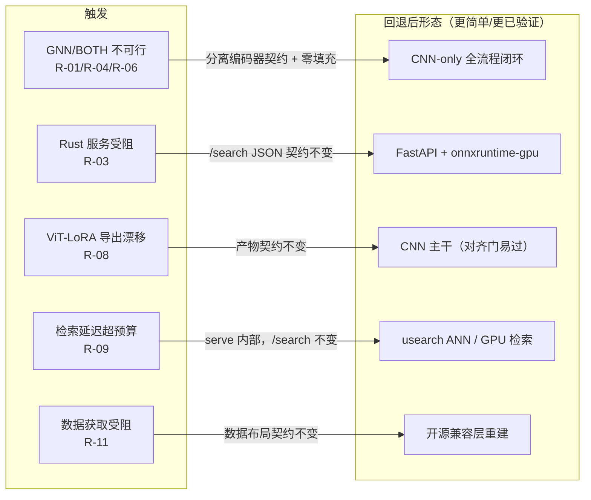

### 10.3 风险监控点

每条风险绑定一个可观测信号 + 在哪个里程碑/单元的退出门检查：

- **M0 退出门**：R-01/R-02/R-03 三个依赖验证（PyG/faiss/ort）——**最早的风险闸**，任一不过即触发对应回退，不进 M1。
- **M1 退出门**：R-11（数据可得性）、R-12（划分泄漏校验）。
- **M2 退出门**：R-04（图提取失败率 + 回退标记到位）。
- **M3 退出门**：R-05（探针结论）、R-06（几何增益决策）、R-07（真实手绘差距报告）、R-12（最终划分复核）。
- **M4 退出门**：R-08（对齐门通过）、R-10（提特征显存/磁盘）。
- **M5 退出门**：R-03（服务打包）、R-09（延迟预算）。

监控信号写入 manifest 或消融报告，使每条风险在退出门处可被客观复核，而非凭印象判断。

## 11. 技术栈与环境

本章固化技术选型与环境约束，是 Part 8 M0 与 Part 9 各单元的环境前提。

### 11.1 技术栈表

| 层 | 选型 | 前向理由 |
|----|------|----------|
| 训练 | Python 3.12 + PyTorch 2.8（CUDA 12.8） | 代码库原生；5090（Blackwell）需 CUDA 12.x |
| CAD 编码 / 图 | torch_geometric（ComplexGNN）；OCC/OCP（STEP 解析、图提取） | 图分支依赖；OCC 开源可复现 |
| 骨架 | timm SE-ResNet50（`seresnet50.a1_in1k`）；可选 OpenCLIP ViT-B/16 | 默认基线骨架 + 消融对比臂 |
| 检索（离线评估） | FAISS flat | 8.4K 规模精确检索，评估口径稳定 |
| 推理导出 | ONNX（opset 17+） | 跨语言、Rust 可载 |
| 在线推理 | ONNX Runtime（`ort` crate；回退 onnxruntime-gpu） | Rust 原生 / Python 回退 |
| 在线检索 | 暴力点积（首版）→ usearch（超规模） | 512-d 下简单优先；usearch Rust 原生 ANN |
| 服务 | Rust + axum（回退 FastAPI） | 单二进制 / 无 GIL / 低空闲内存；FastAPI 为务实逃生舱 |
| 前端 | Astro + three.js（复用 `web/`） | 已有 demo 骨架 |
| 数据管线 | Crossmanager / Sketch3DToolkit / PhotoSketch（既有工具链）+ OCC / moderngl / pyrender（开源层） | 既有路径贴近数据 + 开源层可复现 |
| manifest | LanceDB（或等价瘦表） | 列式、可查询、与质量探查一致 |

### 11.2 环境约束（3× RTX 5090）

- **GPU**：3× RTX 5090（32 GB each，Blackwell，CUDA 12.8）。训练/建库可并行用 3 卡；在线服务用 1 卡。
- **数据落盘**：写 GPU 机大数据盘（`~/data` 约定）；**禁止**写代码仓库目录或临时目录。大数据（原始模型、渲染图、特征库、checkpoint）全部落 `~/data` 子目录。
- **外网**（下载 / 扩规模）：走代理（`http://127.0.0.1:7890`）。
- **预训练权重**：`seresnet50.a1_in1k.bin` 放 `model/Baseline/path_state_dict/`；PhotoSketch 权重在 `tool/PhotoSketch.zip`。
- **关键依赖验证点**：PyG↔torch2.8、faiss-gpu、`ort`↔CUDA12.8（5090）——这三处是 M0/M5 的已知风险，须在 M0 最早验证（见 §11.3）。

### 11.3 依赖验证点（M0 必验）

| 验证点 | 验证方式 | 不过的回退（→ Part 10） |
|--------|----------|--------------------------|
| PyG ↔ torch 2.8 | `import torch_geometric`；跑一次 GNN 前向；确认 CUDA 扩展编译 | 先只跑 CNN 分支（不依赖 PyG），GNN 推迟（R-01） |
| faiss-gpu @ CUDA 12.8 | faiss-gpu import + 小规模 GPU 索引 smoke test | 离线评估用 faiss-cpu（8.4K 可接受）（R-02） |
| `ort` ↔ CUDA 12.8（5090） | Rust 侧加载 ONNX + CUDA EP 推理一次 | 回退 FastAPI + onnxruntime-gpu，`/search` 不变（R-03） |

三点任一未通过，须在 Part 10 对应风险条目记录缓解方案，评估对后续里程碑的影响，再决定推进方式。**这是 M0 退出门的核心内容**。

### 11.4 跨平台说明

- **训练在 GPU 机**（Linux 路径约定，`~/data` 大盘）；**开发机为 Windows**（代码库、spec、前端开发）。
- 去重脚本含 PowerShell（`FindDuplicatesByFileSize.ps1`），跨平台时需移植到 Python 或在 Windows 侧跑。
- 路径分隔、shell 语法按目标机调整；本 spec 的命令意图不绑定单一 OS，执行时按目标机翻译。
- 前端开发（Astro）在 Windows / 任意平台均可；服务部署目标为 GPU 机（Linux）。

## 12. 交付清单与验收

本章逐项列出交付物及其客观验收标准，并给出交付前的总复现演练。验收以 Part 8 各里程碑出口与 Part 9 各单元验收为基础，此处汇总为项目「done」的单一判据。

### 12.1 交付物清单（逐项验收）

| # | 交付物 | 验收标准（客观可验证） | 责任单元 |
|---|--------|------------------------|----------|
| D1 | 可复现全流程 | 从现有数据到起服务的命令意图序列完整可走（含开源兼容层）；无手工中断步骤 | 全部 |
| D2 | 训练好的主干模型 + 消融报告 | 定稿主干 checkpoint；消融报告含各 run Top-1/10/20/50/100 + bootstrap 95% CI + 决策规则实测依据 + 最终回填阈值 | train |
| D3 | artifact 产物 | `artifact/` 六项齐全（manifest/embeddings/ids/metadata/onnx/thumbnails）；通过 serve 启动校验；对齐门通过 | build-artifact |
| D4 | 在线服务 | Rust/axum（或 FastAPI 回退）`/search` 端到端可用；`/healthz` 正常；安全项全到位；API 文档齐 | serve |
| D5 | Astro 前端 demo | 接真实服务，完整查询流程可演示（上传 → 结果 → 3D） | frontend |
| D6 | 数据 manifest + 质量直方图 + 失败清单 | manifest 含每模型各阶段 status + 质量 flag；复杂度直方图产出；失败清单可查 | download/probe/render/graph |
| D7 | 本 spec + 实现 plan + 复现 README | 三件齐备；README 给出端到端复现路径 | 文档 |

### 12.2 最终复现演练

交付前走一遍端到端复现（命令意图序列，验证 D1）：

1. **环境**：在 3×5090 机装齐栈，通过 M0 三个依赖验证点。
2. **数据**：取/重建 8.4K 的 `views`/`sketches`/`train`/`test` + manifest；产复杂度直方图、回填 probe 阈值。
3. **图**：跑 STEP→图提取器产 `graph*.pt`，失败模型标记 CNN-only-fallback。
4. **训练**：跑探针 → 阶段 B → 阶段 C 矩阵 → 阶段 D 定稿，按决策规则选主干并换种子复现。
5. **建库**：用定稿主干提全库特征、导出 ONNX（过对齐门）、打包 `artifact/`。
6. **服务**：起 Rust/axum（或 FastAPI）加载 `artifact/`，`/search` 返回正确 top-K。
7. **前端**：Astro 接 `/search`，上传草图看到结果并可查 3D。

每步以对应里程碑退出门为通过判据；全流程跑通即 D1 验收通过。

### 12.3 演示物（备注）

> **备注（非硬交付项）**：仓库已有 `presentations/` 演示与 `web/` demo 前端。真实服务上线后，演示物可指向真实 `/search`，把概念演示提升为实物演示，无需重写。此项为可选增益，不列入 D1–D7 的硬交付验收。

### 12.4 验收门总表

项目「done」的单一判据 —— 以下全部勾选方为完成：

- [ ] M0 退出门：`train.py --debug` + `test.py` 跑通；三个依赖验证点各有结论。
- [ ] M1 退出门：8.4K 视图+草图齐；manifest 有质量 flag；复杂度直方图产出且阈值回填。
- [ ] M2 退出门：`ComplexGNN` 能加载图前向；失败模型记录且回退 CNN-only。
- [ ] M3 退出门：按决策规则选出主干 + 换种子复现；消融报告产出（含 CI）。
- [ ] M4 退出门：`artifact/` 齐全且过 serve 启动校验；对齐门通过。
- [ ] M5 退出门：`/search` 端到端正确 top-K；单卡 5090 p95 交互级；安全项全到位（无鉴权端点不上线）。
- [ ] M6 退出门：demo 可演示完整查询流程（上传 → 结果 → 3D）。
- [ ] 交付物 D1–D7 全部验收通过。
- [ ] 最终复现演练（§12.2）端到端跑通。

## 13. 附录

查阅辅助：术语表、配置项清单、命令意图速查、架构决策索引、测试用例索引。

### 13.1 术语表（全文汇总）

| 术语 | 含义 |
|------|------|
| 实例检索（instance retrieval） | 召回库中那一个正确的具体 CAD 模型，每个模型自成一类 |
| gallery | 被检索的全库（全部 ~8.4K 模型的视图/几何入库） |
| query | 检索查询（每模型留出的 1 张草图，共 ~8.4K query） |
| 视图（view） | CAD 模型多角度渲染图；每模型 12 张（顶半球 0–5、底半球 6–11，224²） |
| 草图（sketch） | PhotoSketch 风格迁移产出的线稿，与视图一一对应 |
| B-rep 图 | 边界表示几何图（面 14+7 维 / 边 15+12 维 UV-grid），GNN 分支输入 |
| 消融轴 | 消融实验的变量维度（草图主干 / CAD 分支 / 域损失 / 对比损失） |
| 坍缩探针 | 训练前 <1h 判断 CLIP-ViT embedding 是否塌成低秩锥的廉价检查 |
| 产物契约 | build→serve 的 `artifact/` 目录约定（§7.4） |
| 止损线 | 相对于基线锚点的可接受退化下界（如 ΔTop-1 ≥ 2 pp 触发回退） |
| 关键路径（CPM） | 决定项目总工期的里程碑串（M0→…→M6） |
| 退出门（exit gate） | 里程碑/单元的完成判据，不过门不进下一步 |
| deduplicate_ratio | 检索去重倍率（V2=2，每 model 顶/底两条向量） |
| 不对称（asymmetry） | 查询时只跑草图编码器，CAD 侧只在离线建库跑 |

### 13.2 配置项清单

**有明确出处的固定值**（非魔法数）：

| 配置项 | 值 | 出处 |
|--------|----|----|
| `num_classes` | 8422 | ABC_V2 chunk1 去重统计 / config.py |
| `n_views` | 6 | config.py（顶/底各 6） |
| 视图总数 | 12 | 顶 6 + 底 6 |
| `deduplicate_ratio` | 2 | config.py（顶/底各一条特征） |
| `node_attr_dim` / `node_grid_dim` | 14 / 7 | ComplexGNN / baseline.py |
| `edge_attr_dim` / `edge_grid_dim` | 15 / 12 | ComplexGNN / baseline.py |
| `graph_hidden_dim`（5090） | 512 | 仓库注释 |
| 特征描述子维度 | 512 | baseline.py 编码器输出层 / §7.4 |
| ONNX opset | 17+ | 跨语言导出要求 |
| 决策规则阈值 ΔTop-1 | ≥ 2 pp | ~8.4K query bootstrap 95% CI 半宽≈1pp → 2 倍 |
| 输入分辨率 | 224×224 | 仓库 transform |
| 起点学习率 | ≈ 1e-3（V2） | 仓库默认 |

**待回填阈值**（每条标回填依据）：

| 配置项 | 回填依据 |
|--------|----------|
| probe `too_complex` / `file_size` 阈值 | 首跑后看 n_faces/file_size 真实直方图高端长尾截断点 |
| 检索准确率目标（Top-1/Top-10） | 阶段 B R1 实测基线 + 决策规则 |
| ANN 切换点 | 向量规模超 ~1–2M 且 CPU 受限时 |
| 服务 body-size / 解码分辨率上限 | 实测典型草图大小 + 图片炸弹防护参考上限 |
| 归一化 mean/std | 训练 transform 配置（abc_transform_v2） |

### 13.3 命令意图速查

按单元汇总（命令意图，非可复制脚本）：

| 单元 | 跑什么 | 看什么 |
|------|--------|--------|
| download | 下载器指向 chunk + 大盘 | manifest `download_status` 分布 |
| probe | probe 指向 manifest | n_faces/file_size 直方图、`render_eligible` 分布 |
| render | 渲染指向 eligible 集 | 每模型视图计数 == 12、命名合规 |
| sketch | PhotoSketch 批量推理指向 views | 每模型草图数 == 视图数、编号对齐 |
| graph | 图提取指向 eligible 集 | ComplexGNN 加载前向验证维度、`graph_status` 分布 |
| train | 探针 → B → C 分波 → D | 各 run Top-K + CI；定稿 separate 导出 |
| build-artifact | 提特征 + 打包指向定稿主干 | 对齐测试 cosine；serve dry-run 启动校验 |
| serve | 起服务指向 artifact | `/healthz`；样例草图打 `/search` 核对 top-K + 延迟 |
| frontend | 起 dev server | 上传→结果→3D 完整流程 |

**校验命令意图**：结构门（统计 `## N.` 标题数 = 14）；禁用词门（扫描禁用词集 = 0 命中）；行数自检（`wc -l` / `(Get-Content).Count`）。

### 13.4 架构决策索引（ADR）

| 决策 | 前向理由 | 影响单元 | 正文 |
|------|----------|----------|------|
| 不对称架构 | 热路径只一个小模型 → 可简化导出/服务/检索 | serve / build-artifact | §3.1 |
| 暴力检索优先 | 512-d 下 GPU 暴力到很大规模仍够 → 简单优先 | serve | §7.2 |
| Rust 服务 + FastAPI 逃生舱 | 单二进制/无 GIL；打包受阻则回退，API 不变 | serve | §7.3 / §7.8 |
| 消融驱动选主干 | ~8.4K 量级无先验定论 → 经验决定 | train | §5.1 |
| B-rep GNN 离线-only | GNN 输出已融合为向量写盘，serve 无需感知 GNN | graph / build-artifact | §3.6 / §7.1 |

### 13.5 测试用例索引

汇总 Part 9 各单元测试矩阵为总索引，便于 writing-plans 转成测试任务：

| 单元 | 用例数 | 关键失败注入 |
|------|--------|--------------|
| download | 4 | 损坏 7z、网络中断 resume、代理失效 |
| probe | 5 | no_solid、too_complex、degenerate、解析失败 |
| render | 4 | mesh 失败、视图缺失、双路径不一致 |
| sketch | 4 | 权重缺失、编号错位、空白草图 |
| graph | 5 | 提取失败回退、命名错配、维度不符、空图 |
| train | 5 | 探针降级、NaN 停训、断点续训、3 卡串扰 |
| build-artifact | 5 | 对齐门失败、版本门拒启、维度不匹配 |
| serve | 7 | 维度拒启、图片炸弹、413/415/429、CUDA 回退 |
| frontend | 5 | serve 503、空结果、3D 崩溃、大图预校验 |

每个用例覆盖正常路径 + 边界 + 失败注入；失败注入用例是验证「失败处理」与「回退」契约的核心。
